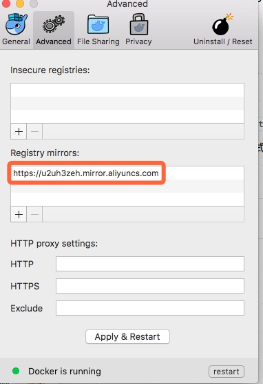
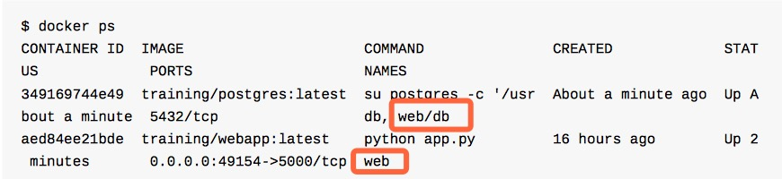
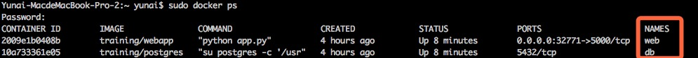

# 本文背景
* 系统：macOS Sierra 10.12.1
* Docker版本：Docker version 1.12.3, build 6b644ec
* 《Docker —— 从入门到实践》PDF版本：6448a627f6c4a9f0ca762951f390d3f9a571d310
* 本文记录：在学习Docker的过程以及尝试中碰到的问题。

-------
-------

# 《Docker —— 从入门到实践》碰到的问题：
1. 执行`docker run -d -p 80:80 --name webserver nginx`报错：`docker: Cannot connect to the Docker daemon. Is the docker daemon running on this host?.`

    * 原因：TODO
    * 解决方式：`sudo docker run -d -p 80:80 --name webserver nginx`
    ps：该解决方式暂时不是最优。TODO
    
2. 执行`docker run -d -p 80:80 --name webserver nginx`报错：`docker: Network timed out while trying to connect to https://index.docker.io/v1/repositories/library/nginx/images. You may want to check your internet connection or if you are`

    * 原因：docker.io存在被墙、连接困难的情况。
    * 解决方式：更换阿里云docker镜像。
            
        
3. `nsenter`：随着docker1.3版本开始，`docker exec -it CONTAINER_NAME bash`成为推荐的连接到容器的方式。参考：https://github.com/jpetazzo/nsenter。
    > There are differences between nsenter and docker exec; namely, nsenter doesn't enter the cgroups, and therefore evades resource limitations. The potential benefit of this would be debugging and external audit, **but for remote access, docker exec is the current recommended approach**.
4. 在《使用网络-容器互联》章节， 
    * `sudo docker run -d --name db training/postgres`
    * `sudo docker run -d -P --name web --link db:db training/webapp python app.py`
    后进行`docker ps`，无法得到如下图：
            
    得到的结果如下图：
            
    * 原因：TODO
    * 解决方式：`sudo docker inspect -f "{{ .HostConfig.Links }}" web`
        > [/db:/web/db]
        
        示例成功。
 
 
-------
-------

       
# 服务发现的选择

### 目前考虑选择Etcd：

主要有3种选择：    

* Etcd
* Consul
* ZooKeeper

选择Etcd的原因如下：

* `CoreOS` 发起的开源项目
* `K8s` 对etcd的官方支持

-------

### Etcd本地测试集群搭建
    
* 参考文章：https://github.com/coreos/etcd/blob/master/Documentation/dev-guide/local_cluster.md  
* 可能会碰到的问题： 
    1. go安装：`yum install go`
    2. git安装：`yum install git`
    3. `go get github.com/mattn/goreman` 报错：`package github.com/mattn/goreman: cannot download, $GOPATH not set. For more details see: go help gopath`。
    
        解决方式：`export GOPATH=~/work`。然后执行上面的命令。最终`goreman`在`~/work/bin`下。
    4. `goreman -f Procfile start`报错：`open Procfile: no such file or directory`。从[https://github.com/coreos/etcd/blob/master/Procfile](https://github.com/coreos/etcd/blob/master/Procfile)进行下载。下载完后，需要修改下文件里的`bin/etcd`为`etcd`所在目录。

-------

### Etcd多服务器集群搭建     

    curl -X PUT http://127.0.0.1:2379/v2/keys/upstreams/test/127.0.0.1:8080

curl -X PUT -d value="{\"weight\":1, \"max_fails\":100, \"fail_timeout\":1000}" http://127.0.0.1:2379/v2/keys/upstreams/test/127.0.0.1:8080

    curl -X DELETE http://127.0.0.1:2379/v2/keys/upstreams/test/127.0.0.1:8080

    curl -X DELETE http://127.0.0.1:2379/v2/keys/upstreams/test/127.0.0.1:8080;
    cat conf/servers/servers_test.conf;

./configure --add-module=/root/nginx/nginx-1.10.1/modules/nginx-upsync-module --add-module=/root/nginx/nginx-1.10.1/modules/nginx_upstream_check_module-0.3.0

./configure --add-module=/root/nginx/nginx-1.10.1/modules/nginx-upsync-module --add-module=/root/nginx/nginx-1.10.1/modules/nginx_upstream_check_module

05.24：https://github.com/weibocom/nginx-upsync-module/releases/tag/v1.0.0
07.31修复：https://github.com/weibocom/nginx-upsync-module/issues/91
自己提交的issue：https://github.com/weibocom/nginx-upsync-module/issues/133

