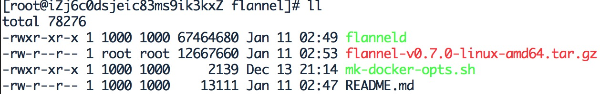

todo flannel简介

## 安装Etcd

## 安装Flannel


### 下载Flannel


```
mkdir /root/work/flanne
cd /root/work/flannel
wget https://github.com/coreos/flannel/releases/download/v0.7.0/flannel-v0.7.0-linux-amd64.tar.gz
tar zxvf flannel-v0.7.0-linux-amd64.tar.gz
ls -ls
```
    
结果：    
    
### 启动Flannel


```
nohup ./flanneld -etcd-endpoints=http://10.29.76.96:2379 &  # http://10.29.76.96:2379 为etcd请求地址，需要改成你自己的噢

```
    

### 配置Docker

### 查看Docker配置是否生效

## 验证网络是否通畅 


