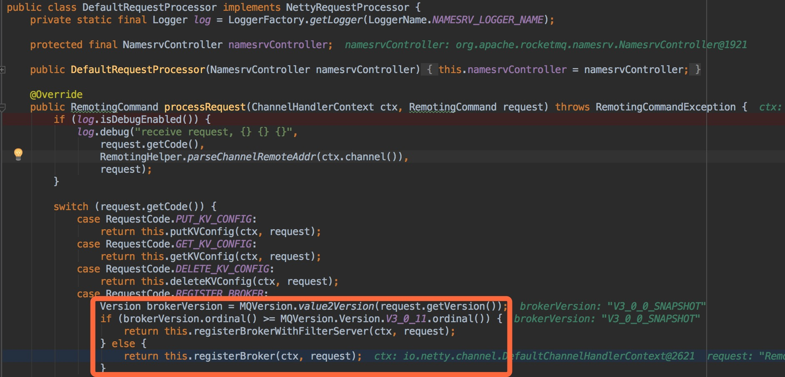

# 03-26

- [x] Producer发送消息失败，报`org.apache.rocketmq.client.exception.MQClientException: No route info of this topic`
    
    操作步骤：
    
    1. 启动 Namesrv ：[NamesrvControllerTest#testStart](https://github.com/YunaiV/incubator-rocketmq/blob/1e1fec48631c69bcd5d1daac406fc934c78a4971/namesrv/src/test2/java/org/apache/rocketmq/namesrv/yunai/NamesrvControllerTest.java) 
    2. 启动 Broker ：[BrokerControllerTest#testBrokerRestart](https://github.com/YunaiV/incubator-rocketmq/blob/1e1fec48631c69bcd5d1daac406fc934c78a4971/namesrv/src/test2/java/org/apache/rocketmq/namesrv/yunai/NamesrvControllerTest.java)
    3. Producer 发送消息：[Producer#main](https://github.com/YunaiV/incubator-rocketmq/blob/1e1fec48631c69bcd5d1daac406fc934c78a4971/example/src/main/java/org/apache/rocketmq/example/quickstart/Producer.java) 发送失败，报`org.apache.rocketmq.client.exception.MQClientException: No route info of this topic`

    解决过程：使用 [quick-start](http://rocketmq.apache.org/docs/quick-start/) 启动 Namesrv 、 Broker 。
    
    1. 使用上述 Producer 进行发送消息，结果成功。
    2. 关闭 Namesrv ，使用上述 Namesrv 启动，使用上述 Producer 进行发送消息，结果发送成功。猜测上述 Broker 启动失败，原因排查中。
    3. 关闭 Broker ，使用上述 Broker 启动。使用`telnet 127.0.0.1 10911`连接上述 Broker，连接成功。猜测 Broker 启动成功，注册 Topic 失败，因为查看 Namesrv 未打印 Topic 注册的日志，例如： `INFO  RocketmqNamesrv - new topic registerd, SELF_TEST_TOPIC QueueData ` ，继续排查。
    4. 调试上述 Namesrv 发现，上述 Broker 注册时，使用了错误的协议解析版本，导致 Topic 未注册上。
       
       调整 上述 Broker 启动代码，增加`System.setProperty(RemotingCommand.REMOTING_VERSION_KEY, Integer.toString(MQVersion.CURRENT_VERSION));`
       使用上述 Producer 发送消息，发送成功。
       最终 Broker代码 ：[BrokerControllerTest#testBrokerRestart](https://github.com/YunaiV/incubator-rocketmq/blob/11f4362eae26a558ee3cbe5a2db976bc6495f2c3/broker/src/test2/java/org/apache/rocketmq/broker/yunai/BrokerControllerTest.java)

- [ ] 

