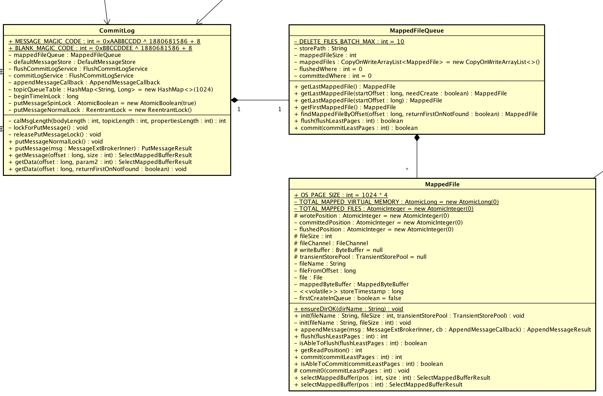
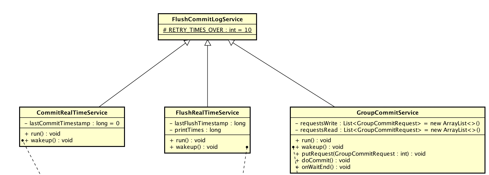

# 1、概述

本文接[《RocketMQ源码解析：Message发送&接收》](https://github.com/YunaiV/Blog/blob/master/RocketMQ/1003-RocketMQ%E6%BA%90%E7%A0%81%E8%A7%A3%E6%9E%90%EF%BC%9AMessage%E5%8F%91%E9%80%81%26%E6%8E%A5%E6%94%B6.md)。
主要解析 `CommitLog` 存储消息部分。考虑到 `CommitLog` 的初始化加载、过期删除有一些关系，因此，一起一起😈。

# 2、CommitLog 结构

`CommitLog`、`MappedFileQueue`、`MappedFile` 的关系如下：

> 
`CommitLog` : `MappedQueue` : `MappedFile` = 1 : 1 : N。

反应到系统文件如下：

```bash
Yunai-MacdeMacBook-Pro-2:commitlog yunai$ pwd
/Users/yunai/store/commitlog
Yunai-MacdeMacBook-Pro-2:commitlog yunai$ ls -l
total 10485760
-rw-r--r--  1 yunai  staff  1073741824  4 21 16:27 00000000000000000000
-rw-r--r--  1 yunai  staff  1073741824  4 21 16:29 00000000001073741824
-rw-r--r--  1 yunai  staff  1073741824  4 21 16:32 00000000002147483648
-rw-r--r--  1 yunai  staff  1073741824  4 21 16:33 00000000003221225472
-rw-r--r--  1 yunai  staff  1073741824  4 21 16:32 00000000004294967296
```

-------

`CommitLog`、`MappedFileQueue`、`MappedFile` 的定义如下：

* `MappedFile` ：00000000000000000000、00000000001073741824、00000000002147483648等文件。
* `MappedFileQueue` ：`MappedFile` 所在的文件夹，对 `MappedFile` 进行封装成文件队列，对上层提供可无限使用的文件容量。
    * 每个 `MappedFile` 统一文件大小。
    * 文件命名方式：fileName[n] = fileName[n - 1] + mappedFileSize。在 `CommitLog` 里默认为 1GB。
* `CommitLog` ：针对 `MappedFileQueue` 的封装使用。

`CommitLog` 目前存储在 `MappedFile` 有两种内容类型：

1. MESSAGE ：消息。
2. BLANK ：文件不足以存储消息时的空白占位。

`CommitLog` 存储在 `MappedFile`的结构：

> | MESSAGE[1] | MESSAGE[2]  | ... | MESSAGE[n - 1] | MESSAGE[n] | BLANK |
> | --- | --- | --- | --- | --- | --- |

`MESSAGE` 在 `CommitLog` 存储结构：

| 第几位 | 字段 | 说明 | 数据类型 | 字节数 |
| :-- | :-- | :-- | :-- | :-- |
| 1 | MsgLen | 消息总长度 | Int | 4 |
| 2 | MagicCode | MESSAGE_MAGIC_CODE | Int | 4 |
| 3 | BodyCRC | 消息内容CRC | Int | 4 |
| 4 | QueueId | 消息队列编号 | Int | 4 |
| 5 | Flag |   |  |  |
| 6 | QueueOffset | 消息队列位置 | Long | 8 |
| 7 | PhysicalOffset | 物理位置。在 `CommitLog` 的顺序存储位置。 | Long | 8 |
| 8 | SysFlag |  | Int | 4 |
| 9 | BornTimestamp | 生成消息时间戳 | Long | 8 |
| 10 | BornHost  | 生效消息的地址+端口 | Long | 8 |
| 11 | StoreTimestamp | 存储消息时间戳 | Long | 8 |
| 12 | StoreHost | 存储消息的地址+端口 | Long | 8 |
| 13 | ReconsumeTimes | 重新消费消息次数 | Int | 4 |
| 14 | PreparedTransationOffset |  | Long | 8 |
| 15 | BodyLength + Body  | 内容长度 + 内容 | Int + Bytes | 4 + bodyLength |
| 16 | TopicLength + Topic | Topic长度 + Topic | Byte + Bytes | 1 + topicLength |
| 17 | PropertiesLength + Properties | 拓展字段长度 + 拓展字段 | Short + Bytes | 2 + PropertiesLength |

`BLANK` 在 `CommitLog` 存储结构：

| 第几位 | 字段 | 说明 | 数据类型 | 字节数 |
| :-- | :-- | :-- | :-- | :-- |
| 1 | maxBlank | 空白长度 | Int | 4 |
| 2 | MagicCode | BLANK_MAGIC_CODE | Int | 4 |

# 3、CommitLog 存储消息

> 

## CommitLog#putMessage(...)

```Java
  1: public PutMessageResult putMessage(final MessageExtBrokerInner msg) {
  2:     // Set the storage time
  3:     msg.setStoreTimestamp(System.currentTimeMillis());
  4:     // Set the message body BODY CRC (consider the most appropriate setting
  5:     // on the client)
  6:     msg.setBodyCRC(UtilAll.crc32(msg.getBody()));
  7:     // Back to Results
  8:     AppendMessageResult result = null;
  9: 
 10:     StoreStatsService storeStatsService = this.defaultMessageStore.getStoreStatsService();
 11: 
 12:     String topic = msg.getTopic();
 13:     int queueId = msg.getQueueId();
 14: 
 15:     // 事务相关 TODO 待读：事务相关
 16:     final int tranType = MessageSysFlag.getTransactionValue(msg.getSysFlag());
 17:     if (tranType == MessageSysFlag.TRANSACTION_NOT_TYPE//
 18:         || tranType == MessageSysFlag.TRANSACTION_COMMIT_TYPE) {
 19:         // Delay Delivery
 20:         if (msg.getDelayTimeLevel() > 0) {
 21:             if (msg.getDelayTimeLevel() > this.defaultMessageStore.getScheduleMessageService().getMaxDelayLevel()) {
 22:                 msg.setDelayTimeLevel(this.defaultMessageStore.getScheduleMessageService().getMaxDelayLevel());
 23:             }
 24: 
 25:             topic = ScheduleMessageService.SCHEDULE_TOPIC;
 26:             queueId = ScheduleMessageService.delayLevel2QueueId(msg.getDelayTimeLevel());
 27: 
 28:             // Backup real topic, queueId
 29:             MessageAccessor.putProperty(msg, MessageConst.PROPERTY_REAL_TOPIC, msg.getTopic());
 30:             MessageAccessor.putProperty(msg, MessageConst.PROPERTY_REAL_QUEUE_ID, String.valueOf(msg.getQueueId()));
 31:             msg.setPropertiesString(MessageDecoder.messageProperties2String(msg.getProperties()));
 32: 
 33:             msg.setTopic(topic);
 34:             msg.setQueueId(queueId);
 35:         }
 36:     }
 37: 
 38:     long eclipseTimeInLock = 0;
 39: 
 40:     // 获取写入映射文件
 41:     MappedFile unlockMappedFile = null;
 42:     MappedFile mappedFile = this.mappedFileQueue.getLastMappedFile();
 43: 
 44:     // 获取写入锁
 45:     lockForPutMessage(); //spin...
 46:     try {
 47:         long beginLockTimestamp = this.defaultMessageStore.getSystemClock().now();
 48:         this.beginTimeInLock = beginLockTimestamp;
 49: 
 50:         // Here settings are stored timestamp, in order to ensure an orderly
 51:         // global
 52:         msg.setStoreTimestamp(beginLockTimestamp);
 53: 
 54:         // 当不存在映射文件时，进行创建
 55:         if (null == mappedFile || mappedFile.isFull()) {
 56:             mappedFile = this.mappedFileQueue.getLastMappedFile(0); // Mark: NewFile may be cause noise
 57:         }
 58:         if (null == mappedFile) {
 59:             log.error("create maped file1 error, topic: " + msg.getTopic() + " clientAddr: " + msg.getBornHostString());
 60:             beginTimeInLock = 0;
 61:             return new PutMessageResult(PutMessageStatus.CREATE_MAPEDFILE_FAILED, null);
 62:         }
 63: 
 64:         // 存储消息
 65:         result = mappedFile.appendMessage(msg, this.appendMessageCallback);
 66:         switch (result.getStatus()) {
 67:             case PUT_OK:
 68:                 break;
 69:             case END_OF_FILE: // 当文件尾时，获取新的映射文件，并进行插入
 70:                 unlockMappedFile = mappedFile;
 71:                 // Create a new file, re-write the message
 72:                 mappedFile = this.mappedFileQueue.getLastMappedFile(0);
 73:                 if (null == mappedFile) {
 74:                     // XXX: warn and notify me
 75:                     log.error("create maped file2 error, topic: " + msg.getTopic() + " clientAddr: " + msg.getBornHostString());
 76:                     beginTimeInLock = 0;
 77:                     return new PutMessageResult(PutMessageStatus.CREATE_MAPEDFILE_FAILED, result);
 78:                 }
 79:                 result = mappedFile.appendMessage(msg, this.appendMessageCallback);
 80:                 break;
 81:             case MESSAGE_SIZE_EXCEEDED:
 82:             case PROPERTIES_SIZE_EXCEEDED:
 83:                 beginTimeInLock = 0;
 84:                 return new PutMessageResult(PutMessageStatus.MESSAGE_ILLEGAL, result);
 85:             case UNKNOWN_ERROR:
 86:                 beginTimeInLock = 0;
 87:                 return new PutMessageResult(PutMessageStatus.UNKNOWN_ERROR, result);
 88:             default:
 89:                 beginTimeInLock = 0;
 90:                 return new PutMessageResult(PutMessageStatus.UNKNOWN_ERROR, result);
 91:         }
 92: 
 93:         eclipseTimeInLock = this.defaultMessageStore.getSystemClock().now() - beginLockTimestamp;
 94:         beginTimeInLock = 0;
 95:     } finally {
 96:         // 释放写入锁
 97:         releasePutMessageLock();
 98:     }
 99: 
100:     if (eclipseTimeInLock > 500) {
101:         log.warn("[NOTIFYME]putMessage in lock cost time(ms)={}, bodyLength={} AppendMessageResult={}", eclipseTimeInLock, msg.getBody().length, result);
102:     }
103: 
104:     // 
105:     if (null != unlockMappedFile && this.defaultMessageStore.getMessageStoreConfig().isWarmMapedFileEnable()) {
106:         this.defaultMessageStore.unlockMappedFile(unlockMappedFile);
107:     }
108: 
109:     PutMessageResult putMessageResult = new PutMessageResult(PutMessageStatus.PUT_OK, result);
110: 
111:     // Statistics
112:     storeStatsService.getSinglePutMessageTopicTimesTotal(msg.getTopic()).incrementAndGet();
113:     storeStatsService.getSinglePutMessageTopicSizeTotal(topic).addAndGet(result.getWroteBytes());
114: 
115:     // 进行同步||异步 flush||commit
116:     GroupCommitRequest request = null;
117:     // Synchronization flush
118:     if (FlushDiskType.SYNC_FLUSH == this.defaultMessageStore.getMessageStoreConfig().getFlushDiskType()) {
119:         final GroupCommitService service = (GroupCommitService) this.flushCommitLogService;
120:         if (msg.isWaitStoreMsgOK()) {
121:             request = new GroupCommitRequest(result.getWroteOffset() + result.getWroteBytes());
122:             service.putRequest(request);
123:             boolean flushOK = request.waitForFlush(this.defaultMessageStore.getMessageStoreConfig().getSyncFlushTimeout());
124:             if (!flushOK) {
125:                 log.error("do groupcommit, wait for flush failed, topic: " + msg.getTopic() + " tags: " + msg.getTags()
126:                     + " client address: " + msg.getBornHostString());
127:                 putMessageResult.setPutMessageStatus(PutMessageStatus.FLUSH_DISK_TIMEOUT);
128:             }
129:         } else {
130:             service.wakeup();
131:         }
132:     }
133:     // Asynchronous flush
134:     else {
135:         if (!this.defaultMessageStore.getMessageStoreConfig().isTransientStorePoolEnable()) {
136:             flushCommitLogService.wakeup(); // important：唤醒commitLog线程，进行flush
137:         } else {
138:             commitLogService.wakeup();
139:         }
140:     }
141: 
142:     // Synchronous write double 如果是同步Master，同步到从节点 // TODO 待读：数据同步
143:     if (BrokerRole.SYNC_MASTER == this.defaultMessageStore.getMessageStoreConfig().getBrokerRole()) {
144:         HAService service = this.defaultMessageStore.getHaService();
145:         if (msg.isWaitStoreMsgOK()) {
146:             // Determine whether to wait
147:             if (service.isSlaveOK(result.getWroteOffset() + result.getWroteBytes())) {
148:                 if (null == request) {
149:                     request = new GroupCommitRequest(result.getWroteOffset() + result.getWroteBytes());
150:                 }
151:                 service.putRequest(request);
152: 
153:                 service.getWaitNotifyObject().wakeupAll();
154: 
155:                 boolean flushOK =
156:                     // TODO
157:                     request.waitForFlush(this.defaultMessageStore.getMessageStoreConfig().getSyncFlushTimeout());
158:                 if (!flushOK) {
159:                     log.error("do sync transfer other node, wait return, but failed, topic: " + msg.getTopic() + " tags: "
160:                         + msg.getTags() + " client address: " + msg.getBornHostString());
161:                     putMessageResult.setPutMessageStatus(PutMessageStatus.FLUSH_SLAVE_TIMEOUT);
162:                 }
163:             }
164:             // Slave problem
165:             else {
166:                 // Tell the producer, slave not available
167:                 putMessageResult.setPutMessageStatus(PutMessageStatus.SLAVE_NOT_AVAILABLE);
168:             }
169:         }
170:     }
171: 
172:     return putMessageResult;
173: }
```

* 说明 ：存储消息，并返回存储结果。
* 第 2 行 ：设置存储时间等。
* 第 16 至 36 行 ：事务消息相关，暂未了解。
* 第 45 & 97 行 ：获取锁与释放锁。
* 第 52 行 ：再次设置存储时间。目前会有多处地方设置存储时间。
* 第 55 至 62 行 ：获取 `MappedFile`，若不存在或已满，则进行创建。详细解析见：[MappedFileQueue#getLastMappedFile(...)](#mappedfilequeuegetlastmappedfile)。
* 第 65 行 ：**插入消息**到 `MappedFile`，解析解析见：[MappedFile#appendMessage(...)](#mappedfileappendmessage)。
* 第 69 至 80 行 ：`MappedFile` 已满，创建新的，再次**插入消息**。
* 第 116 至 140 行 ：**消息刷盘**，即持久化到文件。上面**插入消息**实际未存储到硬盘。此处，根据不同的刷盘策略，执行会有不同。详细解析见：[FlushCommitLogService](#flushcommitlogservice)。
* 第 143 至 173 行 ：`Broker` 主从同步。后面的文章会详细解析😈。

## MappedFileQueue#getLastMappedFile(...)

```Java
  1: public MappedFile getLastMappedFile(final long startOffset, boolean needCreate) {
  2:     long createOffset = -1; // 创建文件开始offset。-1时，不创建
  3:     MappedFile mappedFileLast = getLastMappedFile();
  4: 
  5:     if (mappedFileLast == null) { // 一个映射文件都不存在
  6:         createOffset = startOffset - (startOffset % this.mappedFileSize);
  7:     }
  8: 
  9:     if (mappedFileLast != null && mappedFileLast.isFull()) { // 最后一个文件已满
 10:         createOffset = mappedFileLast.getFileFromOffset() + this.mappedFileSize;
 11:     }
 12: 
 13:     if (createOffset != -1 && needCreate) { // 创建文件
 14:         String nextFilePath = this.storePath + File.separator + UtilAll.offset2FileName(createOffset);
 15:         String nextNextFilePath = this.storePath + File.separator
 16:             + UtilAll.offset2FileName(createOffset + this.mappedFileSize);
 17:         MappedFile mappedFile = null;
 18: 
 19:         if (this.allocateMappedFileService != null) {
 20:             mappedFile = this.allocateMappedFileService.putRequestAndReturnMappedFile(nextFilePath,
 21:                 nextNextFilePath, this.mappedFileSize);
 22:         } else {
 23:             try {
 24:                 mappedFile = new MappedFile(nextFilePath, this.mappedFileSize);
 25:             } catch (IOException e) {
 26:                 log.error("create mappedFile exception", e);
 27:             }
 28:         }
 29: 
 30:         if (mappedFile != null) {
 31:             if (this.mappedFiles.isEmpty()) {
 32:                 mappedFile.setFirstCreateInQueue(true);
 33:             }
 34:             this.mappedFiles.add(mappedFile);
 35:         }
 36: 
 37:         return mappedFile;
 38:     }
 39: 
 40:     return mappedFileLast;
 41: }
```

* 说明 ：获取最后一个 `MappedFile`，若不存在或文件已满，则进行创建。
* 第 5 至 11 行 ：计算当文件不存在或已满时，新创建文件的 `createOffset`。
* 第 14 行 ：计算文件名。从此处我们可
以得知，`MappedFile`的文件命名规则：

    > fileName[n] = fileName[n - 1] + n * mappedFileSize
    > fileName[0] = startOffset - (startOffset % this.mappedFileSize)
    
    目前 `CommitLog` 的 `startOffset` 为 0。
    此处有个**疑问**，为什么需要 `(startOffset % this.mappedFileSize)`。例如：
    
    | startOffset  | mappedFileSize | createOffset |
    | --- | :-- | :-- |
    | 5 | 1 | 5 |
    | 5 | 2 | 4 |
    | 5 | 3 | 3  |
    | 5 | 4 | 4 |
    | 5 | > 5 | 0 |
    
    _如果有知道的同学，麻烦提示下。😈_
    
* 第 30 至 35 行 ：设置 `MappedFile`是否是第一个创建的文件。该标识用于 `ConsumeQueue` 对应的 `MappedFile` ，详见 `ConsumeQueue#fillPreBlank`。
    
## MappedFile#appendMessage(...)

```Java
  1: public AppendMessageResult appendMessage(final MessageExtBrokerInner msg, final AppendMessageCallback cb) {
  2:     assert msg != null;
  3:     assert cb != null;
  4: 
  5:     int currentPos = this.wrotePosition.get();
  6: 
  7:     if (currentPos < this.fileSize) {
  8:         ByteBuffer byteBuffer = writeBuffer != null ? writeBuffer.slice() : this.mappedByteBuffer.slice();
  9:         byteBuffer.position(currentPos);
 10:         AppendMessageResult result =
 11:             cb.doAppend(this.getFileFromOffset(), byteBuffer, this.fileSize - currentPos, msg);
 12:         this.wrotePosition.addAndGet(result.getWroteBytes());
 13:         this.storeTimestamp = result.getStoreTimestamp();
 14:         return result;
 15:     }
 16: 
 17:     log.error("MappedFile.appendMessage return null, wrotePosition: " + currentPos + " fileSize: "
 18:         + this.fileSize);
 19:     return new AppendMessageResult(AppendMessageStatus.UNKNOWN_ERROR);
 20: }
```

* 说明 ：**插入消息**到 `MappedFile`，并返回插入结果。
* 第 8 行 ：获取需要写入的字节缓冲区。为什么会有 `writeBuffer != null` 的判断后，使用不同的字节缓冲区，见：[FlushCommitLogService](#flushcommitlogservice)。
* 第 9 至 11 行 ：设置写入 `position`，执行写入，更新 `wrotePosition`(当前写入位置，下次开始写入开始位置)。

## DefaultAppendMessageCallback#doAppend(...)

```Java
  1: class DefaultAppendMessageCallback implements AppendMessageCallback {
  2:     // File at the end of the minimum fixed length empty
  3:     private static final int END_FILE_MIN_BLANK_LENGTH = 4 + 4;
  4:     /**
  5:      * 存储在内存中的消息编号字节Buffer
  6:      */
  7:     private final ByteBuffer msgIdMemory;
  8:     /**
  9:      * Store the message content
 10:      * 存储在内存中的消息字节Buffer
 11:      * 当消息传递到{@link #doAppend(long, ByteBuffer, int, MessageExtBrokerInner)}方法时，最终写到该参数
 12:      */
 13:     private final ByteBuffer msgStoreItemMemory;
 14:     /**
 15:      * The maximum length of the message
 16:      * 消息最大长度
 17:      */
 18:     private final int maxMessageSize;
 19:     /**
 20:      * Build Message Key
 21:      * {@link #topicQueueTable}的key
 22:      * 计算方式：topic + "-" + queueId
 23:      */
 24:     private final StringBuilder keyBuilder = new StringBuilder();
 25:     /**
 26:      * host字节buffer
 27:      * 用于重复计算host的字节内容
 28:      */
 29:     private final ByteBuffer hostHolder = ByteBuffer.allocate(8);
 30: 
 31:     DefaultAppendMessageCallback(final int size) {
 32:         this.msgIdMemory = ByteBuffer.allocate(MessageDecoder.MSG_ID_LENGTH);
 33:         this.msgStoreItemMemory = ByteBuffer.allocate(size + END_FILE_MIN_BLANK_LENGTH);
 34:         this.maxMessageSize = size;
 35:     }
 36: 
 37:     public ByteBuffer getMsgStoreItemMemory() {
 38:         return msgStoreItemMemory;
 39:     }
 40: 
 41:     public AppendMessageResult doAppend(final long fileFromOffset, final ByteBuffer byteBuffer, final int maxBlank, final MessageExtBrokerInner msgInner) {
 42:         // STORETIMESTAMP + STOREHOSTADDRESS + OFFSET <br>
 43: 
 44:         // PHY OFFSET
 45:         long wroteOffset = fileFromOffset + byteBuffer.position();
 46: 
 47:         // 计算commitLog里的msgId
 48:         this.resetByteBuffer(hostHolder, 8);
 49:         String msgId = MessageDecoder.createMessageId(this.msgIdMemory, msgInner.getStoreHostBytes(hostHolder), wroteOffset);
 50: 
 51:         // Record ConsumeQueue information 获取队列offset
 52:         keyBuilder.setLength(0);
 53:         keyBuilder.append(msgInner.getTopic());
 54:         keyBuilder.append('-');
 55:         keyBuilder.append(msgInner.getQueueId());
 56:         String key = keyBuilder.toString();
 57:         Long queueOffset = CommitLog.this.topicQueueTable.get(key);
 58:         if (null == queueOffset) {
 59:             queueOffset = 0L;
 60:             CommitLog.this.topicQueueTable.put(key, queueOffset);
 61:         }
 62: 
 63:         // Transaction messages that require special handling // TODO 疑问：用途
 64:         final int tranType = MessageSysFlag.getTransactionValue(msgInner.getSysFlag());
 65:         switch (tranType) {
 66:             // Prepared and Rollback message is not consumed, will not enter the
 67:             // consumer queue
 68:             case MessageSysFlag.TRANSACTION_PREPARED_TYPE:
 69:             case MessageSysFlag.TRANSACTION_ROLLBACK_TYPE:
 70:                 queueOffset = 0L;
 71:                 break;
 72:             case MessageSysFlag.TRANSACTION_NOT_TYPE:
 73:             case MessageSysFlag.TRANSACTION_COMMIT_TYPE:
 74:             default:
 75:                 break;
 76:         }
 77: 
 78:         // 计算消息长度
 79:         final byte[] propertiesData =
 80:             msgInner.getPropertiesString() == null ? null : msgInner.getPropertiesString().getBytes(MessageDecoder.CHARSET_UTF8);
 81:         final int propertiesLength = propertiesData == null ? 0 : propertiesData.length;
 82:         if (propertiesLength > Short.MAX_VALUE) {
 83:             log.warn("putMessage message properties length too long. length={}", propertiesData.length);
 84:             return new AppendMessageResult(AppendMessageStatus.PROPERTIES_SIZE_EXCEEDED);
 85:         }
 86:         final byte[] topicData = msgInner.getTopic().getBytes(MessageDecoder.CHARSET_UTF8);
 87:         final int topicLength = topicData.length;
 88:         final int bodyLength = msgInner.getBody() == null ? 0 : msgInner.getBody().length;
 89:         final int msgLen = calMsgLength(bodyLength, topicLength, propertiesLength);
 90:         // Exceeds the maximum message
 91:         if (msgLen > this.maxMessageSize) {
 92:             CommitLog.log.warn("message size exceeded, msg total size: " + msgLen + ", msg body size: " + bodyLength
 93:                 + ", maxMessageSize: " + this.maxMessageSize);
 94:             return new AppendMessageResult(AppendMessageStatus.MESSAGE_SIZE_EXCEEDED);
 95:         }
 96: 
 97:         // Determines whether there is sufficient(足够) free space
 98:         if ((msgLen + END_FILE_MIN_BLANK_LENGTH) > maxBlank) {
 99:             this.resetByteBuffer(this.msgStoreItemMemory, maxBlank);
100:             // 1 TOTAL_SIZE
101:             this.msgStoreItemMemory.putInt(maxBlank);
102:             // 2 MAGIC_CODE
103:             this.msgStoreItemMemory.putInt(CommitLog.BLANK_MAGIC_CODE);
104:             // 3 The remaining space may be any value
105:             //
106: 
107:             // Here the length of the specially set maxBlank
108:             final long beginTimeMills = CommitLog.this.defaultMessageStore.now();
109:             byteBuffer.put(this.msgStoreItemMemory.array(), 0, maxBlank);
110:             return new AppendMessageResult(AppendMessageStatus.END_OF_FILE, wroteOffset, maxBlank, msgId, msgInner.getStoreTimestamp(),
111:                 queueOffset, CommitLog.this.defaultMessageStore.now() - beginTimeMills);
112:         }
113: 
114:         // Initialization of storage space
115:         this.resetByteBuffer(msgStoreItemMemory, msgLen);
116:         // 1 TOTAL_SIZE
117:         this.msgStoreItemMemory.putInt(msgLen);
118:         // 2 MAGIC_CODE
119:         this.msgStoreItemMemory.putInt(CommitLog.MESSAGE_MAGIC_CODE);
120:         // 3 BODY_CRC
121:         this.msgStoreItemMemory.putInt(msgInner.getBodyCRC());
122:         // 4 QUEUE_ID
123:         this.msgStoreItemMemory.putInt(msgInner.getQueueId());
124:         // 5 FLAG
125:         this.msgStoreItemMemory.putInt(msgInner.getFlag());
126:         // 6 QUEUE_OFFSET
127:         this.msgStoreItemMemory.putLong(queueOffset);
128:         // 7 PHYSICAL_OFFSET
129:         this.msgStoreItemMemory.putLong(fileFromOffset + byteBuffer.position());
130:         // 8 SYS_FLAG
131:         this.msgStoreItemMemory.putInt(msgInner.getSysFlag());
132:         // 9 BORN_TIMESTAMP
133:         this.msgStoreItemMemory.putLong(msgInner.getBornTimestamp());
134:         // 10 BORN_HOST
135:         this.resetByteBuffer(hostHolder, 8);
136:         this.msgStoreItemMemory.put(msgInner.getBornHostBytes(hostHolder));
137:         // 11 STORE_TIMESTAMP
138:         this.msgStoreItemMemory.putLong(msgInner.getStoreTimestamp());
139:         // 12 STORE_HOST_ADDRESS
140:         this.resetByteBuffer(hostHolder, 8);
141:         this.msgStoreItemMemory.put(msgInner.getStoreHostBytes(hostHolder));
142:         //this.msgStoreItemMemory.put(msgInner.getStoreHostBytes());
143:         // 13 RECONSUME_TIMES
144:         this.msgStoreItemMemory.putInt(msgInner.getReconsumeTimes());
145:         // 14 Prepared Transaction Offset
146:         this.msgStoreItemMemory.putLong(msgInner.getPreparedTransactionOffset());
147:         // 15 BODY
148:         this.msgStoreItemMemory.putInt(bodyLength);
149:         if (bodyLength > 0)
150:             this.msgStoreItemMemory.put(msgInner.getBody());
151:         // 16 TOPIC
152:         this.msgStoreItemMemory.put((byte) topicLength);
153:         this.msgStoreItemMemory.put(topicData);
154:         // 17 PROPERTIES
155:         this.msgStoreItemMemory.putShort((short) propertiesLength);
156:         if (propertiesLength > 0)
157:             this.msgStoreItemMemory.put(propertiesData);
158: 
159:         final long beginTimeMills = CommitLog.this.defaultMessageStore.now();
160:         // Write messages to the queue buffer
161:         byteBuffer.put(this.msgStoreItemMemory.array(), 0, msgLen);
162: 
163:         AppendMessageResult result = new AppendMessageResult(AppendMessageStatus.PUT_OK, wroteOffset, msgLen, msgId,
164:             msgInner.getStoreTimestamp(), queueOffset, CommitLog.this.defaultMessageStore.now() - beginTimeMills);
165: 
166:         switch (tranType) {
167:             case MessageSysFlag.TRANSACTION_PREPARED_TYPE:
168:             case MessageSysFlag.TRANSACTION_ROLLBACK_TYPE:
169:                 break;
170:             case MessageSysFlag.TRANSACTION_NOT_TYPE:
171:             case MessageSysFlag.TRANSACTION_COMMIT_TYPE:
172:                 // The next update ConsumeQueue information 更新队列的offset
173:                 CommitLog.this.topicQueueTable.put(key, ++queueOffset);
174:                 break;
175:             default:
176:                 break;
177:         }
178:         return result;
179:     }
180: 
181:     /**
182:      * 重置字节缓冲区
183:      *
184:      * @param byteBuffer 字节缓冲区
185:      * @param limit 长度
186:      */
187:     private void resetByteBuffer(final ByteBuffer byteBuffer, final int limit) {
188:         byteBuffer.flip();
189:         byteBuffer.limit(limit);
190:     }
191: }
```
* 说明 ：插入消息到字节缓冲区。
* 第 45 行 ：计算物理位置。在 `CommitLog` 的顺序存储位置。
* 第 47 至 49 行 ：计算 `CommitLog` 里的 `offsetMsgId`。这里一定要和 `msgId` 区分开。

|   |   | 计算方式 | 长度 | |
| --- | --- | --- | --- |  --- |
| offsetMsgId | Broker存储时生成 | Hex(storeHostBytes, wroteOffset) | 32 |
| msgId | Client发送消息时生成 | Hex(进程编号, IP, ClassLoader, startTime, currentTime, 自增序列) | 32 | [《RocketMQ源码解析：Message基础》](https://github.com/YunaiV/Blog/blob/master/RocketMQ/1002-RocketMQ源码解析：Message基础.md) |

* 第 51 至 61 行 ：获取队列位置(offset)。
* 第 78 至 95 行 ：计算消息总长度。
* 第 98 至 112 行 ：当文件剩余空间不足时，写入 `BLANK` 占位，返回结果。
* 第 114 至 161 行 ：写入 `MESSAGE` 。
* 第 173 行 ：更新队列位置(offset)。

## FlushCommitLogService



### MappedFile#落盘


| 方式 |   |  |  |
| --- | --- | :-- | :-- |
| 方式一 | 写入内存字节缓冲区(writeBuffer) | 从内存字节缓冲区(write buffer)提交(commit)到文件通道(fileChannel) | 文件通道(fileChannel)flush |
| 方式二 |  | 写入映射文件字节缓冲区(mappedByteBuffer) | 映射文件字节缓冲区(mappedByteBuffer)flush  |


### FlushRealTimeService

### CommitRealTimeService

### GroupCommitService


# 4、CommitLog 初始化加载
# 5、CommitLog 过期删除

