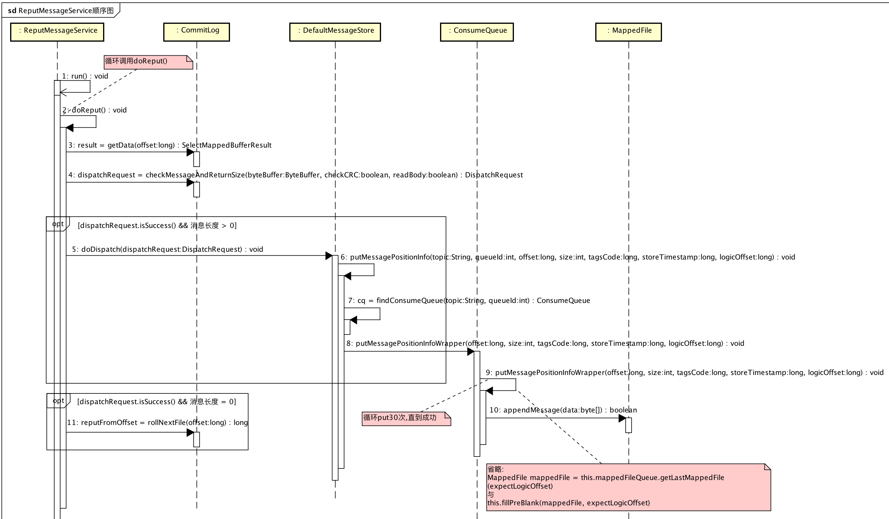

# 1、概述

# 2、ConsumeQueue

## ReputMessageService




# 3、Broker 提供[拉取消息]接口

## PullMessageRequestHeader

```Java
  1: public class PullMessageRequestHeader implements CommandCustomHeader {
  2:     /**
  3:      * 消费者分组
  4:      */
  5:     @CFNotNull
  6:     private String consumerGroup;
  7:     /**
  8:      * Topic
  9:      */
 10:     @CFNotNull
 11:     private String topic;
 12:     /**
 13:      * 队列编号
 14:      */
 15:     @CFNotNull
 16:     private Integer queueId;
 17:     /**
 18:      * 队列开始位置
 19:      */
 20:     @CFNotNull
 21:     private Long queueOffset;
 22:     /**
 23:      * 消息数量
 24:      */
 25:     @CFNotNull
 26:     private Integer maxMsgNums;
 27:     /**
 28:      * 系统标识
 29:      */
 30:     @CFNotNull
 31:     private Integer sysFlag;
 32:     /**
 33:      * 提交消费进度位置
 34:      */
 35:     @CFNotNull
 36:     private Long commitOffset;
 37:     /**
 38:      * 挂起超时时间
 39:      */
 40:     @CFNotNull
 41:     private Long suspendTimeoutMillis;
 42:     /**
 43:      * 订阅表达式
 44:      */
 45:     @CFNullable
 46:     private String subscription;
 47:     /**
 48:      * 订阅版本号
 49:      */
 50:     @CFNotNull
 51:     private Long subVersion;
 52: }
```

* 说明：拉取消息请求Header
* topic +  queueId + queueOffset + maxMsgNums
* sysFlag ：系统标识。
    * 第 0 位 `FLAG_COMMIT_OFFSET` ：标记请求提交消费进度位置，和 `commitOffset` 配合。
    * 第 1 位 `FLAG_SUSPEND` ：标记请求是否挂起请求，和 `suspendTimeoutMillis` 配合。当拉取不到消息时， `Broker` 会挂起请求，直到有消息。最大挂起时间：`suspendTimeoutMillis` 毫秒。
    * 第 2 位 `FLAG_SUBSCRIPTION` ：是否过滤订阅表达式，和 `subscription` 配置。
* subVersion ：订阅版本号。请求时，如果版本号不对，则无法拉取到消息，需要重新获取订阅信息，使用最新的订阅版本号。

## PullMessageProcessor#processRequest(...)

```Java
  1: private RemotingCommand processRequest(final Channel channel, RemotingCommand request, boolean brokerAllowSuspend)
  2:     throws RemotingCommandException {
  3:     RemotingCommand response = RemotingCommand.createResponseCommand(PullMessageResponseHeader.class);
  4:     final PullMessageResponseHeader responseHeader = (PullMessageResponseHeader) response.readCustomHeader();
  5:     final PullMessageRequestHeader requestHeader =
  6:         (PullMessageRequestHeader) request.decodeCommandCustomHeader(PullMessageRequestHeader.class);
  7: 
  8:     response.setOpaque(request.getOpaque());
  9: 
 10:     if (LOG.isDebugEnabled()) {
 11:         LOG.debug("receive PullMessage request command, {}", request);
 12:     }
 13: 
 14:     // 校验 broker 是否可读
 15:     if (!PermName.isReadable(this.brokerController.getBrokerConfig().getBrokerPermission())) {
 16:         response.setCode(ResponseCode.NO_PERMISSION);
 17:         response.setRemark(String.format("the broker[%s] pulling message is forbidden", this.brokerController.getBrokerConfig().getBrokerIP1()));
 18:         return response;
 19:     }
 20: 
 21:     // 校验 consumer分组配置 是否存在
 22:     SubscriptionGroupConfig subscriptionGroupConfig = this.brokerController.getSubscriptionGroupManager().findSubscriptionGroupConfig(requestHeader.getConsumerGroup());
 23:     if (null == subscriptionGroupConfig) {
 24:         response.setCode(ResponseCode.SUBSCRIPTION_GROUP_NOT_EXIST);
 25:         response.setRemark(String.format("subscription group [%s] does not exist, %s", requestHeader.getConsumerGroup(), FAQUrl.suggestTodo(FAQUrl.SUBSCRIPTION_GROUP_NOT_EXIST)));
 26:         return response;
 27:     }
 28:     // 校验 consumer分组配置 是否可消费
 29:     if (!subscriptionGroupConfig.isConsumeEnable()) {
 30:         response.setCode(ResponseCode.NO_PERMISSION);
 31:         response.setRemark("subscription group no permission, " + requestHeader.getConsumerGroup());
 32:         return response;
 33:     }
 34: 
 35:     final boolean hasSuspendFlag = PullSysFlag.hasSuspendFlag(requestHeader.getSysFlag()); // 是否挂起请求，当没有消息时
 36:     final boolean hasCommitOffsetFlag = PullSysFlag.hasCommitOffsetFlag(requestHeader.getSysFlag()); // 是否提交消费进度
 37:     final boolean hasSubscriptionFlag = PullSysFlag.hasSubscriptionFlag(requestHeader.getSysFlag()); // 是否过滤订阅表达式(subscription)
 38:     final long suspendTimeoutMillisLong = hasSuspendFlag ? requestHeader.getSuspendTimeoutMillis() : 0; // 挂起请求超时时长
 39: 
 40:     // 校验 topic配置 存在
 41:     TopicConfig topicConfig = this.brokerController.getTopicConfigManager().selectTopicConfig(requestHeader.getTopic());
 42:     if (null == topicConfig) {
 43:         LOG.error("The topic {} not exist, consumer: {} ", requestHeader.getTopic(), RemotingHelper.parseChannelRemoteAddr(channel));
 44:         response.setCode(ResponseCode.TOPIC_NOT_EXIST);
 45:         response.setRemark(String.format("topic[%s] not exist, apply first please! %s", requestHeader.getTopic(), FAQUrl.suggestTodo(FAQUrl.APPLY_TOPIC_URL)));
 46:         return response;
 47:     }
 48:     // 校验 topic配置 权限可读
 49:     if (!PermName.isReadable(topicConfig.getPerm())) {
 50:         response.setCode(ResponseCode.NO_PERMISSION);
 51:         response.setRemark("the topic[" + requestHeader.getTopic() + "] pulling message is forbidden");
 52:         return response;
 53:     }
 54:     // 校验 读取队列 在 topic配置 队列范围内
 55:     if (requestHeader.getQueueId() < 0 || requestHeader.getQueueId() >= topicConfig.getReadQueueNums()) {
 56:         String errorInfo = String.format("queueId[%d] is illegal, topic:[%s] topicConfig.readQueueNums:[%d] consumer:[%s]",
 57:                 requestHeader.getQueueId(), requestHeader.getTopic(), topicConfig.getReadQueueNums(), channel.remoteAddress());
 58:         LOG.warn(errorInfo);
 59:         response.setCode(ResponseCode.SYSTEM_ERROR);
 60:         response.setRemark(errorInfo);
 61:         return response;
 62:     }
 63: 
 64:     // 校验 订阅关系
 65:     SubscriptionData subscriptionData;
 66:     if (hasSubscriptionFlag) {
 67:         try {
 68:             subscriptionData = FilterAPI.buildSubscriptionData(requestHeader.getConsumerGroup(), requestHeader.getTopic(),
 69:                 requestHeader.getSubscription());
 70:         } catch (Exception e) {
 71:             LOG.warn("Parse the consumer's subscription[{}] failed, group: {}", requestHeader.getSubscription(), //
 72:                     requestHeader.getConsumerGroup());
 73:             response.setCode(ResponseCode.SUBSCRIPTION_PARSE_FAILED);
 74:             response.setRemark("parse the consumer's subscription failed");
 75:             return response;
 76:         }
 77:     } else {
 78:         // 校验 消费分组信息 是否存在
 79:         ConsumerGroupInfo consumerGroupInfo = this.brokerController.getConsumerManager().getConsumerGroupInfo(requestHeader.getConsumerGroup());
 80:         if (null == consumerGroupInfo) {
 81:             LOG.warn("The consumer's group info not exist, group: {}", requestHeader.getConsumerGroup());
 82:             response.setCode(ResponseCode.SUBSCRIPTION_NOT_EXIST);
 83:             response.setRemark("the consumer's group info not exist" + FAQUrl.suggestTodo(FAQUrl.SAME_GROUP_DIFFERENT_TOPIC));
 84:             return response;
 85:         }
 86:         // 校验 消费分组信息 消息模型是否匹配
 87:         if (!subscriptionGroupConfig.isConsumeBroadcastEnable() //
 88:             && consumerGroupInfo.getMessageModel() == MessageModel.BROADCASTING) {
 89:             response.setCode(ResponseCode.NO_PERMISSION);
 90:             response.setRemark("the consumer group[" + requestHeader.getConsumerGroup() + "] can not consume by broadcast way");
 91:             return response;
 92:         }
 93: 
 94:         // 校验 订阅信息 是否存在
 95:         subscriptionData = consumerGroupInfo.findSubscriptionData(requestHeader.getTopic());
 96:         if (null == subscriptionData) {
 97:             LOG.warn("The consumer's subscription not exist, group: {}, topic:{}", requestHeader.getConsumerGroup(), requestHeader.getTopic());
 98:             response.setCode(ResponseCode.SUBSCRIPTION_NOT_EXIST);
 99:             response.setRemark("the consumer's subscription not exist" + FAQUrl.suggestTodo(FAQUrl.SAME_GROUP_DIFFERENT_TOPIC));
100:             return response;
101:         }
102:         // 校验 订阅信息版本 是否合法
103:         if (subscriptionData.getSubVersion() < requestHeader.getSubVersion()) {
104:             LOG.warn("The broker's subscription is not latest, group: {} {}", requestHeader.getConsumerGroup(),
105:                     subscriptionData.getSubString());
106:             response.setCode(ResponseCode.SUBSCRIPTION_NOT_LATEST);
107:             response.setRemark("the consumer's subscription not latest");
108:             return response;
109:         }
110:     }
111: 
112:     // 获取消息
113:     final GetMessageResult getMessageResult = this.brokerController.getMessageStore().getMessage(requestHeader.getConsumerGroup(), requestHeader.getTopic(),
114:             requestHeader.getQueueId(), requestHeader.getQueueOffset(), requestHeader.getMaxMsgNums(), subscriptionData);
115:     if (getMessageResult != null) {
116:         response.setRemark(getMessageResult.getStatus().name());
117:         responseHeader.setNextBeginOffset(getMessageResult.getNextBeginOffset());
118:         responseHeader.setMinOffset(getMessageResult.getMinOffset());
119:         responseHeader.setMaxOffset(getMessageResult.getMaxOffset());
120: 
121:         // TODO 待读
122:         // 计算建议读取brokerId
123:         if (getMessageResult.isSuggestPullingFromSlave()) {
124:             responseHeader.setSuggestWhichBrokerId(subscriptionGroupConfig.getWhichBrokerWhenConsumeSlowly());
125:         } else {
126:             responseHeader.setSuggestWhichBrokerId(MixAll.MASTER_ID);
127:         }
128: 
129:         switch (this.brokerController.getMessageStoreConfig().getBrokerRole()) {
130:             case ASYNC_MASTER:
131:             case SYNC_MASTER:
132:                 break;
133:             case SLAVE:
134:                 if (!this.brokerController.getBrokerConfig().isSlaveReadEnable()) { // 从节点不允许读取，告诉consumer读取主节点。
135:                     response.setCode(ResponseCode.PULL_RETRY_IMMEDIATELY);
136:                     responseHeader.setSuggestWhichBrokerId(MixAll.MASTER_ID);
137:                 }
138:                 break;
139:         }
140: 
141:         if (this.brokerController.getBrokerConfig().isSlaveReadEnable()) {
142:             // consume too slow ,redirect to another machine
143:             if (getMessageResult.isSuggestPullingFromSlave()) {
144:                 responseHeader.setSuggestWhichBrokerId(subscriptionGroupConfig.getWhichBrokerWhenConsumeSlowly());
145:             }
146:             // consume ok
147:             else {
148:                 responseHeader.setSuggestWhichBrokerId(subscriptionGroupConfig.getBrokerId());
149:             }
150:         } else {
151:             responseHeader.setSuggestWhichBrokerId(MixAll.MASTER_ID);
152:         }
153: 
154:         switch (getMessageResult.getStatus()) {
155:             case FOUND:
156:                 response.setCode(ResponseCode.SUCCESS);
157:                 break;
158:             case MESSAGE_WAS_REMOVING:
159:                 response.setCode(ResponseCode.PULL_RETRY_IMMEDIATELY);
160:                 break;
161:             case NO_MATCHED_LOGIC_QUEUE: // TODO 待补充博客
162:             case NO_MESSAGE_IN_QUEUE: // TODO 待补充博客
163:                 if (0 != requestHeader.getQueueOffset()) {
164:                     response.setCode(ResponseCode.PULL_OFFSET_MOVED);
165: 
166:                     // XXX: warn and notify me
167:                     LOG.info("the broker store no queue data, fix the request offset {} to {}, Topic: {} QueueId: {} Consumer Group: {}", //
168:                         requestHeader.getQueueOffset(), //
169:                         getMessageResult.getNextBeginOffset(), //
170:                         requestHeader.getTopic(), //
171:                         requestHeader.getQueueId(), //
172:                         requestHeader.getConsumerGroup()//
173:                     );
174:                 } else {
175:                     response.setCode(ResponseCode.PULL_NOT_FOUND);
176:                 }
177:                 break;
178:             case NO_MATCHED_MESSAGE:
179:                 response.setCode(ResponseCode.PULL_RETRY_IMMEDIATELY);
180:                 break;
181:             case OFFSET_FOUND_NULL:
182:                 response.setCode(ResponseCode.PULL_NOT_FOUND);
183:                 break;
184:             case OFFSET_OVERFLOW_BADLY: // TODO 待补充博客
185:                 response.setCode(ResponseCode.PULL_OFFSET_MOVED);
186:                 // XXX: warn and notify me
187:                 LOG.info("The request offset:{} over flow badly, broker max offset:{} , consumer: {}", requestHeader.getQueueOffset(), getMessageResult.getMaxOffset(), channel.remoteAddress());
188:                 break;
189:             case OFFSET_OVERFLOW_ONE: // TODO 待补充博客
190:                 response.setCode(ResponseCode.PULL_NOT_FOUND);
191:                 break;
192:             case OFFSET_TOO_SMALL: // TODO 待补充博客
193:                 response.setCode(ResponseCode.PULL_OFFSET_MOVED);
194:                 LOG.info("The request offset is too small. group={}, topic={}, requestOffset={}, brokerMinOffset={}, clientIp={}",
195:                     requestHeader.getConsumerGroup(), requestHeader.getTopic(), requestHeader.getQueueOffset(),
196:                     getMessageResult.getMinOffset(), channel.remoteAddress());
197:                 break;
198:             default:
199:                 assert false;
200:                 break;
201:         }
202: 
203:         // hook：before
204:         if (this.hasConsumeMessageHook()) {
205:             ConsumeMessageContext context = new ConsumeMessageContext();
206:             context.setConsumerGroup(requestHeader.getConsumerGroup());
207:             context.setTopic(requestHeader.getTopic());
208:             context.setQueueId(requestHeader.getQueueId());
209: 
210:             String owner = request.getExtFields().get(BrokerStatsManager.COMMERCIAL_OWNER);
211: 
212:             switch (response.getCode()) {
213:                 case ResponseCode.SUCCESS:
214:                     int commercialBaseCount = brokerController.getBrokerConfig().getCommercialBaseCount();
215:                     int incValue = getMessageResult.getMsgCount4Commercial() * commercialBaseCount;
216: 
217:                     context.setCommercialRcvStats(BrokerStatsManager.StatsType.RCV_SUCCESS);
218:                     context.setCommercialRcvTimes(incValue);
219:                     context.setCommercialRcvSize(getMessageResult.getBufferTotalSize());
220:                     context.setCommercialOwner(owner);
221: 
222:                     break;
223:                 case ResponseCode.PULL_NOT_FOUND:
224:                     if (!brokerAllowSuspend) {
225: 
226:                         context.setCommercialRcvStats(BrokerStatsManager.StatsType.RCV_EPOLLS);
227:                         context.setCommercialRcvTimes(1);
228:                         context.setCommercialOwner(owner);
229: 
230:                     }
231:                     break;
232:                 case ResponseCode.PULL_RETRY_IMMEDIATELY:
233:                 case ResponseCode.PULL_OFFSET_MOVED:
234:                     context.setCommercialRcvStats(BrokerStatsManager.StatsType.RCV_EPOLLS);
235:                     context.setCommercialRcvTimes(1);
236:                     context.setCommercialOwner(owner);
237:                     break;
238:                 default:
239:                     assert false;
240:                     break;
241:             }
242: 
243:             this.executeConsumeMessageHookBefore(context);
244:         }
245: 
246:         switch (response.getCode()) {
247:             case ResponseCode.SUCCESS:
248: 
249:                 this.brokerController.getBrokerStatsManager().incGroupGetNums(requestHeader.getConsumerGroup(), requestHeader.getTopic(),
250:                     getMessageResult.getMessageCount());
251:                 this.brokerController.getBrokerStatsManager().incGroupGetSize(requestHeader.getConsumerGroup(), requestHeader.getTopic(),
252:                     getMessageResult.getBufferTotalSize());
253:                 this.brokerController.getBrokerStatsManager().incBrokerGetNums(getMessageResult.getMessageCount());
254:                 // 读取消息
255:                 if (this.brokerController.getBrokerConfig().isTransferMsgByHeap()) { // 内存中
256:                     final long beginTimeMills = this.brokerController.getMessageStore().now();
257: 
258:                     final byte[] r = this.readGetMessageResult(getMessageResult, requestHeader.getConsumerGroup(), requestHeader.getTopic(), requestHeader.getQueueId());
259: 
260:                     this.brokerController.getBrokerStatsManager().incGroupGetLatency(requestHeader.getConsumerGroup(),
261:                         requestHeader.getTopic(), requestHeader.getQueueId(),
262:                         (int) (this.brokerController.getMessageStore().now() - beginTimeMills));
263:                     response.setBody(r);
264:                 } else { // zero-copy
265:                     try {
266:                         FileRegion fileRegion = new ManyMessageTransfer(response.encodeHeader(getMessageResult.getBufferTotalSize()), getMessageResult);
267:                         channel.writeAndFlush(fileRegion).addListener(new ChannelFutureListener() {
268:                             @Override
269:                             public void operationComplete(ChannelFuture future) throws Exception {
270:                                 getMessageResult.release();
271:                                 if (!future.isSuccess()) {
272:                                     LOG.error("Fail to transfer messages from page cache to {}", channel.remoteAddress(), future.cause());
273:                                 }
274:                             }
275:                         });
276:                     } catch (Throwable e) {
277:                         LOG.error("Error occurred when transferring messages from page cache", e);
278:                         getMessageResult.release();
279:                     }
280: 
281:                     response = null;
282:                 }
283:                 break;
284:             case ResponseCode.PULL_NOT_FOUND:
285:                 // 消息未查询到 && broker允许挂起请求 && 请求允许挂起
286:                 if (brokerAllowSuspend && hasSuspendFlag) {
287:                     long pollingTimeMills = suspendTimeoutMillisLong;
288:                     if (!this.brokerController.getBrokerConfig().isLongPollingEnable()) {
289:                         pollingTimeMills = this.brokerController.getBrokerConfig().getShortPollingTimeMills();
290:                     }
291: 
292:                     String topic = requestHeader.getTopic();
293:                     long offset = requestHeader.getQueueOffset();
294:                     int queueId = requestHeader.getQueueId();
295:                     PullRequest pullRequest = new PullRequest(request, channel, pollingTimeMills,
296:                         this.brokerController.getMessageStore().now(), offset, subscriptionData);
297:                     this.brokerController.getPullRequestHoldService().suspendPullRequest(topic, queueId, pullRequest);
298:                     response = null;
299:                     break;
300:                 }
301: 
302:             case ResponseCode.PULL_RETRY_IMMEDIATELY:
303:                 break;
304:             case ResponseCode.PULL_OFFSET_MOVED:
305:                 if (this.brokerController.getMessageStoreConfig().getBrokerRole() != BrokerRole.SLAVE
306:                     || this.brokerController.getMessageStoreConfig().isOffsetCheckInSlave()) { // TODO 待博客补充
307:                     MessageQueue mq = new MessageQueue();
308:                     mq.setTopic(requestHeader.getTopic());
309:                     mq.setQueueId(requestHeader.getQueueId());
310:                     mq.setBrokerName(this.brokerController.getBrokerConfig().getBrokerName());
311: 
312:                     OffsetMovedEvent event = new OffsetMovedEvent();
313:                     event.setConsumerGroup(requestHeader.getConsumerGroup());
314:                     event.setMessageQueue(mq);
315:                     event.setOffsetRequest(requestHeader.getQueueOffset());
316:                     event.setOffsetNew(getMessageResult.getNextBeginOffset());
317:                     this.generateOffsetMovedEvent(event);
318:                     LOG.warn(
319:                         "PULL_OFFSET_MOVED:correction offset. topic={}, groupId={}, requestOffset={}, newOffset={}, suggestBrokerId={}",
320:                         requestHeader.getTopic(), requestHeader.getConsumerGroup(), event.getOffsetRequest(), event.getOffsetNew(),
321:                         responseHeader.getSuggestWhichBrokerId());
322:                 } else {
323:                     responseHeader.setSuggestWhichBrokerId(subscriptionGroupConfig.getBrokerId());
324:                     response.setCode(ResponseCode.PULL_RETRY_IMMEDIATELY);
325:                     LOG.warn("PULL_OFFSET_MOVED:none correction. topic={}, groupId={}, requestOffset={}, suggestBrokerId={}",
326:                         requestHeader.getTopic(), requestHeader.getConsumerGroup(), requestHeader.getQueueOffset(),
327:                         responseHeader.getSuggestWhichBrokerId());
328:                 }
329: 
330:                 break;
331:             default:
332:                 assert false;
333:         }
334:     } else {
335:         response.setCode(ResponseCode.SYSTEM_ERROR);
336:         response.setRemark("store getMessage return null");
337:     }
338: 
339:     // 请求要求持久化进度 && broker非主，进行持久化进度。
340:     boolean storeOffsetEnable = brokerAllowSuspend;
341:     storeOffsetEnable = storeOffsetEnable && hasCommitOffsetFlag;
342:     storeOffsetEnable = storeOffsetEnable && this.brokerController.getMessageStoreConfig().getBrokerRole() != BrokerRole.SLAVE;
343:     if (storeOffsetEnable) {
344:         this.brokerController.getConsumerOffsetManager().commitOffset(RemotingHelper.parseChannelRemoteAddr(channel),
345:             requestHeader.getConsumerGroup(), requestHeader.getTopic(), requestHeader.getQueueId(), requestHeader.getCommitOffset());
346:     }
347:     return response;
348: }
```

* 说明：处理拉取消息请求，返回响应。
* 第 14 至 19 行 ：校验 `Broker` 是否可读。
* 第 21 至 33 行 ：校验 `SubscriptionGroupConfig`(订阅分组配置) 是否存在 && 可以消费。
* 第 35 至 38 行 ：处理 `PullMessageRequestHeader.sysFlag` 对应的标志位。
* 第 40 至 62 行 ：校验 `TopicConfig`(主题配置) 是否存在 && 可读 && 队列编号正确。
* 第 64 至 110 行 ：校验 `SubscriptionData`(订阅信息) 是否正确。
* 第 113 行 ：调用 `MessageStore#getMessage(...)` 获取 `GetMessageResult`(消息)。详细解析见：[MessageStore#getMessage(...)](#messagestoregetmessage)。
* 第 122 至 152 行 ：计算建议拉取消息 `brokerId` 。
* TODO GetMessageResult 说明 
* 第 204 至 244 行 ：`Hook` 逻辑，`#executeConsumeMessageHookBefore(...)` 。
* 第 247 至 283 行 ：拉取消息成功，即拉取到消息。
    * 第 255 至 263 行 ：方式一 ：调用 `readGetMessageResult(...)` 获取消息内容到堆内内存，设置到 响应`body`。
    * 第 265 至 281 行 ：方式二 ：基于 `zero-copy` 实现，直接响应，无需堆内内存，性能更优。TODO 
* 第 284 至 300 行 ：拉取不到消息，当满足条件 (`Broker` 允许挂起 && 请求要求挂起)，执行挂起请求。详细解析见：[PullRequestHoldService](#pullrequestholdservice)。
* 第 304 至 328 行 ：TODO
* 第 339 至 346 ：持久化消费进度，当满足 (`Broker` 非主 && 请求要求持久化进度)。详细解析见：[更新消费进度](#3broker-提供更新消费进度接口)。

## MessageStore#getMessage(...)

```Java
  1: /**
  2:  * 获取消息结果
  3:  *
  4:  * @param group 消费分组
  5:  * @param topic 主题
  6:  * @param queueId 队列编号
  7:  * @param offset 队列位置
  8:  * @param maxMsgNums 消息数量
  9:  * @param subscriptionData 订阅信息
 10:  * @return 消息结果
 11:  */
 12: public GetMessageResult getMessage(final String group, final String topic, final int queueId, final long offset, final int maxMsgNums,
 13:     final SubscriptionData subscriptionData) {
 14:     // 是否关闭
 15:     if (this.shutdown) {
 16:         log.warn("message store has shutdown, so getMessage is forbidden");
 17:         return null;
 18:     }
 19:     // 是否可读
 20:     if (!this.runningFlags.isReadable()) {
 21:         log.warn("message store is not readable, so getMessage is forbidden " + this.runningFlags.getFlagBits());
 22:         return null;
 23:     }
 24: 
 25:     long beginTime = this.getSystemClock().now();
 26: 
 27:     GetMessageStatus status = GetMessageStatus.NO_MESSAGE_IN_QUEUE;
 28:     long nextBeginOffset = offset;
 29:     long minOffset = 0;
 30:     long maxOffset = 0;
 31: 
 32:     GetMessageResult getResult = new GetMessageResult();
 33: 
 34:     final long maxOffsetPy = this.commitLog.getMaxOffset();
 35: 
 36:     // 获取消费队列
 37:     ConsumeQueue consumeQueue = findConsumeQueue(topic, queueId);
 38:     if (consumeQueue != null) {
 39:         minOffset = consumeQueue.getMinOffsetInQueue(); // 消费队列 最小队列编号
 40:         maxOffset = consumeQueue.getMaxOffsetInQueue(); // 消费队列 最大队列编号
 41: 
 42:         // 判断 队列位置(offset)
 43:         if (maxOffset == 0) { // 消费队列无消息
 44:             status = GetMessageStatus.NO_MESSAGE_IN_QUEUE;
 45:             nextBeginOffset = nextOffsetCorrection(offset, 0);
 46:         } else if (offset < minOffset) { // 查询offset 太小
 47:             status = GetMessageStatus.OFFSET_TOO_SMALL;
 48:             nextBeginOffset = nextOffsetCorrection(offset, minOffset);
 49:         } else if (offset == maxOffset) { // 查询offset 超过 消费队列 一个位置
 50:             status = GetMessageStatus.OFFSET_OVERFLOW_ONE;
 51:             nextBeginOffset = nextOffsetCorrection(offset, offset);
 52:         } else if (offset > maxOffset) { // 查询offset 超过 消费队列 太多(大于一个位置)
 53:             status = GetMessageStatus.OFFSET_OVERFLOW_BADLY;
 54:             if (0 == minOffset) { // TODO blog 这里是？？为啥0 == minOffset做了特殊判断
 55:                 nextBeginOffset = nextOffsetCorrection(offset, minOffset);
 56:             } else {
 57:                 nextBeginOffset = nextOffsetCorrection(offset, maxOffset);
 58:             }
 59:         } else {
 60:             // 获得 映射Buffer结果(MappedFile)
 61:             SelectMappedBufferResult bufferConsumeQueue = consumeQueue.getIndexBuffer(offset);
 62:             if (bufferConsumeQueue != null) {
 63:                 try {
 64:                     status = GetMessageStatus.NO_MATCHED_MESSAGE;
 65: 
 66:                     long nextPhyFileStartOffset = Long.MIN_VALUE; // commitLog下一个文件(MappedFile)对应的开始offset。
 67:                     long maxPhyOffsetPulling = 0; // 消息物理位置拉取到的最大offset
 68: 
 69:                     int i = 0;
 70:                     final int maxFilterMessageCount = 16000;
 71:                     final boolean diskFallRecorded = this.messageStoreConfig.isDiskFallRecorded();
 72:                     // 循环获取 消息位置信息
 73:                     for (; i < bufferConsumeQueue.getSize() && i < maxFilterMessageCount; i += ConsumeQueue.CQ_STORE_UNIT_SIZE) {
 74:                         long offsetPy = bufferConsumeQueue.getByteBuffer().getLong(); // 消息物理位置offset
 75:                         int sizePy = bufferConsumeQueue.getByteBuffer().getInt(); // 消息长度
 76:                         long tagsCode = bufferConsumeQueue.getByteBuffer().getLong(); // 消息tagsCode
 77:                         // 设置消息物理位置拉取到的最大offset
 78:                         maxPhyOffsetPulling = offsetPy;
 79:                         // 当 offsetPy 小于 nextPhyFileStartOffset 时，意味着对应的 Message 已经移除，所以直接continue，直到可读取的Message。
 80:                         if (nextPhyFileStartOffset != Long.MIN_VALUE) {
 81:                             if (offsetPy < nextPhyFileStartOffset)
 82:                                 continue;
 83:                         }
 84:                         // 校验 commitLog 是否需要硬盘，无法全部放在内存
 85:                         boolean isInDisk = checkInDiskByCommitOffset(offsetPy, maxOffsetPy);
 86:                         // 是否已经获得足够消息
 87:                         if (this.isTheBatchFull(sizePy, maxMsgNums, getResult.getBufferTotalSize(), getResult.getMessageCount(),
 88:                             isInDisk)) {
 89:                             break;
 90:                         }
 91:                         // 判断消息是否符合条件
 92:                         if (this.messageFilter.isMessageMatched(subscriptionData, tagsCode)) {
 93:                             // 从commitLog获取对应消息ByteBuffer
 94:                             SelectMappedBufferResult selectResult = this.commitLog.getMessage(offsetPy, sizePy);
 95:                             if (selectResult != null) {
 96:                                 this.storeStatsService.getGetMessageTransferedMsgCount().incrementAndGet();
 97:                                 getResult.addMessage(selectResult);
 98:                                 status = GetMessageStatus.FOUND;
 99:                                 nextPhyFileStartOffset = Long.MIN_VALUE;
100:                             } else {
101:                                 // 从commitLog无法读取到消息，说明该消息对应的文件（MappedFile）已经删除，计算下一个MappedFile的起始位置
102:                                 if (getResult.getBufferTotalSize() == 0) {
103:                                     status = GetMessageStatus.MESSAGE_WAS_REMOVING;
104:                                 }
105:                                 nextPhyFileStartOffset = this.commitLog.rollNextFile(offsetPy);
106:                             }
107:                         } else {
108:                             if (getResult.getBufferTotalSize() == 0) {
109:                                 status = GetMessageStatus.NO_MATCHED_MESSAGE;
110:                             }
111: 
112:                             if (log.isDebugEnabled()) {
113:                                 log.debug("message type not matched, client: " + subscriptionData + " server: " + tagsCode);
114:                             }
115:                         }
116:                     }
117:                     // 统计剩余可拉取消息字节数
118:                     if (diskFallRecorded) {
119:                         long fallBehind = maxOffsetPy - maxPhyOffsetPulling;
120:                         brokerStatsManager.recordDiskFallBehindSize(group, topic, queueId, fallBehind);
121:                     }
122:                     // 计算下次拉取消息的消息队列编号
123:                     nextBeginOffset = offset + (i / ConsumeQueue.CQ_STORE_UNIT_SIZE);
124:                     // 根据剩余可拉取消息字节数与内存判断是否建议读取从节点
125:                     long diff = maxOffsetPy - maxPhyOffsetPulling;
126:                     long memory = (long) (StoreUtil.TOTAL_PHYSICAL_MEMORY_SIZE
127:                             * (this.messageStoreConfig.getAccessMessageInMemoryMaxRatio() / 100.0));
128:                     getResult.setSuggestPullingFromSlave(diff > memory);
129:                 } finally {
130:                     bufferConsumeQueue.release();
131:                 }
132:             } else {
133:                 status = GetMessageStatus.OFFSET_FOUND_NULL;
134:                 nextBeginOffset = nextOffsetCorrection(offset, consumeQueue.rollNextFile(offset));
135:                 log.warn("consumer request topic: " + topic + "offset: " + offset + " minOffset: " + minOffset + " maxOffset: "
136:                     + maxOffset + ", but access logic queue failed.");
137:             }
138:         }
139:     } else {
140:         status = GetMessageStatus.NO_MATCHED_LOGIC_QUEUE;
141:         nextBeginOffset = nextOffsetCorrection(offset, 0);
142:     }
143:     // 统计
144:     if (GetMessageStatus.FOUND == status) {
145:         this.storeStatsService.getGetMessageTimesTotalFound().incrementAndGet();
146:     } else {
147:         this.storeStatsService.getGetMessageTimesTotalMiss().incrementAndGet();
148:     }
149:     long eclipseTime = this.getSystemClock().now() - beginTime;
150:     this.storeStatsService.setGetMessageEntireTimeMax(eclipseTime);
151:     // 设置返回结果
152:     getResult.setStatus(status);
153:     getResult.setNextBeginOffset(nextBeginOffset);
154:     getResult.setMaxOffset(maxOffset);
155:     getResult.setMinOffset(minOffset);
156:     return getResult;
157: }
158: 
159: /**
160:  * 根据 主题 + 队列编号 获取 消费队列
161:  *
162:  * @param topic 主题
163:  * @param queueId 队列编号
164:  * @return 消费队列
165:  */
166: public ConsumeQueue findConsumeQueue(String topic, int queueId) {
167:     // 获取 topic 对应的 所有消费队列
168:     ConcurrentHashMap<Integer, ConsumeQueue> map = consumeQueueTable.get(topic);
169:     if (null == map) {
170:         ConcurrentHashMap<Integer, ConsumeQueue> newMap = new ConcurrentHashMap<>(128);
171:         ConcurrentHashMap<Integer, ConsumeQueue> oldMap = consumeQueueTable.putIfAbsent(topic, newMap);
172:         if (oldMap != null) {
173:             map = oldMap;
174:         } else {
175:             map = newMap;
176:         }
177:     }
178:     // 获取 queueId 对应的 消费队列
179:     ConsumeQueue logic = map.get(queueId);
180:     if (null == logic) {
181:         ConsumeQueue newLogic = new ConsumeQueue(//
182:             topic, //
183:             queueId, //
184:             StorePathConfigHelper.getStorePathConsumeQueue(this.messageStoreConfig.getStorePathRootDir()), //
185:             this.getMessageStoreConfig().getMapedFileSizeConsumeQueue(), //
186:             this);
187:         ConsumeQueue oldLogic = map.putIfAbsent(queueId, newLogic);
188:         if (oldLogic != null) {
189:             logic = oldLogic;
190:         } else {
191:             logic = newLogic;
192:         }
193:     }
194: 
195:     return logic;
196: }
197: 
198: /**
199:  * 下一个获取队列offset修正
200:  * 修正条件：主节点 或者 从节点开启校验offset开关
201:  *
202:  * @param oldOffset 老队列offset
203:  * @param newOffset 新队列offset
204:  * @return 修正后的队列offset
205:  */
206: private long nextOffsetCorrection(long oldOffset, long newOffset) {
207:     long nextOffset = oldOffset;
208:     if (this.getMessageStoreConfig().getBrokerRole() != BrokerRole.SLAVE || this.getMessageStoreConfig().isOffsetCheckInSlave()) {
209:         nextOffset = newOffset;
210:     }
211:     return nextOffset;
212: }
213: 
214: /**
215:  * 校验 commitLog 是否需要硬盘，无法全部放在内存
216:  *
217:  * @param offsetPy commitLog 指定offset
218:  * @param maxOffsetPy commitLog 最大offset
219:  * @return 是否需要硬盘
220:  */
221: private boolean checkInDiskByCommitOffset(long offsetPy, long maxOffsetPy) {
222:     long memory = (long) (StoreUtil.TOTAL_PHYSICAL_MEMORY_SIZE * (this.messageStoreConfig.getAccessMessageInMemoryMaxRatio() / 100.0));
223:     return (maxOffsetPy - offsetPy) > memory;
224: }
225: 
226: /**
227:  * 判断获取消息是否已经满
228:  *
229:  * @param sizePy 字节数
230:  * @param maxMsgNums 最大消息数
231:  * @param bufferTotal 目前已经计算字节数
232:  * @param messageTotal 目前已经计算消息数
233:  * @param isInDisk 是否在硬盘中
234:  * @return 是否已满
235:  */
236: private boolean isTheBatchFull(int sizePy, int maxMsgNums, int bufferTotal, int messageTotal, boolean isInDisk) {
237:     if (0 == bufferTotal || 0 == messageTotal) {
238:         return false;
239:     }
240:     // 消息数量已经满足请求数量(maxMsgNums)
241:     if ((messageTotal + 1) >= maxMsgNums) {
242:         return true;
243:     }
244:     // 根据消息存储配置的最大传输字节数、最大传输消息数是否已满
245:     if (isInDisk) {
246:         if ((bufferTotal + sizePy) > this.messageStoreConfig.getMaxTransferBytesOnMessageInDisk()) {
247:             return true;
248:         }
249: 
250:         if ((messageTotal + 1) > this.messageStoreConfig.getMaxTransferCountOnMessageInDisk()) {
251:             return true;
252:         }
253:     } else {
254:         if ((bufferTotal + sizePy) > this.messageStoreConfig.getMaxTransferBytesOnMessageInMemory()) {
255:             return true;
256:         }
257: 
258:         if ((messageTotal + 1) > this.messageStoreConfig.getMaxTransferCountOnMessageInMemory()) {
259:             return true;
260:         }
261:     }
262: 
263:     return false;
264: }
```

* 说明 ：根据 消息分组(`group`) + 主题(`Topic`) + 队列编号(`queueId`) + 队列位置(`offset`) + 订阅信息(`subscriptionData`) 获取 指定条数(`maxMsgNums`) 消息(`Message`)。
* 第 14 至 18 行 ：判断 `Store` 是否处于关闭状态，若关闭，则无法获取消息。
* 第 19 至 23 行 ：判断当前运行状态是否可读，若不可读，则无法获取消息。
* 第 37 行 ：根据 主题(`Topic`) + 队列编号(`queueId`) 获取 消息队列(`ConsumeQueue`)。
    * `findConsumeQueue(...)` ：第 159 至 196 行。
* 第 43 至 58 行 ：各种队列位置(`offset`) 无法读取消息，并针对对应的情况，计算下一次 `Client` 队列拉取位置。
    * 第 43 至 45 行 ：消息队列无消息。
    * 第 46 至 48 行 ：查询的消息队列位置（`offset`） 太小。
    * 第 49 至 51 行 ：查询的消息队列位置（`offset`） 恰好等于 消息队列最大的队列位置。该情况是正常现象，相当于查询最新的消息。
    * 第 52 至 58 行 ：查询的消息队列位置（`offset`） 超过过多。
    * `nextOffsetCorrection(...)` ：第 198 至 212 行。
* 第 61 行 ：根据 消费队列位置(`offset`) 获取 对应的`MappedFile`。
* 第 72 至 128 行 ：**循环**获取 `消息位置信息`。
    * 第 74 至 76 行 ：读取每一个 `消息位置信息`。
    * 第 79 至 83 行 ：当 `offsetPy` 小于 `nextPhyFileStartOffset` 时，意味着对
应的 `Message` 已经移除，所以直接continue，直到可读取的 `Message`。
    * 第 84 至 90 行 ：判断是否已经获得足够的消息。
        * `checkInDiskByCommitOffset(...)` ：第 214 至 224 行。
        * `isTheBatchFull(...)` ：第 226 至 264 行。
* 第 92 行 ：判断消息是否符合条件。详细解析见：[DefaultMessageFilter#isMessageMatched(...)](defaultmessagefilterismessagematched)。
* 第 94 行 ：从 `CommitLog` 获取对应 `消息MappedByteBuffer`。
* 第 95 至 99 行 ：获取 `消息MappedByteBuffer` 成功。
* 第 100 至 106 行 ：获取 `消息MappedByteBuffer` 失败。从 `CommitLog` 无法读取到消息，说明 该消息对应的文件(`MappedFile`) 已经删除，此时计算下一个`MappedFile`的起始位置。**该逻辑需要配合（第 79 至 83 行）一起理解。**
* 第 117 至 120 行 ：统计剩余可拉取消息字节数。
* 第 123 行 ：计算下次拉取消息的消息队列编号。
* 第 124 至 128 行 ：根据剩余可拉取消息字节数与内存判断是否建议读取从节点。
* 第 130 行 ：释放 `bufferConsumeQueue` 对 `MappedFile` 的指向。此处 `MappedFile` 是 `ConsumeQueue` 里的文件，不是 `CommitLog` 下的文件。TODO
* 第 133 至 136 行 ：获得消费队列位置(`offset`) 获取 对应的`MappedFile` 为**空**，计算`ConsumeQueue` 从 `offset` 开始的下一个 `MappedFile` 对应的位置。
* 第 143 至 150 行 ：记录统计信息：消耗时间、拉取到消息/未拉取到消息次数。
* 第 151 至 156 行 ：设置返回结果并返回。 

## DefaultMessageFilter#isMessageMatched(...)

```Java
  1: public class DefaultMessageFilter implements MessageFilter {
  2: 
  3:     @Override
  4:     public boolean isMessageMatched(SubscriptionData subscriptionData, Long tagsCode) {
  5:         // 消息tagsCode 空
  6:         if (tagsCode == null) {
  7:             return true;
  8:         }
  9:         // 订阅数据 空
 10:         if (null == subscriptionData) {
 11:             return true;
 12:         }
 13:         // classFilter
 14:         if (subscriptionData.isClassFilterMode())
 15:             return true;
 16:         // 订阅表达式 全匹配
 17:         if (subscriptionData.getSubString().equals(SubscriptionData.SUB_ALL)) {
 18:             return true;
 19:         }
 20:         // 订阅数据code数组 是否包含 消息tagsCode
 21:         return subscriptionData.getCodeSet().contains(tagsCode.intValue());
 22:     }
 23: 
 24: }
```

* 说明 ：消息过滤器默认实现。

## PullRequestHoldService

```Java
  1: public class PullRequestHoldService extends ServiceThread {
  2: 
  3:     private static final Logger log = LoggerFactory.getLogger(LoggerName.BROKER_LOGGER_NAME);
  4: 
  5:     private static final String TOPIC_QUEUEID_SEPARATOR = "@";
  6: 
  7:     private final BrokerController brokerController;
  8: 
  9:     private final SystemClock systemClock = new SystemClock();
 10:     /**
 11:      * 消息过滤器
 12:      */
 13:     private final MessageFilter messageFilter = new DefaultMessageFilter();
 14:     /**
 15:      * 拉取消息请求集合
 16:      */
 17:     private ConcurrentHashMap<String/* topic@queueId */, ManyPullRequest> pullRequestTable =
 18:             new ConcurrentHashMap<>(1024);
 19: 
 20:     public PullRequestHoldService(final BrokerController brokerController) {
 21:         this.brokerController = brokerController;
 22:     }
 23: 
 24:     /**
 25:      * 添加拉取消息挂起请求
 26:      *
 27:      * @param topic 主题
 28:      * @param queueId 队列编号
 29:      * @param pullRequest 拉取消息请求
 30:      */
 31:     public void suspendPullRequest(final String topic, final int queueId, final PullRequest pullRequest) {
 32:         String key = this.buildKey(topic, queueId);
 33:         ManyPullRequest mpr = this.pullRequestTable.get(key);
 34:         if (null == mpr) {
 35:             mpr = new ManyPullRequest();
 36:             ManyPullRequest prev = this.pullRequestTable.putIfAbsent(key, mpr);
 37:             if (prev != null) {
 38:                 mpr = prev;
 39:             }
 40:         }
 41: 
 42:         mpr.addPullRequest(pullRequest);
 43:     }
 44: 
 45:     /**
 46:      * 根据 主题 + 队列编号 创建唯一标识
 47:      *
 48:      * @param topic 主题
 49:      * @param queueId 队列编号
 50:      * @return key
 51:      */
 52:     private String buildKey(final String topic, final int queueId) {
 53:         StringBuilder sb = new StringBuilder();
 54:         sb.append(topic);
 55:         sb.append(TOPIC_QUEUEID_SEPARATOR);
 56:         sb.append(queueId);
 57:         return sb.toString();
 58:     }
 59: 
 60:     @Override
 61:     public void run() {
 62:         log.info("{} service started", this.getServiceName());
 63:         while (!this.isStopped()) {
 64:             try {
 65:                 // 根据 长轮训 还是 短轮训 设置不同的等待时间
 66:                 if (this.brokerController.getBrokerConfig().isLongPollingEnable()) {
 67:                     this.waitForRunning(5 * 1000);
 68:                 } else {
 69:                     this.waitForRunning(this.brokerController.getBrokerConfig().getShortPollingTimeMills());
 70:                 }
 71:                 // 检查挂起请求是否有需要通知的
 72:                 long beginLockTimestamp = this.systemClock.now();
 73:                 this.checkHoldRequest();
 74:                 long costTime = this.systemClock.now() - beginLockTimestamp;
 75:                 if (costTime > 5 * 1000) {
 76:                     log.info("[NOTIFYME] check hold request cost {} ms.", costTime);
 77:                 }
 78:             } catch (Throwable e) {
 79:                 log.warn(this.getServiceName() + " service has exception. ", e);
 80:             }
 81:         }
 82: 
 83:         log.info("{} service end", this.getServiceName());
 84:     }
 85: 
 86:     @Override
 87:     public String getServiceName() {
 88:         return PullRequestHoldService.class.getSimpleName();
 89:     }
 90: 
 91:     /**
 92:      * 遍历挂起请求，检查是否有需要通知的请求。
 93:      */
 94:     private void checkHoldRequest() {
 95:         for (String key : this.pullRequestTable.keySet()) {
 96:             String[] kArray = key.split(TOPIC_QUEUEID_SEPARATOR);
 97:             if (2 == kArray.length) {
 98:                 String topic = kArray[0];
 99:                 int queueId = Integer.parseInt(kArray[1]);
100:                 final long offset = this.brokerController.getMessageStore().getMaxOffsetInQuque(topic, queueId);
101:                 try {
102:                     this.notifyMessageArriving(topic, queueId, offset);
103:                 } catch (Throwable e) {
104:                     log.error("check hold request failed. topic={}, queueId={}", topic, queueId, e);
105:                 }
106:             }
107:         }
108:     }
109: 
110:     /**
111:      * 检查是否有需要通知的请求
112:      *
113:      * @param topic 主题
114:      * @param queueId 队列编号
115:      * @param maxOffset 消费队列最大offset
116:      */
117:     public void notifyMessageArriving(final String topic, final int queueId, final long maxOffset) {
118:         notifyMessageArriving(topic, queueId, maxOffset, null);
119:     }
120: 
121:     /**
122:      * 检查是否有需要通知的请求
123:      *
124:      * @param topic 主题
125:      * @param queueId 队列编号
126:      * @param maxOffset 消费队列最大offset
127:      * @param tagsCode 过滤tagsCode
128:      */
129:     public void notifyMessageArriving(final String topic, final int queueId, final long maxOffset, final Long tagsCode) {
130:         String key = this.buildKey(topic, queueId);
131:         ManyPullRequest mpr = this.pullRequestTable.get(key);
132:         if (mpr != null) {
133:             //
134:             List<PullRequest> requestList = mpr.cloneListAndClear();
135:             if (requestList != null) {
136:                 List<PullRequest> replayList = new ArrayList<>(); // 不符合唤醒的请求数组
137: 
138:                 for (PullRequest request : requestList) {
139:                     // 如果 maxOffset 过小，则重新读取一次。
140:                     long newestOffset = maxOffset;
141:                     if (newestOffset <= request.getPullFromThisOffset()) {
142:                         newestOffset = this.brokerController.getMessageStore().getMaxOffsetInQuque(topic, queueId);
143:                     }
144:                     // 有新的匹配消息，唤醒请求，即再次拉取消息。
145:                     if (newestOffset > request.getPullFromThisOffset()) {
146:                         if (this.messageFilter.isMessageMatched(request.getSubscriptionData(), tagsCode)) {
147:                             try {
148:                                 this.brokerController.getPullMessageProcessor().executeRequestWhenWakeup(request.getClientChannel(),
149:                                     request.getRequestCommand());
150:                             } catch (Throwable e) {
151:                                 log.error("execute request when wakeup failed.", e);
152:                             }
153:                             continue;
154:                         }
155:                     }
156:                     // 超过挂起时间，唤醒请求，即再次拉取消息。
157:                     if (System.currentTimeMillis() >= (request.getSuspendTimestamp() + request.getTimeoutMillis())) {
158:                         try {
159:                             this.brokerController.getPullMessageProcessor().executeRequestWhenWakeup(request.getClientChannel(),
160:                                 request.getRequestCommand());
161:                         } catch (Throwable e) {
162:                             log.error("execute request when wakeup failed.", e);
163:                         }
164:                         continue;
165:                     }
166:                     // 不符合再次拉取的请求，再次添加回去
167:                     replayList.add(request);
168:                 }
169:                 // 添加回去
170:                 if (!replayList.isEmpty()) {
171:                     mpr.addPullRequest(replayList);
172:                 }
173:             }
174:         }
175:     }
176: }
```

* `PullRequestHoldService` 说明 ：拉取消息请求挂起维护线程服务。
* `suspendPullRequest(...)` 说明 ：添加拉取消息挂起请求到集合(`pullRequestTable`)。
* `run(...)` 说明 ：**定时**检查挂起请求是否有需要通知重新拉取消息并进行通知。
    * 第 65 至 70 行 ：根据`长轮训`or`短轮训`设置不同的等待时间。
    * 第 71 至 77 行 ：检查挂起请求是否有需要通知的。
* `checkHoldRequest(...)` 说明 ：遍历挂起请求，检查是否有需要通知的。
* `notifyMessageArriving(...)` 说明 ：检查**指定队列**是否有需要通知的请求。
    * 第 139 至 143 行 ：如果 `maxOffset` 过小，重新获取一次最新的。
    * 第 144 至 155 行 ：有新的匹配消息，唤醒请求，即再次拉取消息。
    * 第 156 至 165 行 ：超过挂起时间，唤醒请求，即再次拉取消息。
    * 第 148 || 159 行 ：唤醒请求，再次拉取消息。原先担心拉取消息时间过长，导致影响整个挂起请求的遍历，后面查看`executeRequestWhenWakeup(...)`，实际是丢到线程池进行一步的消息拉取，不会有性能上的问题。详细解析见：[PullMessageProcessor#executeRequestWhenWakeup(...)](pullmessageprocessorexecuterequestwhenwakeup)。
    * 第 166 至 172 行 ：不符合唤醒的请求重新添加到集合(`pullRequestTable`)。

## PullMessageProcessor#executeRequestWhenWakeup(...)

```Java
  1: public void executeRequestWhenWakeup(final Channel channel, final RemotingCommand request) throws RemotingCommandException {
  2:     Runnable run = new Runnable() {
  3:         @Override
  4:         public void run() {
  5:             try {
  6:                 // 调用拉取请求。本次调用，设置不挂起请求。
  7:                 final RemotingCommand response = PullMessageProcessor.this.processRequest(channel, request, false);
  8: 
  9:                 if (response != null) {
 10:                     response.setOpaque(request.getOpaque());
 11:                     response.markResponseType();
 12:                     try {
 13:                         channel.writeAndFlush(response).addListener(new ChannelFutureListener() {
 14:                             @Override
 15:                             public void operationComplete(ChannelFuture future) throws Exception {
 16:                                 if (!future.isSuccess()) {
 17:                                     LOG.error("ProcessRequestWrapper response to {} failed", future.channel().remoteAddress(), future.cause());
 18:                                     LOG.error(request.toString());
 19:                                     LOG.error(response.toString());
 20:                                 }
 21:                             }
 22:                         });
 23:                     } catch (Throwable e) {
 24:                         LOG.error("ProcessRequestWrapper process request over, but response failed", e);
 25:                         LOG.error(request.toString());
 26:                         LOG.error(response.toString());
 27:                     }
 28:                 }
 29:             } catch (RemotingCommandException e1) {
 30:                 LOG.error("ExecuteRequestWhenWakeup run", e1);
 31:             }
 32:         }
 33:     };
 34:     // 提交拉取请求到线程池
 35:     this.brokerController.getPullMessageExecutor().submit(new RequestTask(run, channel, request));
 36: }
```

* 说明 ：执行请求唤醒，即再次拉取消息。该方法调用线程池，因此，不会阻塞。
* 第 7 行 ：调用拉取消息请求。本次调用，设置即使请求不到消息，也不挂起请求。如果不设置，请求可能被无限挂起，被 `Broker` 不停循环。
* 第 35 行 ：**提交拉取消息请求到线程池**。

# 4、Broker 提供[更新消费进度]接口
# 5、Broker 提供[发回消息]接口
# 6、Consumer 调用[拉取消息]接口
# 7、Consumer 消费消息
# 8、Consumer 调用[发回消息]接口
# 9、Consumer 调用[更新消费进度]接口

