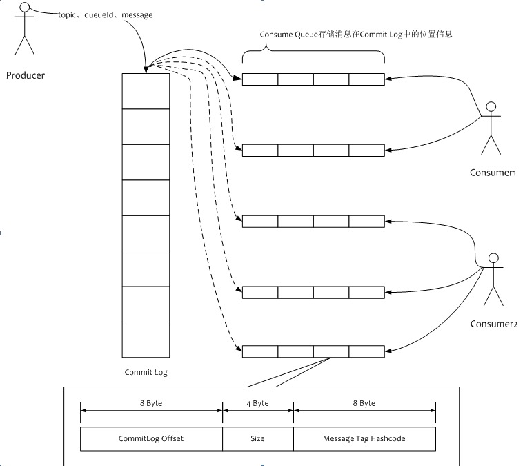
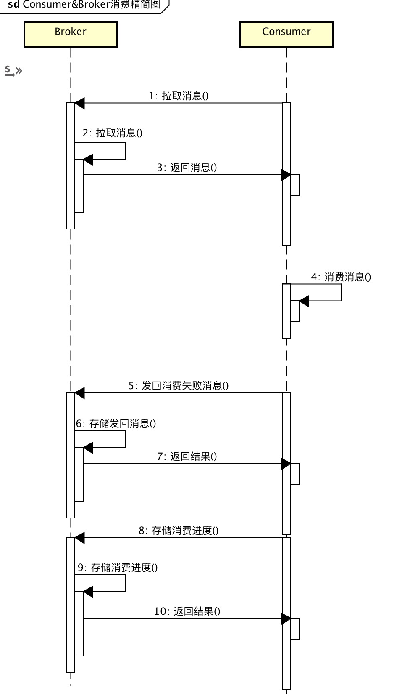
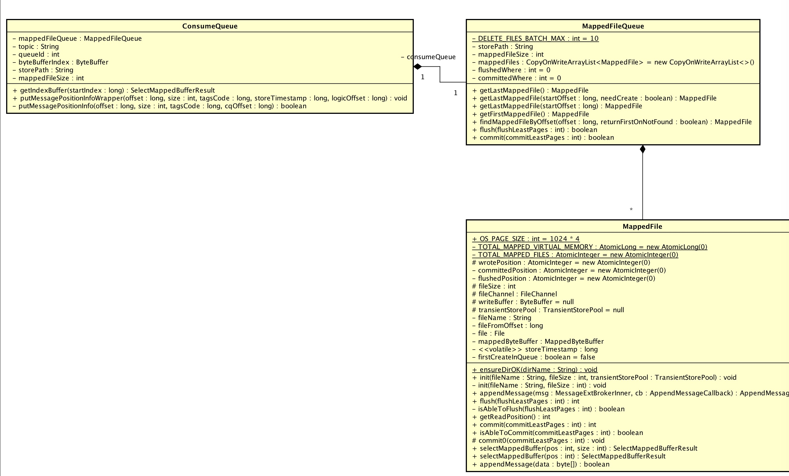
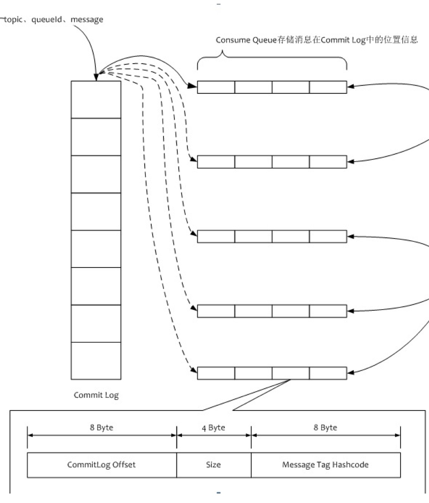
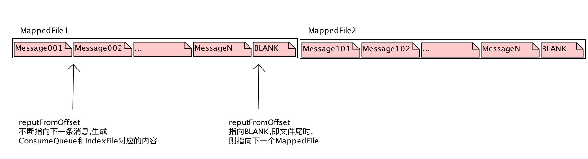
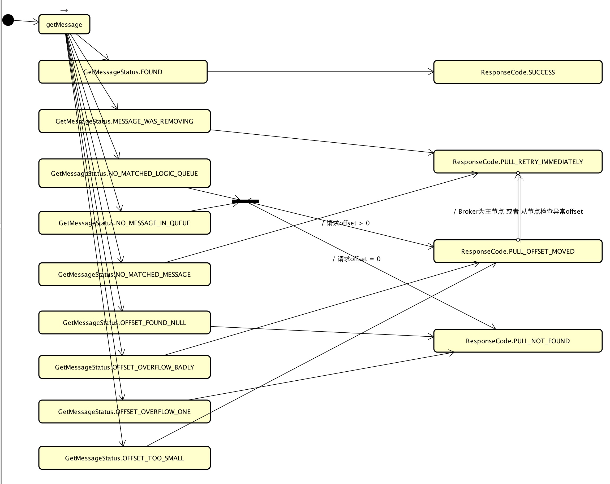

# 1、概述

本章主要解析 **消费** 逻辑涉及到的源码。
因为篇幅较长，分成上下两篇：

1. 上篇：`Broker` 相关源码。
2. 下篇：`Consumer` 相关源码。

*本文即是上篇。*

-------

ok，先看第一张关于消费逻辑的图：

> 

再看消费逻辑精简的顺序图（实际情况会略有差别）：

> 

# 2、ConsumeQueue 结构

`ConsumeQueue`、`MappedFileQueue`、`MappedFile` 的关系如下：

> 
`ConsumeQueue` : `MappedFileQueue` : `MappedFile` = 1 : 1 : N。

反应到系统文件如下：

```bash
Yunai-MacdeMacBook-Pro-2:consumequeue yunai$ pwd
/Users/yunai/store/consumequeue
Yunai-MacdeMacBook-Pro-2:consumequeue yunai$ cd TopicRead3/
Yunai-MacdeMacBook-Pro-2:TopicRead3 yunai$ ls -ls
total 0
0 drwxr-xr-x  3 yunai  staff  102  4 27 21:52 0
0 drwxr-xr-x  3 yunai  staff  102  4 27 21:55 1
0 drwxr-xr-x  3 yunai  staff  102  4 27 21:55 2
0 drwxr-xr-x  3 yunai  staff  102  4 27 21:55 3
Yunai-MacdeMacBook-Pro-2:TopicRead3 yunai$ cd 0/
Yunai-MacdeMacBook-Pro-2:0 yunai$ ls -ls
total 11720
11720 -rw-r--r--  1 yunai  staff  6000000  4 27 21:55 00000000000000000000
```

-------

`ConsumeQueue`、`MappedFileQueue`、`MappedFile` 的定义如下：

* `MappedFile` ：00000000000000000000等文件。
* `MappedFileQueue` ：`MappedFile` 所在的文件夹，对 `MappedFile` 进行封装成文件队列，对上层提供可无限使用的文件容量。
    * 每个 `MappedFile` 统一文件大小。
    * 文件命名方式：fileName[n] = fileName[n - 1] + mappedFileSize。在 `ConsumeQueue` 里默认为 6000000B。
* `ConsumeQueue` ：针对 `MappedFileQueue` 的封装使用。
    * `Store : ConsumeQueue = ConcurrentHashMap<String/* topic */, ConcurrentHashMap<Integer/* queueId */, ConsumeQueue>>`。

`ConsumeQueue` 存储在 `MappedFile` 的内容**必须**大小是 20B( `ConsumeQueue.CQ_STORE_UNIT_SIZE` )，有两种内容类型：

1. `MESSAGE_POSITION_INFO` ：消息位置信息。
2. `BLANK` : 文件前置空白占位。当历史 `Message` 被删除时，需要用 `BLANK`占位被删除的消息。

`MESSAGE_POSITION_INFO` 在 `ConsumeQueue` 存储结构：

| 第几位 | 字段 | 说明 | 数据类型 | 字节数 |
| :-- | :-- | :-- | :-- | :-- |
| 1 | offset | 消息 `CommitLog` 存储位置 | Long | 8 |
| 2 | size | 消息长度 | Int | 4 |
| 3 | tagsCode | 消息tagsCode | Long | 8 |

`BLANK` 在 `ConsumeQueue` 存储结构：

| 第几位 | 字段 | 说明 | 数据类型 | 字节数 |
| :-- | :-- | :-- | :-- | :-- |
| 1 | | 0 | Long | 8 |
| 2 | | Integer.MAX_VALUE | Int | 4 |
| 3 | | 0 | Long | 8 |

# 3、ConsumeQueue 存储



主要有两个组件：

* `ReputMessageService` ：write ConsumeQueue。
* `FlushConsumeQueueService` ：flush ConsumeQueue。

## ReputMessageService


```Java
  1: class ReputMessageService extends ServiceThread {
  2: 
  3:     /**
  4:      * 开始重放消息的CommitLog物理位置
  5:      */
  6:     private volatile long reputFromOffset = 0;
  7: 
  8:     public long getReputFromOffset() {
  9:         return reputFromOffset;
 10:     }
 11: 
 12:     public void setReputFromOffset(long reputFromOffset) {
 13:         this.reputFromOffset = reputFromOffset;
 14:     }
 15: 
 16:     @Override
 17:     public void shutdown() {
 18:         for (int i = 0; i < 50 && this.isCommitLogAvailable(); i++) {
 19:             try {
 20:                 Thread.sleep(100);
 21:             } catch (InterruptedException ignored) {
 22:             }
 23:         }
 24: 
 25:         if (this.isCommitLogAvailable()) {
 26:             log.warn("shutdown ReputMessageService, but commitlog have not finish to be dispatched, CL: {} reputFromOffset: {}",
 27:                 DefaultMessageStore.this.commitLog.getMaxOffset(), this.reputFromOffset);
 28:         }
 29: 
 30:         super.shutdown();
 31:     }
 32: 
 33:     /**
 34:      * 剩余需要重放消息字节数
 35:      *
 36:      * @return 字节数
 37:      */
 38:     public long behind() {
 39:         return DefaultMessageStore.this.commitLog.getMaxOffset() - this.reputFromOffset;
 40:     }
 41: 
 42:     /**
 43:      * 是否commitLog需要重放消息
 44:      *
 45:      * @return 是否
 46:      */
 47:     private boolean isCommitLogAvailable() {
 48:         return this.reputFromOffset < DefaultMessageStore.this.commitLog.getMaxOffset();
 49:     }
 50: 
 51:     private void doReput() {
 52:         for (boolean doNext = true; this.isCommitLogAvailable() && doNext; ) {
 53: 
 54:             // TODO 疑问：这个是啥
 55:             if (DefaultMessageStore.this.getMessageStoreConfig().isDuplicationEnable() //
 56:                 && this.reputFromOffset >= DefaultMessageStore.this.getConfirmOffset()) {
 57:                 break;
 58:             }
 59: 
 60:             // 获取从reputFromOffset开始的commitLog对应的MappeFile对应的MappedByteBuffer
 61:             SelectMappedBufferResult result = DefaultMessageStore.this.commitLog.getData(reputFromOffset);
 62:             if (result != null) {
 63:                 try {
 64:                     this.reputFromOffset = result.getStartOffset();
 65: 
 66:                     // 遍历MappedByteBuffer
 67:                     for (int readSize = 0; readSize < result.getSize() && doNext; ) {
 68:                         // 生成重放消息重放调度请求
 69:                         DispatchRequest dispatchRequest = DefaultMessageStore.this.commitLog.checkMessageAndReturnSize(result.getByteBuffer(), false, false);
 70:                         int size = dispatchRequest.getMsgSize(); // 消息长度
 71:                         // 根据请求的结果处理
 72:                         if (dispatchRequest.isSuccess()) { // 读取成功
 73:                             if (size > 0) { // 读取Message
 74:                                 DefaultMessageStore.this.doDispatch(dispatchRequest);
 75:                                 // 通知有新消息
 76:                                 if (BrokerRole.SLAVE != DefaultMessageStore.this.getMessageStoreConfig().getBrokerRole()
 77:                                     && DefaultMessageStore.this.brokerConfig.isLongPollingEnable()) {
 78:                                     DefaultMessageStore.this.messageArrivingListener.arriving(dispatchRequest.getTopic(),
 79:                                         dispatchRequest.getQueueId(), dispatchRequest.getConsumeQueueOffset() + 1,
 80:                                         dispatchRequest.getTagsCode());
 81:                                 }
 82:                                 // FIXED BUG By shijia
 83:                                 this.reputFromOffset += size;
 84:                                 readSize += size;
 85:                                 // 统计
 86:                                 if (DefaultMessageStore.this.getMessageStoreConfig().getBrokerRole() == BrokerRole.SLAVE) {
 87:                                     DefaultMessageStore.this.storeStatsService
 88:                                         .getSinglePutMessageTopicTimesTotal(dispatchRequest.getTopic()).incrementAndGet();
 89:                                     DefaultMessageStore.this.storeStatsService
 90:                                         .getSinglePutMessageTopicSizeTotal(dispatchRequest.getTopic())
 91:                                         .addAndGet(dispatchRequest.getMsgSize());
 92:                                 }
 93:                             } else if (size == 0) { // 读取到MappedFile文件尾
 94:                                 this.reputFromOffset = DefaultMessageStore.this.commitLog.rollNextFile(this.reputFromOffset);
 95:                                 readSize = result.getSize();
 96:                             }
 97:                         } else if (!dispatchRequest.isSuccess()) { // 读取失败
 98:                             if (size > 0) { // 读取到Message却不是Message
 99:                                 log.error("[BUG]read total count not equals msg total size. reputFromOffset={}", reputFromOffset);
100:                                 this.reputFromOffset += size;
101:                             } else { // 读取到Blank却不是Blank
102:                                 doNext = false;
103:                                 if (DefaultMessageStore.this.brokerConfig.getBrokerId() == MixAll.MASTER_ID) {
104:                                     log.error("[BUG]the master dispatch message to consume queue error, COMMITLOG OFFSET: {}",
105:                                         this.reputFromOffset);
106: 
107:                                     this.reputFromOffset += result.getSize() - readSize;
108:                                 }
109:                             }
110:                         }
111:                     }
112:                 } finally {
113:                     result.release();
114:                 }
115:             } else {
116:                 doNext = false;
117:             }
118:         }
119:     }
120: 
121:     @Override
122:     public void run() {
123:         DefaultMessageStore.log.info(this.getServiceName() + " service started");
124: 
125:         while (!this.isStopped()) {
126:             try {
127:                 Thread.sleep(1);
128:                 this.doReput();
129:             } catch (Exception e) {
130:                 DefaultMessageStore.log.warn(this.getServiceName() + " service has exception. ", e);
131:             }
132:         }
133: 
134:         DefaultMessageStore.log.info(this.getServiceName() + " service end");
135:     }
136: 
137:     @Override
138:     public String getServiceName() {
139:         return ReputMessageService.class.getSimpleName();
140:     }
141: 
142: }
```

* 说明：重放消息线程服务。
    * 该服务不断生成 消息位置信息 到 消费队列(ConsumeQueue)
    * 该服务不断生成 消息索引 到 索引文件(IndexFile)    
* 
    * 第 61 行 ：获取 `reputFromOffset` 开始的 `CommitLog` 对应的 `MappedFile` 对应的 `MappedByteBuffer`。
    * 第 67 行 ：遍历 `MappedByteBuffer`。
    * 第 69 行 ：生成重放消息重放调度请求 (`DispatchRequest`) 。请求里主要包含一条消息 (`Message`) 或者 文件尾 (`BLANK`) 的基本信息。
    * 第 72 至 96 行 ：请求是有效请求，进行逻辑处理。
        * 第 75 至 81 行 ：当 `Broker` 是主节点 && `Broker` 开启的是长轮询，通知消费队列有新的消息。`NotifyMessageArrivingListener` 会 调用 `PullRequestHoldService#notifyMessageArriving(...)` 方法，详细解析见：[PullRequestHoldService](#pullrequestholdservice)
    * 第 73 至 92 行 ：请求对应的是 `Message`，进行调度，生成 `ConsumeQueue` 和 `IndexFile` 对应的内容。详细解析见：
    * 第 93 至 96 行 ：请求对应的是 `Blank`，即文件尾，跳转指向下一个 `MappedFile`。
    * 第 97 至 110 行 ：请求是无效请求。出现该情况，基本是一个**BUG**。
* 第 127 至 128 行 ：每 1ms 循环执行重放逻辑。
* 第 18 至 30 行 ：`shutdown`时，多次 `sleep(100)` 直到 `CommitLog` 回放到最新位置。恩，如果未回放完，会输出警告日志。

### DefaultMessageStore#doDispatch(...)

```Java
  1: /**
  2:  * 执行调度请求
  3:  * 1. 非事务消息 或 事务提交消息 建立 消息位置信息 到 ConsumeQueue
  4:  * 2. 建立 索引信息 到 IndexFile
  5:  *
  6:  * @param req 调度请求
  7:  */
  8: public void doDispatch(DispatchRequest req) {
  9:     // 非事务消息 或 事务提交消息 建立 消息位置信息 到 ConsumeQueue
 10:     final int tranType = MessageSysFlag.getTransactionValue(req.getSysFlag());
 11:     switch (tranType) {
 12:         case MessageSysFlag.TRANSACTION_NOT_TYPE:
 13:         case MessageSysFlag.TRANSACTION_COMMIT_TYPE:
 14:             DefaultMessageStore.this.putMessagePositionInfo(req.getTopic(), req.getQueueId(), req.getCommitLogOffset(), req.getMsgSize(),
 15:                 req.getTagsCode(), req.getStoreTimestamp(), req.getConsumeQueueOffset());
 16:             break;
 17:         case MessageSysFlag.TRANSACTION_PREPARED_TYPE:
 18:         case MessageSysFlag.TRANSACTION_ROLLBACK_TYPE:
 19:             break;
 20:     }
 21:     // 建立 索引信息 到 IndexFile
 22:     if (DefaultMessageStore.this.getMessageStoreConfig().isMessageIndexEnable()) {
 23:         DefaultMessageStore.this.indexService.buildIndex(req);
 24:     }
 25: }
 26: 
 27: /**
 28:  * 建立 消息位置信息 到 ConsumeQueue
 29:  *
 30:  * @param topic 主题
 31:  * @param queueId 队列编号
 32:  * @param offset commitLog存储位置
 33:  * @param size 消息长度
 34:  * @param tagsCode 消息tagsCode
 35:  * @param storeTimestamp 存储时间
 36:  * @param logicOffset 队列位置
 37:  */
 38: public void putMessagePositionInfo(String topic, int queueId, long offset, int size, long tagsCode, long storeTimestamp,
 39:     long logicOffset) {
 40:     ConsumeQueue cq = this.findConsumeQueue(topic, queueId);
 41:     cq.putMessagePositionInfoWrapper(offset, size, tagsCode, storeTimestamp, logicOffset);
 42: }
```

### ConsumeQueue#putMessagePositionInfoWrapper(...)

```Java
  1: /**
  2:  * 添加位置信息封装
  3:  *
  4:  * @param offset commitLog存储位置
  5:  * @param size 消息长度
  6:  * @param tagsCode 消息tagsCode
  7:  * @param storeTimestamp 消息存储时间
  8:  * @param logicOffset 队列位置
  9:  */
 10: public void putMessagePositionInfoWrapper(long offset, int size, long tagsCode, long storeTimestamp,
 11:     long logicOffset) {
 12:     final int maxRetries = 30;
 13:     boolean canWrite = this.defaultMessageStore.getRunningFlags().isWriteable();
 14:     // 多次循环写，直到成功
 15:     for (int i = 0; i < maxRetries && canWrite; i++) {
 16:         // 调用添加位置信息
 17:         boolean result = this.putMessagePositionInfo(offset, size, tagsCode, logicOffset);
 18:         if (result) {
 19:             // 添加成功，使用消息存储时间 作为 存储check point。
 20:             this.defaultMessageStore.getStoreCheckpoint().setLogicsMsgTimestamp(storeTimestamp);
 21:             return;
 22:         } else {
 23:             // XXX: warn and notify me
 24:             log.warn("[BUG]put commit log position info to " + topic + ":" + queueId + " " + offset
 25:                 + " failed, retry " + i + " times");
 26: 
 27:             try {
 28:                 Thread.sleep(1000);
 29:             } catch (InterruptedException e) {
 30:                 log.warn("", e);
 31:             }
 32:         }
 33:     }
 34: 
 35:     // XXX: warn and notify me 设置异常不可写入
 36:     log.error("[BUG]consume queue can not write, {} {}", this.topic, this.queueId);
 37:     this.defaultMessageStore.getRunningFlags().makeLogicsQueueError();
 38: }
 39: 
 40: /**
 41:  * 添加位置信息，并返回添加是否成功
 42:  *
 43:  * @param offset commitLog存储位置
 44:  * @param size 消息长度
 45:  * @param tagsCode 消息tagsCode
 46:  * @param cqOffset 队列位置
 47:  * @return 是否成功
 48:  */
 49: private boolean putMessagePositionInfo(final long offset, final int size, final long tagsCode,
 50:     final long cqOffset) {
 51:     // 如果已经重放过，直接返回成功
 52:     if (offset <= this.maxPhysicOffset) {
 53:         return true;
 54:     }
 55:     // 写入位置信息到byteBuffer
 56:     this.byteBufferIndex.flip();
 57:     this.byteBufferIndex.limit(CQ_STORE_UNIT_SIZE);
 58:     this.byteBufferIndex.putLong(offset);
 59:     this.byteBufferIndex.putInt(size);
 60:     this.byteBufferIndex.putLong(tagsCode);
 61:     // 计算consumeQueue存储位置，并获得对应的MappedFile
 62:     final long expectLogicOffset = cqOffset * CQ_STORE_UNIT_SIZE;
 63:     MappedFile mappedFile = this.mappedFileQueue.getLastMappedFile(expectLogicOffset);
 64:     if (mappedFile != null) {
 65:         // 当是ConsumeQueue第一个MappedFile && 队列位置非第一个 && MappedFile未写入内容，则填充前置空白占位
 66:         if (mappedFile.isFirstCreateInQueue() && cqOffset != 0 && mappedFile.getWrotePosition() == 0) { // TODO 疑问：为啥这个操作。目前能够想象到的是，一些老的消息很久没发送，突然发送，这个时候刚好满足。
 67:             this.minLogicOffset = expectLogicOffset;
 68:             this.mappedFileQueue.setFlushedWhere(expectLogicOffset);
 69:             this.mappedFileQueue.setCommittedWhere(expectLogicOffset);
 70:             this.fillPreBlank(mappedFile, expectLogicOffset);
 71:             log.info("fill pre blank space " + mappedFile.getFileName() + " " + expectLogicOffset + " "
 72:                 + mappedFile.getWrotePosition());
 73:         }
 74:         // 校验consumeQueue存储位置是否合法。TODO 如果不合法，继续写入会不会有问题？
 75:         if (cqOffset != 0) {
 76:             long currentLogicOffset = mappedFile.getWrotePosition() + mappedFile.getFileFromOffset();
 77:             if (expectLogicOffset != currentLogicOffset) {
 78:                 LOG_ERROR.warn(
 79:                     "[BUG]logic queue order maybe wrong, expectLogicOffset: {} currentLogicOffset: {} Topic: {} QID: {} Diff: {}",
 80:                     expectLogicOffset,
 81:                     currentLogicOffset,
 82:                     this.topic,
 83:                     this.queueId,
 84:                     expectLogicOffset - currentLogicOffset
 85:                 );
 86:             }
 87:         }
 88:         // 设置commitLog重放消息到ConsumeQueue位置。
 89:         this.maxPhysicOffset = offset;
 90:         // 插入mappedFile
 91:         return mappedFile.appendMessage(this.byteBufferIndex.array());
 92:     }
 93:     return false;
 94: }
 95: 
 96: /**
 97:  * 填充前置空白占位
 98:  *
 99:  * @param mappedFile MappedFile
100:  * @param untilWhere consumeQueue存储位置
101:  */
102: private void fillPreBlank(final MappedFile mappedFile, final long untilWhere) {
103:     // 写入前置空白占位到byteBuffer
104:     ByteBuffer byteBuffer = ByteBuffer.allocate(CQ_STORE_UNIT_SIZE);
105:     byteBuffer.putLong(0L);
106:     byteBuffer.putInt(Integer.MAX_VALUE);
107:     byteBuffer.putLong(0L);
108:     // 循环填空
109:     int until = (int) (untilWhere % this.mappedFileQueue.getMappedFileSize());
110:     for (int i = 0; i < until; i += CQ_STORE_UNIT_SIZE) {
111:         mappedFile.appendMessage(byteBuffer.array());
112:     }
113: }
```

* `#putMessagePositionInfoWrapper(...)` 说明 ：添加位置信息到 `ConsumeQueue` 的封装，实际需要调用 `#putMessagePositionInfo(...)` 方法。
    * 第 13 行 ：判断 `ConsumeQueue` 是否允许写入。当发生Bug时，不允许写入。
    * 第 17 行 ：调用 `#putMessagePositionInfo(...)` 方法，添加位置信息。
    * 第 18 至 21 行 ：添加成功，使用消息存储时间 作为 存储检查点。`StoreCheckpoint` 的详细解析见：[Store初始化与关闭](https://github.com/YunaiV/Blog/blob/master/RocketMQ/1006-RocketMQ源码解析：Store初始化与关闭.md)。
    * 第 22 至 32 行 ：添加失败，目前基本可以认为是BUG。
    * 第 35 至 37 行 ：写入失败时，标记 `ConsumeQueue` 写入异常，不允许继续写入。
* `#putMessagePositionInfo(...)` 说明 ：添加位置信息到 `ConsumeQueue`，并返回添加是否成功。
    * 第 51 至 54 行 ：如果 `offset`(存储位置) 小于等于  `maxPhysicOffset`(`CommitLog` 消息重放到 `ConsumeQueue` 最大的 `CommitLog` 存储位置)，表示已经重放过，此时，不再重复写入，直接返回写入成功。
    * 第 55 至 60 行 ：写 位置信息到byteBuffer。
    * 第 62 至 63 行 ：计算 `ConsumeQueue`存储位置，并获得对应的MappedFile。
    * 第 65 至 73 行 ：当 `MappedFile` 是 `ConsumeQueue` 当前第一个文件 && `MappedFile` 未写入内容 && 重放消息队列位置大于0，则需要进行 `MappedFile` 填充前置  `BLANK`。
       * *这块比较有疑问，什么场景下会需要。猜测产生的原因：一个 `Topic` 长期无消息产生，突然N天后进行发送，`Topic` 对应的历史消息以及和消费队列数据已经被清理，新生成的`MappedFile`需要前置占位。*
    * 第 74 至 87 行 ：校验 `ConsumeQueue` 存储位置是否合法，不合法则输出日志。
        * *这块比较有疑问，如果计算出来的存储位置不合法，不返回添加失败，继续进行添加位置信息，会不会有问题？？？*
    * 第 89 行 ：设置 `CommitLog` 重放消息到 `ConsumeQueue` 的最大位置。
    * 第 91 行 ：插入消息位置到 `MappedFile`。

## FlushConsumeQueueService

```Java
  1: class FlushConsumeQueueService extends ServiceThread {
  2:     private static final int RETRY_TIMES_OVER = 3;
  3:     /**
  4:      * 最后flush时间戳
  5:      */
  6:     private long lastFlushTimestamp = 0;
  7: 
  8:     private void doFlush(int retryTimes) {
  9:         int flushConsumeQueueLeastPages = DefaultMessageStore.this.getMessageStoreConfig().getFlushConsumeQueueLeastPages();
 10: 
 11:         // retryTimes == RETRY_TIMES_OVER时，进行强制flush。主要用于shutdown时。
 12:         if (retryTimes == RETRY_TIMES_OVER) {
 13:             flushConsumeQueueLeastPages = 0;
 14:         }
 15:         // 当时间满足flushConsumeQueueThoroughInterval时，即使写入的数量不足flushConsumeQueueLeastPages，也进行flush
 16:         long logicsMsgTimestamp = 0;
 17:         int flushConsumeQueueThoroughInterval = DefaultMessageStore.this.getMessageStoreConfig().getFlushConsumeQueueThoroughInterval();
 18:         long currentTimeMillis = System.currentTimeMillis();
 19:         if (currentTimeMillis >= (this.lastFlushTimestamp + flushConsumeQueueThoroughInterval)) {
 20:             this.lastFlushTimestamp = currentTimeMillis;
 21:             flushConsumeQueueLeastPages = 0;
 22:             logicsMsgTimestamp = DefaultMessageStore.this.getStoreCheckpoint().getLogicsMsgTimestamp();
 23:         }
 24:         // flush消费队列
 25:         ConcurrentHashMap<String, ConcurrentHashMap<Integer, ConsumeQueue>> tables = DefaultMessageStore.this.consumeQueueTable;
 26:         for (ConcurrentHashMap<Integer, ConsumeQueue> maps : tables.values()) {
 27:             for (ConsumeQueue cq : maps.values()) {
 28:                 boolean result = false;
 29:                 for (int i = 0; i < retryTimes && !result; i++) {
 30:                     result = cq.flush(flushConsumeQueueLeastPages);
 31:                 }
 32:             }
 33:         }
 34:         // flush 存储 check point
 35:         if (0 == flushConsumeQueueLeastPages) {
 36:             if (logicsMsgTimestamp > 0) {
 37:                 DefaultMessageStore.this.getStoreCheckpoint().setLogicsMsgTimestamp(logicsMsgTimestamp);
 38:             }
 39:             DefaultMessageStore.this.getStoreCheckpoint().flush();
 40:         }
 41:     }
 42: 
 43:     public void run() {
 44:         DefaultMessageStore.log.info(this.getServiceName() + " service started");
 45: 
 46:         while (!this.isStopped()) {
 47:             try {
 48:                 int interval = DefaultMessageStore.this.getMessageStoreConfig().getFlushIntervalConsumeQueue();
 49:                 this.waitForRunning(interval);
 50:                 this.doFlush(1);
 51:             } catch (Exception e) {
 52:                 DefaultMessageStore.log.warn(this.getServiceName() + " service has exception. ", e);
 53:             }
 54:         }
 55: 
 56:         this.doFlush(RETRY_TIMES_OVER);
 57: 
 58:         DefaultMessageStore.log.info(this.getServiceName() + " service end");
 59:     }
 60: 
 61:     @Override
 62:     public String getServiceName() {
 63:         return FlushConsumeQueueService.class.getSimpleName();
 64:     }
 65: 
 66:     @Override
 67:     public long getJointime() {
 68:         return 1000 * 60;
 69:     }
 70: }
```

* 说明 ：flush `ConsumeQueue`(消费队列) 线程服务。
* 第 11 至 14 行 ：当 `retryTimes == RETRY_TIMES_OVER` 时，进行强制flush。用于 `shutdown` 时。
* 第 15 至 23 行 ：每 flushConsumeQueueThoroughInterval 周期，执行一次 flush 。因为不是每次循环到都能满足 flushConsumeQueueLeastPages 大小，因此，需要一定周期进行一次强制 flush 。当然，不能每次循环都去执行强制 flush，这样性能较差。
* 第 24 至 33 行 ：flush `ConsumeQueue`(消费队列)。
    * flush 逻辑：[MappedFile#落盘](https://github.com/YunaiV/Blog/blob/master/RocketMQ/1004-RocketMQ源码解析：Message存储.md#mappedfile落盘)。
* 第 34 至 40 行 ：flush `StoreCheckpoint`。`StoreCheckpoint` 的详细解析见：[Store初始化与关闭](https://github.com/YunaiV/Blog/blob/master/RocketMQ/1006-RocketMQ源码解析：Store初始化与关闭.md)。
* 第 43 至 59 行 ：每 1000ms 执行一次 `flush`。如果 wakeup() 时，则会立即进行一次 `flush`。目前，暂时不存在 wakeup() 的调用。

# 4、Broker 提供[拉取消息]接口

## PullMessageRequestHeader

```Java
  1: public class PullMessageRequestHeader implements CommandCustomHeader {
  2:     /**
  3:      * 消费者分组
  4:      */
  5:     @CFNotNull
  6:     private String consumerGroup;
  7:     /**
  8:      * Topic
  9:      */
 10:     @CFNotNull
 11:     private String topic;
 12:     /**
 13:      * 队列编号
 14:      */
 15:     @CFNotNull
 16:     private Integer queueId;
 17:     /**
 18:      * 队列开始位置
 19:      */
 20:     @CFNotNull
 21:     private Long queueOffset;
 22:     /**
 23:      * 消息数量
 24:      */
 25:     @CFNotNull
 26:     private Integer maxMsgNums;
 27:     /**
 28:      * 系统标识
 29:      */
 30:     @CFNotNull
 31:     private Integer sysFlag;
 32:     /**
 33:      * 提交消费进度位置
 34:      */
 35:     @CFNotNull
 36:     private Long commitOffset;
 37:     /**
 38:      * 挂起超时时间
 39:      */
 40:     @CFNotNull
 41:     private Long suspendTimeoutMillis;
 42:     /**
 43:      * 订阅表达式
 44:      */
 45:     @CFNullable
 46:     private String subscription;
 47:     /**
 48:      * 订阅版本号
 49:      */
 50:     @CFNotNull
 51:     private Long subVersion;
 52: }
```

* 说明：拉取消息请求Header
* topic +  queueId + queueOffset + maxMsgNums
* sysFlag ：系统标识。
    * 第 0 位 `FLAG_COMMIT_OFFSET` ：标记请求提交消费进度位置，和 `commitOffset` 配合。
    * 第 1 位 `FLAG_SUSPEND` ：标记请求是否挂起请求，和 `suspendTimeoutMillis` 配合。当拉取不到消息时， `Broker` 会挂起请求，直到有消息。最大挂起时间：`suspendTimeoutMillis` 毫秒。
    * 第 2 位 `FLAG_SUBSCRIPTION` ：是否过滤订阅表达式，和 `subscription` 配置。
* subVersion ：订阅版本号。请求时，如果版本号不对，则无法拉取到消息，需要重新获取订阅信息，使用最新的订阅版本号。

## PullMessageProcessor#processRequest(...)

```Java
  1: private RemotingCommand processRequest(final Channel channel, RemotingCommand request, boolean brokerAllowSuspend)
  2:     throws RemotingCommandException {
  3:     RemotingCommand response = RemotingCommand.createResponseCommand(PullMessageResponseHeader.class);
  4:     final PullMessageResponseHeader responseHeader = (PullMessageResponseHeader) response.readCustomHeader();
  5:     final PullMessageRequestHeader requestHeader =
  6:         (PullMessageRequestHeader) request.decodeCommandCustomHeader(PullMessageRequestHeader.class);
  7: 
  8:     response.setOpaque(request.getOpaque());
  9: 
 10:     if (LOG.isDebugEnabled()) {
 11:         LOG.debug("receive PullMessage request command, {}", request);
 12:     }
 13: 
 14:     // 校验 broker 是否可读
 15:     if (!PermName.isReadable(this.brokerController.getBrokerConfig().getBrokerPermission())) {
 16:         response.setCode(ResponseCode.NO_PERMISSION);
 17:         response.setRemark(String.format("the broker[%s] pulling message is forbidden", this.brokerController.getBrokerConfig().getBrokerIP1()));
 18:         return response;
 19:     }
 20: 
 21:     // 校验 consumer分组配置 是否存在
 22:     SubscriptionGroupConfig subscriptionGroupConfig = this.brokerController.getSubscriptionGroupManager().findSubscriptionGroupConfig(requestHeader.getConsumerGroup());
 23:     if (null == subscriptionGroupConfig) {
 24:         response.setCode(ResponseCode.SUBSCRIPTION_GROUP_NOT_EXIST);
 25:         response.setRemark(String.format("subscription group [%s] does not exist, %s", requestHeader.getConsumerGroup(), FAQUrl.suggestTodo(FAQUrl.SUBSCRIPTION_GROUP_NOT_EXIST)));
 26:         return response;
 27:     }
 28:     // 校验 consumer分组配置 是否可消费
 29:     if (!subscriptionGroupConfig.isConsumeEnable()) {
 30:         response.setCode(ResponseCode.NO_PERMISSION);
 31:         response.setRemark("subscription group no permission, " + requestHeader.getConsumerGroup());
 32:         return response;
 33:     }
 34: 
 35:     final boolean hasSuspendFlag = PullSysFlag.hasSuspendFlag(requestHeader.getSysFlag()); // 是否挂起请求，当没有消息时
 36:     final boolean hasCommitOffsetFlag = PullSysFlag.hasCommitOffsetFlag(requestHeader.getSysFlag()); // 是否提交消费进度
 37:     final boolean hasSubscriptionFlag = PullSysFlag.hasSubscriptionFlag(requestHeader.getSysFlag()); // 是否过滤订阅表达式(subscription)
 38:     final long suspendTimeoutMillisLong = hasSuspendFlag ? requestHeader.getSuspendTimeoutMillis() : 0; // 挂起请求超时时长
 39: 
 40:     // 校验 topic配置 存在
 41:     TopicConfig topicConfig = this.brokerController.getTopicConfigManager().selectTopicConfig(requestHeader.getTopic());
 42:     if (null == topicConfig) {
 43:         LOG.error("The topic {} not exist, consumer: {} ", requestHeader.getTopic(), RemotingHelper.parseChannelRemoteAddr(channel));
 44:         response.setCode(ResponseCode.TOPIC_NOT_EXIST);
 45:         response.setRemark(String.format("topic[%s] not exist, apply first please! %s", requestHeader.getTopic(), FAQUrl.suggestTodo(FAQUrl.APPLY_TOPIC_URL)));
 46:         return response;
 47:     }
 48:     // 校验 topic配置 权限可读
 49:     if (!PermName.isReadable(topicConfig.getPerm())) {
 50:         response.setCode(ResponseCode.NO_PERMISSION);
 51:         response.setRemark("the topic[" + requestHeader.getTopic() + "] pulling message is forbidden");
 52:         return response;
 53:     }
 54:     // 校验 读取队列 在 topic配置 队列范围内
 55:     if (requestHeader.getQueueId() < 0 || requestHeader.getQueueId() >= topicConfig.getReadQueueNums()) {
 56:         String errorInfo = String.format("queueId[%d] is illegal, topic:[%s] topicConfig.readQueueNums:[%d] consumer:[%s]",
 57:                 requestHeader.getQueueId(), requestHeader.getTopic(), topicConfig.getReadQueueNums(), channel.remoteAddress());
 58:         LOG.warn(errorInfo);
 59:         response.setCode(ResponseCode.SYSTEM_ERROR);
 60:         response.setRemark(errorInfo);
 61:         return response;
 62:     }
 63: 
 64:     // 校验 订阅关系
 65:     SubscriptionData subscriptionData;
 66:     if (hasSubscriptionFlag) {
 67:         try {
 68:             subscriptionData = FilterAPI.buildSubscriptionData(requestHeader.getConsumerGroup(), requestHeader.getTopic(),
 69:                 requestHeader.getSubscription());
 70:         } catch (Exception e) {
 71:             LOG.warn("Parse the consumer's subscription[{}] failed, group: {}", requestHeader.getSubscription(), //
 72:                     requestHeader.getConsumerGroup());
 73:             response.setCode(ResponseCode.SUBSCRIPTION_PARSE_FAILED);
 74:             response.setRemark("parse the consumer's subscription failed");
 75:             return response;
 76:         }
 77:     } else {
 78:         // 校验 消费分组信息 是否存在
 79:         ConsumerGroupInfo consumerGroupInfo = this.brokerController.getConsumerManager().getConsumerGroupInfo(requestHeader.getConsumerGroup());
 80:         if (null == consumerGroupInfo) {
 81:             LOG.warn("The consumer's group info not exist, group: {}", requestHeader.getConsumerGroup());
 82:             response.setCode(ResponseCode.SUBSCRIPTION_NOT_EXIST);
 83:             response.setRemark("the consumer's group info not exist" + FAQUrl.suggestTodo(FAQUrl.SAME_GROUP_DIFFERENT_TOPIC));
 84:             return response;
 85:         }
 86:         // 校验 消费分组信息 消息模型是否匹配
 87:         if (!subscriptionGroupConfig.isConsumeBroadcastEnable() //
 88:             && consumerGroupInfo.getMessageModel() == MessageModel.BROADCASTING) {
 89:             response.setCode(ResponseCode.NO_PERMISSION);
 90:             response.setRemark("the consumer group[" + requestHeader.getConsumerGroup() + "] can not consume by broadcast way");
 91:             return response;
 92:         }
 93: 
 94:         // 校验 订阅信息 是否存在
 95:         subscriptionData = consumerGroupInfo.findSubscriptionData(requestHeader.getTopic());
 96:         if (null == subscriptionData) {
 97:             LOG.warn("The consumer's subscription not exist, group: {}, topic:{}", requestHeader.getConsumerGroup(), requestHeader.getTopic());
 98:             response.setCode(ResponseCode.SUBSCRIPTION_NOT_EXIST);
 99:             response.setRemark("the consumer's subscription not exist" + FAQUrl.suggestTodo(FAQUrl.SAME_GROUP_DIFFERENT_TOPIC));
100:             return response;
101:         }
102:         // 校验 订阅信息版本 是否合法
103:         if (subscriptionData.getSubVersion() < requestHeader.getSubVersion()) {
104:             LOG.warn("The broker's subscription is not latest, group: {} {}", requestHeader.getConsumerGroup(),
105:                     subscriptionData.getSubString());
106:             response.setCode(ResponseCode.SUBSCRIPTION_NOT_LATEST);
107:             response.setRemark("the consumer's subscription not latest");
108:             return response;
109:         }
110:     }
111: 
112:     // 获取消息
113:     final GetMessageResult getMessageResult = this.brokerController.getMessageStore().getMessage(requestHeader.getConsumerGroup(), requestHeader.getTopic(),
114:             requestHeader.getQueueId(), requestHeader.getQueueOffset(), requestHeader.getMaxMsgNums(), subscriptionData);
115:     if (getMessageResult != null) {
116:         response.setRemark(getMessageResult.getStatus().name());
117:         responseHeader.setNextBeginOffset(getMessageResult.getNextBeginOffset());
118:         responseHeader.setMinOffset(getMessageResult.getMinOffset());
119:         responseHeader.setMaxOffset(getMessageResult.getMaxOffset());
120: 
121:         // TODO 待读
122:         // 计算建议读取brokerId
123:         if (getMessageResult.isSuggestPullingFromSlave()) {
124:             responseHeader.setSuggestWhichBrokerId(subscriptionGroupConfig.getWhichBrokerWhenConsumeSlowly());
125:         } else {
126:             responseHeader.setSuggestWhichBrokerId(MixAll.MASTER_ID);
127:         }
128: 
129:         switch (this.brokerController.getMessageStoreConfig().getBrokerRole()) {
130:             case ASYNC_MASTER:
131:             case SYNC_MASTER:
132:                 break;
133:             case SLAVE:
134:                 if (!this.brokerController.getBrokerConfig().isSlaveReadEnable()) { // 从节点不允许读取，告诉consumer读取主节点。
135:                     response.setCode(ResponseCode.PULL_RETRY_IMMEDIATELY);
136:                     responseHeader.setSuggestWhichBrokerId(MixAll.MASTER_ID);
137:                 }
138:                 break;
139:         }
140: 
141:         if (this.brokerController.getBrokerConfig().isSlaveReadEnable()) {
142:             // consume too slow ,redirect to another machine
143:             if (getMessageResult.isSuggestPullingFromSlave()) {
144:                 responseHeader.setSuggestWhichBrokerId(subscriptionGroupConfig.getWhichBrokerWhenConsumeSlowly());
145:             }
146:             // consume ok
147:             else {
148:                 responseHeader.setSuggestWhichBrokerId(subscriptionGroupConfig.getBrokerId());
149:             }
150:         } else {
151:             responseHeader.setSuggestWhichBrokerId(MixAll.MASTER_ID);
152:         }
153: 
154:         switch (getMessageResult.getStatus()) {
155:             case FOUND:
156:                 response.setCode(ResponseCode.SUCCESS);
157:                 break;
158:             case MESSAGE_WAS_REMOVING:
159:                 response.setCode(ResponseCode.PULL_RETRY_IMMEDIATELY);
160:                 break;
161:             case NO_MATCHED_LOGIC_QUEUE:
162:             case NO_MESSAGE_IN_QUEUE:
163:                 if (0 != requestHeader.getQueueOffset()) {
164:                     response.setCode(ResponseCode.PULL_OFFSET_MOVED);
165: 
166:                     // XXX: warn and notify me
167:                     LOG.info("the broker store no queue data, fix the request offset {} to {}, Topic: {} QueueId: {} Consumer Group: {}", //
168:                         requestHeader.getQueueOffset(), //
169:                         getMessageResult.getNextBeginOffset(), //
170:                         requestHeader.getTopic(), //
171:                         requestHeader.getQueueId(), //
172:                         requestHeader.getConsumerGroup()//
173:                     );
174:                 } else {
175:                     response.setCode(ResponseCode.PULL_NOT_FOUND);
176:                 }
177:                 break;
178:             case NO_MATCHED_MESSAGE:
179:                 response.setCode(ResponseCode.PULL_RETRY_IMMEDIATELY);
180:                 break;
181:             case OFFSET_FOUND_NULL:
182:                 response.setCode(ResponseCode.PULL_NOT_FOUND);
183:                 break;
184:             case OFFSET_OVERFLOW_BADLY:
185:                 response.setCode(ResponseCode.PULL_OFFSET_MOVED);
186:                 // XXX: warn and notify me
187:                 LOG.info("The request offset:{} over flow badly, broker max offset:{} , consumer: {}", requestHeader.getQueueOffset(), getMessageResult.getMaxOffset(), channel.remoteAddress());
188:                 break;
189:             case OFFSET_OVERFLOW_ONE:
190:                 response.setCode(ResponseCode.PULL_NOT_FOUND);
191:                 break;
192:             case OFFSET_TOO_SMALL:
193:                 response.setCode(ResponseCode.PULL_OFFSET_MOVED);
194:                 LOG.info("The request offset is too small. group={}, topic={}, requestOffset={}, brokerMinOffset={}, clientIp={}",
195:                     requestHeader.getConsumerGroup(), requestHeader.getTopic(), requestHeader.getQueueOffset(),
196:                     getMessageResult.getMinOffset(), channel.remoteAddress());
197:                 break;
198:             default:
199:                 assert false;
200:                 break;
201:         }
202: 
203:         // hook：before
204:         if (this.hasConsumeMessageHook()) {
205:             ConsumeMessageContext context = new ConsumeMessageContext();
206:             context.setConsumerGroup(requestHeader.getConsumerGroup());
207:             context.setTopic(requestHeader.getTopic());
208:             context.setQueueId(requestHeader.getQueueId());
209: 
210:             String owner = request.getExtFields().get(BrokerStatsManager.COMMERCIAL_OWNER);
211: 
212:             switch (response.getCode()) {
213:                 case ResponseCode.SUCCESS:
214:                     int commercialBaseCount = brokerController.getBrokerConfig().getCommercialBaseCount();
215:                     int incValue = getMessageResult.getMsgCount4Commercial() * commercialBaseCount;
216: 
217:                     context.setCommercialRcvStats(BrokerStatsManager.StatsType.RCV_SUCCESS);
218:                     context.setCommercialRcvTimes(incValue);
219:                     context.setCommercialRcvSize(getMessageResult.getBufferTotalSize());
220:                     context.setCommercialOwner(owner);
221: 
222:                     break;
223:                 case ResponseCode.PULL_NOT_FOUND:
224:                     if (!brokerAllowSuspend) {
225: 
226:                         context.setCommercialRcvStats(BrokerStatsManager.StatsType.RCV_EPOLLS);
227:                         context.setCommercialRcvTimes(1);
228:                         context.setCommercialOwner(owner);
229: 
230:                     }
231:                     break;
232:                 case ResponseCode.PULL_RETRY_IMMEDIATELY:
233:                 case ResponseCode.PULL_OFFSET_MOVED:
234:                     context.setCommercialRcvStats(BrokerStatsManager.StatsType.RCV_EPOLLS);
235:                     context.setCommercialRcvTimes(1);
236:                     context.setCommercialOwner(owner);
237:                     break;
238:                 default:
239:                     assert false;
240:                     break;
241:             }
242: 
243:             this.executeConsumeMessageHookBefore(context);
244:         }
245: 
246:         switch (response.getCode()) {
247:             case ResponseCode.SUCCESS:
248: 
249:                 this.brokerController.getBrokerStatsManager().incGroupGetNums(requestHeader.getConsumerGroup(), requestHeader.getTopic(),
250:                     getMessageResult.getMessageCount());
251:                 this.brokerController.getBrokerStatsManager().incGroupGetSize(requestHeader.getConsumerGroup(), requestHeader.getTopic(),
252:                     getMessageResult.getBufferTotalSize());
253:                 this.brokerController.getBrokerStatsManager().incBrokerGetNums(getMessageResult.getMessageCount());
254:                 // 读取消息
255:                 if (this.brokerController.getBrokerConfig().isTransferMsgByHeap()) { // 内存中
256:                     final long beginTimeMills = this.brokerController.getMessageStore().now();
257: 
258:                     final byte[] r = this.readGetMessageResult(getMessageResult, requestHeader.getConsumerGroup(), requestHeader.getTopic(), requestHeader.getQueueId());
259: 
260:                     this.brokerController.getBrokerStatsManager().incGroupGetLatency(requestHeader.getConsumerGroup(),
261:                         requestHeader.getTopic(), requestHeader.getQueueId(),
262:                         (int) (this.brokerController.getMessageStore().now() - beginTimeMills));
263:                     response.setBody(r);
264:                 } else { // zero-copy
265:                     try {
266:                         FileRegion fileRegion = new ManyMessageTransfer(response.encodeHeader(getMessageResult.getBufferTotalSize()), getMessageResult);
267:                         channel.writeAndFlush(fileRegion).addListener(new ChannelFutureListener() {
268:                             @Override
269:                             public void operationComplete(ChannelFuture future) throws Exception {
270:                                 getMessageResult.release();
271:                                 if (!future.isSuccess()) {
272:                                     LOG.error("Fail to transfer messages from page cache to {}", channel.remoteAddress(), future.cause());
273:                                 }
274:                             }
275:                         });
276:                     } catch (Throwable e) {
277:                         LOG.error("Error occurred when transferring messages from page cache", e);
278:                         getMessageResult.release();
279:                     }
280: 
281:                     response = null;
282:                 }
283:                 break;
284:             case ResponseCode.PULL_NOT_FOUND:
285:                 // 消息未查询到 && broker允许挂起请求 && 请求允许挂起
286:                 if (brokerAllowSuspend && hasSuspendFlag) {
287:                     long pollingTimeMills = suspendTimeoutMillisLong;
288:                     if (!this.brokerController.getBrokerConfig().isLongPollingEnable()) {
289:                         pollingTimeMills = this.brokerController.getBrokerConfig().getShortPollingTimeMills();
290:                     }
291: 
292:                     String topic = requestHeader.getTopic();
293:                     long offset = requestHeader.getQueueOffset();
294:                     int queueId = requestHeader.getQueueId();
295:                     PullRequest pullRequest = new PullRequest(request, channel, pollingTimeMills,
296:                         this.brokerController.getMessageStore().now(), offset, subscriptionData);
297:                     this.brokerController.getPullRequestHoldService().suspendPullRequest(topic, queueId, pullRequest);
298:                     response = null;
299:                     break;
300:                 }
301: 
302:             case ResponseCode.PULL_RETRY_IMMEDIATELY:
303:                 break;
304:             case ResponseCode.PULL_OFFSET_MOVED:
305:                 if (this.brokerController.getMessageStoreConfig().getBrokerRole() != BrokerRole.SLAVE
306:                     || this.brokerController.getMessageStoreConfig().isOffsetCheckInSlave()) { // TODO 待博客补充
307:                     MessageQueue mq = new MessageQueue();
308:                     mq.setTopic(requestHeader.getTopic());
309:                     mq.setQueueId(requestHeader.getQueueId());
310:                     mq.setBrokerName(this.brokerController.getBrokerConfig().getBrokerName());
311: 
312:                     OffsetMovedEvent event = new OffsetMovedEvent();
313:                     event.setConsumerGroup(requestHeader.getConsumerGroup());
314:                     event.setMessageQueue(mq);
315:                     event.setOffsetRequest(requestHeader.getQueueOffset());
316:                     event.setOffsetNew(getMessageResult.getNextBeginOffset());
317:                     this.generateOffsetMovedEvent(event);
318:                     LOG.warn(
319:                         "PULL_OFFSET_MOVED:correction offset. topic={}, groupId={}, requestOffset={}, newOffset={}, suggestBrokerId={}",
320:                         requestHeader.getTopic(), requestHeader.getConsumerGroup(), event.getOffsetRequest(), event.getOffsetNew(),
321:                         responseHeader.getSuggestWhichBrokerId());
322:                 } else {
323:                     responseHeader.setSuggestWhichBrokerId(subscriptionGroupConfig.getBrokerId());
324:                     response.setCode(ResponseCode.PULL_RETRY_IMMEDIATELY);
325:                     LOG.warn("PULL_OFFSET_MOVED:none correction. topic={}, groupId={}, requestOffset={}, suggestBrokerId={}",
326:                         requestHeader.getTopic(), requestHeader.getConsumerGroup(), requestHeader.getQueueOffset(),
327:                         responseHeader.getSuggestWhichBrokerId());
328:                 }
329: 
330:                 break;
331:             default:
332:                 assert false;
333:         }
334:     } else {
335:         response.setCode(ResponseCode.SYSTEM_ERROR);
336:         response.setRemark("store getMessage return null");
337:     }
338: 
339:     // 请求要求持久化进度 && broker非主，进行持久化进度。
340:     boolean storeOffsetEnable = brokerAllowSuspend;
341:     storeOffsetEnable = storeOffsetEnable && hasCommitOffsetFlag;
342:     storeOffsetEnable = storeOffsetEnable && this.brokerController.getMessageStoreConfig().getBrokerRole() != BrokerRole.SLAVE;
343:     if (storeOffsetEnable) {
344:         this.brokerController.getConsumerOffsetManager().commitOffset(RemotingHelper.parseChannelRemoteAddr(channel),
345:             requestHeader.getConsumerGroup(), requestHeader.getTopic(), requestHeader.getQueueId(), requestHeader.getCommitOffset());
346:     }
347:     return response;
348: }
```

* 说明：处理拉取消息请求，返回响应。
* 第 14 至 19 行 ：校验 `Broker` 是否可读。
* 第 21 至 33 行 ：校验 `SubscriptionGroupConfig`(订阅分组配置) 是否存在 && 可以消费。
* 第 35 至 38 行 ：处理 `PullMessageRequestHeader.sysFlag` 对应的标志位。
* 第 40 至 62 行 ：校验 `TopicConfig`(主题配置) 是否存在 && 可读 && 队列编号正确。
* 第 64 至 110 行 ：校验 `SubscriptionData`(订阅信息) 是否正确。
* 第 113 行 ：调用 `MessageStore#getMessage(...)` 获取 `GetMessageResult`(消息)。详细解析见：[MessageStore#getMessage(...)](#messagestoregetmessage)。
* 第 122 至 152 行 ：计算建议拉取消息 `brokerId` 。
* 第 154 至 201 行 ：
* 第 204 至 244 行 ：`Hook` 逻辑，`#executeConsumeMessageHookBefore(...)` 。
* 第 247 至 283 行 ：拉取消息成功，即拉取到消息。
    * 第 255 至 263 行 ：方式一 ：调用 `readGetMessageResult(...)` 获取消息内容到堆内内存，设置到 响应`body`。
    * 第 265 至 281 行 ：方式二 ：基于 `zero-copy` 实现，直接响应，无需堆内内存，性能更优。*TODO ：此处等对zero-copy有研究，再补充一些*。
* 第 284 至 300 行 ：拉取不到消息，当满足条件 (`Broker` 允许挂起 && 请求要求挂起)，执行挂起请求。详细解析见：[PullRequestHoldService](#pullrequestholdservice)。
* 第 304 至 328 行 ：*TODO ：此处等对`tools`模块研究后再补充*。
* 第 339 至 346 ：持久化消费进度，当满足 (`Broker` 非主 && 请求要求持久化进度)。详细解析见：[更新消费进度](#3broker-提供更新消费进度接口)。

## MessageStore#getMessage(...)

```Java
  1: /**
  2:  * 获取消息结果
  3:  *
  4:  * @param group 消费分组
  5:  * @param topic 主题
  6:  * @param queueId 队列编号
  7:  * @param offset 队列位置
  8:  * @param maxMsgNums 消息数量
  9:  * @param subscriptionData 订阅信息
 10:  * @return 消息结果
 11:  */
 12: public GetMessageResult getMessage(final String group, final String topic, final int queueId, final long offset, final int maxMsgNums,
 13:     final SubscriptionData subscriptionData) {
 14:     // 是否关闭
 15:     if (this.shutdown) {
 16:         log.warn("message store has shutdown, so getMessage is forbidden");
 17:         return null;
 18:     }
 19:     // 是否可读
 20:     if (!this.runningFlags.isReadable()) {
 21:         log.warn("message store is not readable, so getMessage is forbidden " + this.runningFlags.getFlagBits());
 22:         return null;
 23:     }
 24: 
 25:     long beginTime = this.getSystemClock().now();
 26: 
 27:     GetMessageStatus status = GetMessageStatus.NO_MESSAGE_IN_QUEUE;
 28:     long nextBeginOffset = offset;
 29:     long minOffset = 0;
 30:     long maxOffset = 0;
 31: 
 32:     GetMessageResult getResult = new GetMessageResult();
 33: 
 34:     final long maxOffsetPy = this.commitLog.getMaxOffset();
 35: 
 36:     // 获取消费队列
 37:     ConsumeQueue consumeQueue = findConsumeQueue(topic, queueId);
 38:     if (consumeQueue != null) {
 39:         minOffset = consumeQueue.getMinOffsetInQueue(); // 消费队列 最小队列编号
 40:         maxOffset = consumeQueue.getMaxOffsetInQueue(); // 消费队列 最大队列编号
 41: 
 42:         // 判断 队列位置(offset)
 43:         if (maxOffset == 0) { // 消费队列无消息
 44:             status = GetMessageStatus.NO_MESSAGE_IN_QUEUE;
 45:             nextBeginOffset = nextOffsetCorrection(offset, 0);
 46:         } else if (offset < minOffset) { // 查询offset 太小
 47:             status = GetMessageStatus.OFFSET_TOO_SMALL;
 48:             nextBeginOffset = nextOffsetCorrection(offset, minOffset);
 49:         } else if (offset == maxOffset) { // 查询offset 超过 消费队列 一个位置
 50:             status = GetMessageStatus.OFFSET_OVERFLOW_ONE;
 51:             nextBeginOffset = nextOffsetCorrection(offset, offset);
 52:         } else if (offset > maxOffset) { // 查询offset 超过 消费队列 太多(大于一个位置)
 53:             status = GetMessageStatus.OFFSET_OVERFLOW_BADLY;
 54:             if (0 == minOffset) { // TODO blog 这里是？？为啥0 == minOffset做了特殊判断
 55:                 nextBeginOffset = nextOffsetCorrection(offset, minOffset);
 56:             } else {
 57:                 nextBeginOffset = nextOffsetCorrection(offset, maxOffset);
 58:             }
 59:         } else {
 60:             // 获得 映射Buffer结果(MappedFile)
 61:             SelectMappedBufferResult bufferConsumeQueue = consumeQueue.getIndexBuffer(offset);
 62:             if (bufferConsumeQueue != null) {
 63:                 try {
 64:                     status = GetMessageStatus.NO_MATCHED_MESSAGE;
 65: 
 66:                     long nextPhyFileStartOffset = Long.MIN_VALUE; // commitLog下一个文件(MappedFile)对应的开始offset。
 67:                     long maxPhyOffsetPulling = 0; // 消息物理位置拉取到的最大offset
 68: 
 69:                     int i = 0;
 70:                     final int maxFilterMessageCount = 16000;
 71:                     final boolean diskFallRecorded = this.messageStoreConfig.isDiskFallRecorded();
 72:                     // 循环获取 消息位置信息
 73:                     for (; i < bufferConsumeQueue.getSize() && i < maxFilterMessageCount; i += ConsumeQueue.CQ_STORE_UNIT_SIZE) {
 74:                         long offsetPy = bufferConsumeQueue.getByteBuffer().getLong(); // 消息物理位置offset
 75:                         int sizePy = bufferConsumeQueue.getByteBuffer().getInt(); // 消息长度
 76:                         long tagsCode = bufferConsumeQueue.getByteBuffer().getLong(); // 消息tagsCode
 77:                         // 设置消息物理位置拉取到的最大offset
 78:                         maxPhyOffsetPulling = offsetPy;
 79:                         // 当 offsetPy 小于 nextPhyFileStartOffset 时，意味着对应的 Message 已经移除，所以直接continue，直到可读取的Message。
 80:                         if (nextPhyFileStartOffset != Long.MIN_VALUE) {
 81:                             if (offsetPy < nextPhyFileStartOffset)
 82:                                 continue;
 83:                         }
 84:                         // 校验 commitLog 是否需要硬盘，无法全部放在内存
 85:                         boolean isInDisk = checkInDiskByCommitOffset(offsetPy, maxOffsetPy);
 86:                         // 是否已经获得足够消息
 87:                         if (this.isTheBatchFull(sizePy, maxMsgNums, getResult.getBufferTotalSize(), getResult.getMessageCount(),
 88:                             isInDisk)) {
 89:                             break;
 90:                         }
 91:                         // 判断消息是否符合条件
 92:                         if (this.messageFilter.isMessageMatched(subscriptionData, tagsCode)) {
 93:                             // 从commitLog获取对应消息ByteBuffer
 94:                             SelectMappedBufferResult selectResult = this.commitLog.getMessage(offsetPy, sizePy);
 95:                             if (selectResult != null) {
 96:                                 this.storeStatsService.getGetMessageTransferedMsgCount().incrementAndGet();
 97:                                 getResult.addMessage(selectResult);
 98:                                 status = GetMessageStatus.FOUND;
 99:                                 nextPhyFileStartOffset = Long.MIN_VALUE;
100:                             } else {
101:                                 // 从commitLog无法读取到消息，说明该消息对应的文件（MappedFile）已经删除，计算下一个MappedFile的起始位置
102:                                 if (getResult.getBufferTotalSize() == 0) {
103:                                     status = GetMessageStatus.MESSAGE_WAS_REMOVING;
104:                                 }
105:                                 nextPhyFileStartOffset = this.commitLog.rollNextFile(offsetPy);
106:                             }
107:                         } else {
108:                             if (getResult.getBufferTotalSize() == 0) {
109:                                 status = GetMessageStatus.NO_MATCHED_MESSAGE;
110:                             }
111: 
112:                             if (log.isDebugEnabled()) {
113:                                 log.debug("message type not matched, client: " + subscriptionData + " server: " + tagsCode);
114:                             }
115:                         }
116:                     }
117:                     // 统计剩余可拉取消息字节数
118:                     if (diskFallRecorded) {
119:                         long fallBehind = maxOffsetPy - maxPhyOffsetPulling;
120:                         brokerStatsManager.recordDiskFallBehindSize(group, topic, queueId, fallBehind);
121:                     }
122:                     // 计算下次拉取消息的消息队列编号
123:                     nextBeginOffset = offset + (i / ConsumeQueue.CQ_STORE_UNIT_SIZE);
124:                     // 根据剩余可拉取消息字节数与内存判断是否建议读取从节点
125:                     long diff = maxOffsetPy - maxPhyOffsetPulling;
126:                     long memory = (long) (StoreUtil.TOTAL_PHYSICAL_MEMORY_SIZE
127:                             * (this.messageStoreConfig.getAccessMessageInMemoryMaxRatio() / 100.0));
128:                     getResult.setSuggestPullingFromSlave(diff > memory);
129:                 } finally {
130:                     bufferConsumeQueue.release();
131:                 }
132:             } else {
133:                 status = GetMessageStatus.OFFSET_FOUND_NULL;
134:                 nextBeginOffset = nextOffsetCorrection(offset, consumeQueue.rollNextFile(offset));
135:                 log.warn("consumer request topic: " + topic + "offset: " + offset + " minOffset: " + minOffset + " maxOffset: "
136:                     + maxOffset + ", but access logic queue failed.");
137:             }
138:         }
139:     } else {
140:         status = GetMessageStatus.NO_MATCHED_LOGIC_QUEUE;
141:         nextBeginOffset = nextOffsetCorrection(offset, 0);
142:     }
143:     // 统计
144:     if (GetMessageStatus.FOUND == status) {
145:         this.storeStatsService.getGetMessageTimesTotalFound().incrementAndGet();
146:     } else {
147:         this.storeStatsService.getGetMessageTimesTotalMiss().incrementAndGet();
148:     }
149:     long eclipseTime = this.getSystemClock().now() - beginTime;
150:     this.storeStatsService.setGetMessageEntireTimeMax(eclipseTime);
151:     // 设置返回结果
152:     getResult.setStatus(status);
153:     getResult.setNextBeginOffset(nextBeginOffset);
154:     getResult.setMaxOffset(maxOffset);
155:     getResult.setMinOffset(minOffset);
156:     return getResult;
157: }
158: 
159: /**
160:  * 根据 主题 + 队列编号 获取 消费队列
161:  *
162:  * @param topic 主题
163:  * @param queueId 队列编号
164:  * @return 消费队列
165:  */
166: public ConsumeQueue findConsumeQueue(String topic, int queueId) {
167:     // 获取 topic 对应的 所有消费队列
168:     ConcurrentHashMap<Integer, ConsumeQueue> map = consumeQueueTable.get(topic);
169:     if (null == map) {
170:         ConcurrentHashMap<Integer, ConsumeQueue> newMap = new ConcurrentHashMap<>(128);
171:         ConcurrentHashMap<Integer, ConsumeQueue> oldMap = consumeQueueTable.putIfAbsent(topic, newMap);
172:         if (oldMap != null) {
173:             map = oldMap;
174:         } else {
175:             map = newMap;
176:         }
177:     }
178:     // 获取 queueId 对应的 消费队列
179:     ConsumeQueue logic = map.get(queueId);
180:     if (null == logic) {
181:         ConsumeQueue newLogic = new ConsumeQueue(//
182:             topic, //
183:             queueId, //
184:             StorePathConfigHelper.getStorePathConsumeQueue(this.messageStoreConfig.getStorePathRootDir()), //
185:             this.getMessageStoreConfig().getMapedFileSizeConsumeQueue(), //
186:             this);
187:         ConsumeQueue oldLogic = map.putIfAbsent(queueId, newLogic);
188:         if (oldLogic != null) {
189:             logic = oldLogic;
190:         } else {
191:             logic = newLogic;
192:         }
193:     }
194: 
195:     return logic;
196: }
197: 
198: /**
199:  * 下一个获取队列offset修正
200:  * 修正条件：主节点 或者 从节点开启校验offset开关
201:  *
202:  * @param oldOffset 老队列offset
203:  * @param newOffset 新队列offset
204:  * @return 修正后的队列offset
205:  */
206: private long nextOffsetCorrection(long oldOffset, long newOffset) {
207:     long nextOffset = oldOffset;
208:     if (this.getMessageStoreConfig().getBrokerRole() != BrokerRole.SLAVE || this.getMessageStoreConfig().isOffsetCheckInSlave()) {
209:         nextOffset = newOffset;
210:     }
211:     return nextOffset;
212: }
213: 
214: /**
215:  * 校验 commitLog 是否需要硬盘，无法全部放在内存
216:  *
217:  * @param offsetPy commitLog 指定offset
218:  * @param maxOffsetPy commitLog 最大offset
219:  * @return 是否需要硬盘
220:  */
221: private boolean checkInDiskByCommitOffset(long offsetPy, long maxOffsetPy) {
222:     long memory = (long) (StoreUtil.TOTAL_PHYSICAL_MEMORY_SIZE * (this.messageStoreConfig.getAccessMessageInMemoryMaxRatio() / 100.0));
223:     return (maxOffsetPy - offsetPy) > memory;
224: }
225: 
226: /**
227:  * 判断获取消息是否已经满
228:  *
229:  * @param sizePy 字节数
230:  * @param maxMsgNums 最大消息数
231:  * @param bufferTotal 目前已经计算字节数
232:  * @param messageTotal 目前已经计算消息数
233:  * @param isInDisk 是否在硬盘中
234:  * @return 是否已满
235:  */
236: private boolean isTheBatchFull(int sizePy, int maxMsgNums, int bufferTotal, int messageTotal, boolean isInDisk) {
237:     if (0 == bufferTotal || 0 == messageTotal) {
238:         return false;
239:     }
240:     // 消息数量已经满足请求数量(maxMsgNums)
241:     if ((messageTotal + 1) >= maxMsgNums) {
242:         return true;
243:     }
244:     // 根据消息存储配置的最大传输字节数、最大传输消息数是否已满
245:     if (isInDisk) {
246:         if ((bufferTotal + sizePy) > this.messageStoreConfig.getMaxTransferBytesOnMessageInDisk()) {
247:             return true;
248:         }
249: 
250:         if ((messageTotal + 1) > this.messageStoreConfig.getMaxTransferCountOnMessageInDisk()) {
251:             return true;
252:         }
253:     } else {
254:         if ((bufferTotal + sizePy) > this.messageStoreConfig.getMaxTransferBytesOnMessageInMemory()) {
255:             return true;
256:         }
257: 
258:         if ((messageTotal + 1) > this.messageStoreConfig.getMaxTransferCountOnMessageInMemory()) {
259:             return true;
260:         }
261:     }
262: 
263:     return false;
264: }
```

* 说明 ：根据 消息分组(`group`) + 主题(`Topic`) + 队列编号(`queueId`) + 队列位置(`offset`) + 订阅信息(`subscriptionData`) 获取 指定条数(`maxMsgNums`) 消息(`Message`)。
* 第 14 至 18 行 ：判断 `Store` 是否处于关闭状态，若关闭，则无法获取消息。
* 第 19 至 23 行 ：判断当前运行状态是否可读，若不可读，则无法获取消息。
* 第 37 行 ：根据 主题(`Topic`) + 队列编号(`queueId`) 获取 消息队列(`ConsumeQueue`)。
    * `#findConsumeQueue(...)` ：第 159 至 196 行。
* 第 43 至 58 行 ：各种队列位置(`offset`) 无法读取消息，并针对对应的情况，计算下一次 `Client` 队列拉取位置。
    * 第 43 至 45 行 ：消息队列无消息。
    * 第 46 至 48 行 ：查询的消息队列位置（`offset`） 太小。
    * 第 49 至 51 行 ：查询的消息队列位置（`offset`） 恰好等于 消息队列最大的队列位置。该情况是正常现象，相当于查询最新的消息。
    * 第 52 至 58 行 ：查询的消息队列位置（`offset`） 超过过多。
    * `#nextOffsetCorrection(...)` ：第 198 至 212 行。
* 第 61 行 ：根据 消费队列位置(`offset`) 获取 对应的`MappedFile`。
* 第 72 至 128 行 ：**循环**获取 `消息位置信息`。
    * 第 74 至 76 行 ：读取每一个 `消息位置信息`。
    * 第 79 至 83 行 ：当 `offsetPy` 小于 `nextPhyFileStartOffset` 时，意味着对
应的 `Message` 已经移除，所以直接continue，直到可读取的 `Message`。
    * 第 84 至 90 行 ：判断是否已经获得足够的消息。
        * `#checkInDiskByCommitOffset(...)` ：第 214 至 224 行。
        * `#isTheBatchFull(...)` ：第 226 至 264 行。
* 第 92 行 ：判断消息是否符合条件。详细解析见：[DefaultMessageFilter#isMessageMatched(...)](defaultmessagefilterismessagematched)。
* 第 94 行 ：从 `CommitLog` 获取对应 消息的`MappedByteBuffer`。
* 第 95 至 99 行 ：获取 `消息MappedByteBuffer` 成功。
* 第 100 至 106 行 ：获取 `消息MappedByteBuffer` 失败。从 `CommitLog` 无法读取到消息，说明 该消息对应的文件(`MappedFile`) 已经删除，此时计算下一个`MappedFile`的起始位置。**该逻辑需要配合（第 79 至 83 行）一起理解。**
* 第 117 至 120 行 ：统计剩余可拉取消息字节数。
* 第 123 行 ：计算下次拉取消息的消息队列编号。
* 第 124 至 128 行 ：根据剩余可拉取消息字节数与内存判断是否建议读取从节点。
* 第 130 行 ：释放 `bufferConsumeQueue` 对 `MappedFile` 的指向。此处 `MappedFile` 是 `ConsumeQueue` 里的文件，不是 `CommitLog` 下的文件。
* 第 133 至 136 行 ：获得消费队列位置(`offset`) 获取 对应的`MappedFile` 为**空**，计算`ConsumeQueue` 从 `offset` 开始的下一个 `MappedFile` 对应的位置。
* 第 143 至 150 行 ：记录统计信息：消耗时间、拉取到消息/未拉取到消息次数。
* 第 151 至 156 行 ：设置返回结果并返回。 

## DefaultMessageFilter#isMessageMatched(...)

```Java
  1: public class DefaultMessageFilter implements MessageFilter {
  2: 
  3:     @Override
  4:     public boolean isMessageMatched(SubscriptionData subscriptionData, Long tagsCode) {
  5:         // 消息tagsCode 空
  6:         if (tagsCode == null) {
  7:             return true;
  8:         }
  9:         // 订阅数据 空
 10:         if (null == subscriptionData) {
 11:             return true;
 12:         }
 13:         // classFilter
 14:         if (subscriptionData.isClassFilterMode())
 15:             return true;
 16:         // 订阅表达式 全匹配
 17:         if (subscriptionData.getSubString().equals(SubscriptionData.SUB_ALL)) {
 18:             return true;
 19:         }
 20:         // 订阅数据code数组 是否包含 消息tagsCode
 21:         return subscriptionData.getCodeSet().contains(tagsCode.intValue());
 22:     }
 23: 
 24: }
```

* 说明 ：消息过滤器默认实现。

## PullRequestHoldService

```Java
  1: public class PullRequestHoldService extends ServiceThread {
  2: 
  3:     private static final Logger log = LoggerFactory.getLogger(LoggerName.BROKER_LOGGER_NAME);
  4: 
  5:     private static final String TOPIC_QUEUEID_SEPARATOR = "@";
  6: 
  7:     private final BrokerController brokerController;
  8: 
  9:     private final SystemClock systemClock = new SystemClock();
 10:     /**
 11:      * 消息过滤器
 12:      */
 13:     private final MessageFilter messageFilter = new DefaultMessageFilter();
 14:     /**
 15:      * 拉取消息请求集合
 16:      */
 17:     private ConcurrentHashMap<String/* topic@queueId */, ManyPullRequest> pullRequestTable =
 18:             new ConcurrentHashMap<>(1024);
 19: 
 20:     public PullRequestHoldService(final BrokerController brokerController) {
 21:         this.brokerController = brokerController;
 22:     }
 23: 
 24:     /**
 25:      * 添加拉取消息挂起请求
 26:      *
 27:      * @param topic 主题
 28:      * @param queueId 队列编号
 29:      * @param pullRequest 拉取消息请求
 30:      */
 31:     public void suspendPullRequest(final String topic, final int queueId, final PullRequest pullRequest) {
 32:         String key = this.buildKey(topic, queueId);
 33:         ManyPullRequest mpr = this.pullRequestTable.get(key);
 34:         if (null == mpr) {
 35:             mpr = new ManyPullRequest();
 36:             ManyPullRequest prev = this.pullRequestTable.putIfAbsent(key, mpr);
 37:             if (prev != null) {
 38:                 mpr = prev;
 39:             }
 40:         }
 41: 
 42:         mpr.addPullRequest(pullRequest);
 43:     }
 44: 
 45:     /**
 46:      * 根据 主题 + 队列编号 创建唯一标识
 47:      *
 48:      * @param topic 主题
 49:      * @param queueId 队列编号
 50:      * @return key
 51:      */
 52:     private String buildKey(final String topic, final int queueId) {
 53:         StringBuilder sb = new StringBuilder();
 54:         sb.append(topic);
 55:         sb.append(TOPIC_QUEUEID_SEPARATOR);
 56:         sb.append(queueId);
 57:         return sb.toString();
 58:     }
 59: 
 60:     @Override
 61:     public void run() {
 62:         log.info("{} service started", this.getServiceName());
 63:         while (!this.isStopped()) {
 64:             try {
 65:                 // 根据 长轮训 还是 短轮训 设置不同的等待时间
 66:                 if (this.brokerController.getBrokerConfig().isLongPollingEnable()) {
 67:                     this.waitForRunning(5 * 1000);
 68:                 } else {
 69:                     this.waitForRunning(this.brokerController.getBrokerConfig().getShortPollingTimeMills());
 70:                 }
 71:                 // 检查挂起请求是否有需要通知的
 72:                 long beginLockTimestamp = this.systemClock.now();
 73:                 this.checkHoldRequest();
 74:                 long costTime = this.systemClock.now() - beginLockTimestamp;
 75:                 if (costTime > 5 * 1000) {
 76:                     log.info("[NOTIFYME] check hold request cost {} ms.", costTime);
 77:                 }
 78:             } catch (Throwable e) {
 79:                 log.warn(this.getServiceName() + " service has exception. ", e);
 80:             }
 81:         }
 82: 
 83:         log.info("{} service end", this.getServiceName());
 84:     }
 85: 
 86:     @Override
 87:     public String getServiceName() {
 88:         return PullRequestHoldService.class.getSimpleName();
 89:     }
 90: 
 91:     /**
 92:      * 遍历挂起请求，检查是否有需要通知的请求。
 93:      */
 94:     private void checkHoldRequest() {
 95:         for (String key : this.pullRequestTable.keySet()) {
 96:             String[] kArray = key.split(TOPIC_QUEUEID_SEPARATOR);
 97:             if (2 == kArray.length) {
 98:                 String topic = kArray[0];
 99:                 int queueId = Integer.parseInt(kArray[1]);
100:                 final long offset = this.brokerController.getMessageStore().getMaxOffsetInQuque(topic, queueId);
101:                 try {
102:                     this.notifyMessageArriving(topic, queueId, offset);
103:                 } catch (Throwable e) {
104:                     log.error("check hold request failed. topic={}, queueId={}", topic, queueId, e);
105:                 }
106:             }
107:         }
108:     }
109: 
110:     /**
111:      * 检查是否有需要通知的请求
112:      *
113:      * @param topic 主题
114:      * @param queueId 队列编号
115:      * @param maxOffset 消费队列最大offset
116:      */
117:     public void notifyMessageArriving(final String topic, final int queueId, final long maxOffset) {
118:         notifyMessageArriving(topic, queueId, maxOffset, null);
119:     }
120: 
121:     /**
122:      * 检查是否有需要通知的请求
123:      *
124:      * @param topic 主题
125:      * @param queueId 队列编号
126:      * @param maxOffset 消费队列最大offset
127:      * @param tagsCode 过滤tagsCode
128:      */
129:     public void notifyMessageArriving(final String topic, final int queueId, final long maxOffset, final Long tagsCode) {
130:         String key = this.buildKey(topic, queueId);
131:         ManyPullRequest mpr = this.pullRequestTable.get(key);
132:         if (mpr != null) {
133:             //
134:             List<PullRequest> requestList = mpr.cloneListAndClear();
135:             if (requestList != null) {
136:                 List<PullRequest> replayList = new ArrayList<>(); // 不符合唤醒的请求数组
137: 
138:                 for (PullRequest request : requestList) {
139:                     // 如果 maxOffset 过小，则重新读取一次。
140:                     long newestOffset = maxOffset;
141:                     if (newestOffset <= request.getPullFromThisOffset()) {
142:                         newestOffset = this.brokerController.getMessageStore().getMaxOffsetInQuque(topic, queueId);
143:                     }
144:                     // 有新的匹配消息，唤醒请求，即再次拉取消息。
145:                     if (newestOffset > request.getPullFromThisOffset()) {
146:                         if (this.messageFilter.isMessageMatched(request.getSubscriptionData(), tagsCode)) {
147:                             try {
148:                                 this.brokerController.getPullMessageProcessor().executeRequestWhenWakeup(request.getClientChannel(),
149:                                     request.getRequestCommand());
150:                             } catch (Throwable e) {
151:                                 log.error("execute request when wakeup failed.", e);
152:                             }
153:                             continue;
154:                         }
155:                     }
156:                     // 超过挂起时间，唤醒请求，即再次拉取消息。
157:                     if (System.currentTimeMillis() >= (request.getSuspendTimestamp() + request.getTimeoutMillis())) {
158:                         try {
159:                             this.brokerController.getPullMessageProcessor().executeRequestWhenWakeup(request.getClientChannel(),
160:                                 request.getRequestCommand());
161:                         } catch (Throwable e) {
162:                             log.error("execute request when wakeup failed.", e);
163:                         }
164:                         continue;
165:                     }
166:                     // 不符合再次拉取的请求，再次添加回去
167:                     replayList.add(request);
168:                 }
169:                 // 添加回去
170:                 if (!replayList.isEmpty()) {
171:                     mpr.addPullRequest(replayList);
172:                 }
173:             }
174:         }
175:     }
176: }
```

* `PullRequestHoldService` 说明 ：拉取消息请求挂起维护线程服务。
    * 当拉取消息请求获得不了消息时，则会将请求进行挂起，添加到该服务。
    * 当有符合条件信息时 或 挂起超时时，重新执行获取消息逻辑。
* `#suspendPullRequest(...)` 说明 ：添加拉取消息挂起请求到集合( `pullRequestTable` )。
* `#run(...)` 说明 ：**定时**检查挂起请求是否有需要通知重新拉取消息并进行通知。
    * 第 65 至 70 行 ：根据`长轮训`or`短轮训`设置不同的等待时间。
    * 第 71 至 77 行 ：检查挂起请求是否有需要通知的。
* `#checkHoldRequest(...)` 说明 ：遍历挂起请求，检查是否有需要通知的。
* `#notifyMessageArriving(...)` 说明 ：检查**指定队列**是否有需要通知的请求。
    * 第 139 至 143 行 ：如果 `maxOffset` 过小，重新获取一次最新的。
    * 第 144 至 155 行 ：有新的匹配消息，唤醒请求，即再次拉取消息。
    * 第 156 至 165 行 ：超过挂起时间，唤醒请求，即再次拉取消息。
    * 第 148 || 159 行 ：唤醒请求，再次拉取消息。原先担心拉取消息时间过长，导致影响整个挂起请求的遍历，后面查看`#executeRequestWhenWakeup(...)`，实际是丢到线程池进行一步的消息拉取，不会有性能上的问题。详细解析见：[PullMessageProcessor#executeRequestWhenWakeup(...)](pullmessageprocessorexecuterequestwhenwakeup)。
    * 第 166 至 172 行 ：不符合唤醒的请求重新添加到集合(`pullRequestTable`)。

## PullMessageProcessor#executeRequestWhenWakeup(...)

```Java
  1: public void executeRequestWhenWakeup(final Channel channel, final RemotingCommand request) throws RemotingCommandException {
  2:     Runnable run = new Runnable() {
  3:         @Override
  4:         public void run() {
  5:             try {
  6:                 // 调用拉取请求。本次调用，设置不挂起请求。
  7:                 final RemotingCommand response = PullMessageProcessor.this.processRequest(channel, request, false);
  8: 
  9:                 if (response != null) {
 10:                     response.setOpaque(request.getOpaque());
 11:                     response.markResponseType();
 12:                     try {
 13:                         channel.writeAndFlush(response).addListener(new ChannelFutureListener() {
 14:                             @Override
 15:                             public void operationComplete(ChannelFuture future) throws Exception {
 16:                                 if (!future.isSuccess()) {
 17:                                     LOG.error("ProcessRequestWrapper response to {} failed", future.channel().remoteAddress(), future.cause());
 18:                                     LOG.error(request.toString());
 19:                                     LOG.error(response.toString());
 20:                                 }
 21:                             }
 22:                         });
 23:                     } catch (Throwable e) {
 24:                         LOG.error("ProcessRequestWrapper process request over, but response failed", e);
 25:                         LOG.error(request.toString());
 26:                         LOG.error(response.toString());
 27:                     }
 28:                 }
 29:             } catch (RemotingCommandException e1) {
 30:                 LOG.error("ExecuteRequestWhenWakeup run", e1);
 31:             }
 32:         }
 33:     };
 34:     // 提交拉取请求到线程池
 35:     this.brokerController.getPullMessageExecutor().submit(new RequestTask(run, channel, request));
 36: }
```

* 说明 ：执行请求唤醒，即再次拉取消息。该方法调用线程池，因此，不会阻塞。
* 第 7 行 ：调用拉取消息请求。本次调用，设置即使请求不到消息，也不挂起请求。如果不设置，请求可能被无限挂起，被 `Broker` 无限循环。
* 第 35 行 ：**提交拉取消息请求到线程池**。

# 5、Broker 提供[更新消费进度]接口

```bash
Yunai-MacdeMacBook-Pro-2:config yunai$ pwd
/Users/yunai/store/config
Yunai-MacdeMacBook-Pro-2:config yunai$ ls -ls
total 40
8 -rw-r--r--  1 yunai  staff    21  4 28 16:58 consumerOffset.json
8 -rw-r--r--  1 yunai  staff    21  4 28 16:58 consumerOffset.json.bak
8 -rw-r--r--  1 yunai  staff    21  4 28 16:58 delayOffset.json
8 -rw-r--r--  1 yunai  staff    21  4 28 16:58 delayOffset.json.bak
8 -rw-r--r--  1 yunai  staff  1401  4 27 21:51 topics.json
Yunai-MacdeMacBook-Pro-2:config yunai$ cat consumerOffset.json
{
	"offsetTable":{
		"%RETRY%please_rename_unique_group_name_4@please_rename_unique_group_name_4":{0:0
		},
		"TopicRead3@please_rename_unique_group_name_4":{1:5
		}
	}
}
```

* `consumerOffset.json` ：消费进度存储文件。
* `consumerOffset.json.bak` ：消费进度存储文件备份。
* 每次写入 `consumerOffset.json`，将原内容备份到 `consumerOffset.json.bak`。实现见：[MixAll#string2File(...)](mixallstring2file)。

## BrokerController#initialize(...)

```Java
  1:this.scheduledExecutorService.scheduleAtFixedRate(new Runnable() {
  2:    @Override
  3:    public void run() {
  4:        try {
  5:            BrokerController.this.consumerOffsetManager.persist();
  6:        } catch (Throwable e) {
  7:            log.error("schedule persist consumerOffset error.", e);
  8:        }
  9:    }
 10:}, 1000 * 10, this.brokerConfig.getFlushConsumerOffsetInterval(), TimeUnit.MILLISECONDS);
```

* 说明 ：每 5s 执行一次持久化逻辑。

## ConfigManager

```Java
  1: public abstract class ConfigManager {
  2: private static final Logger PLOG = LoggerFactory.getLogger(LoggerName.COMMON_LOGGER_NAME);
  3: 
  4: /**
  5:  * 编码内容
  6:  * @return 编码后的内容
  7:  */
  8: public abstract String encode();
  9: 
 10: /**
 11:  * 加载文件
 12:  *
 13:  * @return 加载是否成功
 14:  */
 15: public boolean load() {
 16:     String fileName = null;
 17:     try {
 18:         fileName = this.configFilePath();
 19:         String jsonString = MixAll.file2String(fileName);
 20:         // 如果内容不存在，则加载备份文件
 21:         if (null == jsonString || jsonString.length() == 0) {
 22:             return this.loadBak();
 23:         } else {
 24:             this.decode(jsonString);
 25:             PLOG.info("load {} OK", fileName);
 26:             return true;
 27:         }
 28:     } catch (Exception e) {
 29:         PLOG.error("load " + fileName + " Failed, and try to load backup file", e);
 30:         return this.loadBak();
 31:     }
 32: }
 33: 
 34: /**
 35:  * 配置文件地址
 36:  *
 37:  * @return 配置文件地址
 38:  */
 39: public abstract String configFilePath();
 40: 
 41: /**
 42:  * 加载备份文件
 43:  *
 44:  * @return 是否成功
 45:  */
 46: private boolean loadBak() {
 47:     String fileName = null;
 48:     try {
 49:         fileName = this.configFilePath();
 50:         String jsonString = MixAll.file2String(fileName + ".bak");
 51:         if (jsonString != null && jsonString.length() > 0) {
 52:             this.decode(jsonString);
 53:             PLOG.info("load " + fileName + " OK");
 54:             return true;
 55:         }
 56:     } catch (Exception e) {
 57:         PLOG.error("load " + fileName + " Failed", e);
 58:         return false;
 59:     }
 60: 
 61:     return true;
 62: }
 63: 
 64: /**
 65:  * 解码内容
 66:  *
 67:  * @param jsonString 内容
 68:  */
 69: public abstract void decode(final String jsonString);
 70: 
 71: /**
 72:  * 持久化
 73:  */
 74: public synchronized void persist() {
 75:     String jsonString = this.encode(true);
 76:     if (jsonString != null) {
 77:         String fileName = this.configFilePath();
 78:         try {
 79:             MixAll.string2File(jsonString, fileName);
 80:         } catch (IOException e) {
 81:             PLOG.error("persist file Exception, " + fileName, e);
 82:         }
 83:     }
 84: }
 85: 
 86: /**
 87:  * 编码存储内容
 88:  *
 89:  * @param prettyFormat 是否格式化
 90:  * @return 内容
 91:  */
 92: public abstract String encode(final boolean prettyFormat);
 93: }
```

### MixAll#string2File(...)

```Java
  1: /**
  2:  * 将内容写到文件
  3:  * 安全写
  4:  * 1. 写到.tmp文件
  5:  * 2. 备份准备写入文件到.bak文件
  6:  * 3. 删除原文件，将.tmp修改成文件
  7:  *
  8:  * @param str 内容
  9:  * @param fileName 文件名
 10:  * @throws IOException 当IO发生异常时
 11:  */
 12: public static void string2File(final String str, final String fileName) throws IOException {
 13:     // 写到 tmp文件
 14:     String tmpFile = fileName + ".tmp";
 15:     string2FileNotSafe(str, tmpFile);
 16:     //
 17:     String bakFile = fileName + ".bak";
 18:     String prevContent = file2String(fileName);
 19:     if (prevContent != null) {
 20:         string2FileNotSafe(prevContent, bakFile);
 21:     }
 22: 
 23:     File file = new File(fileName);
 24:     file.delete();
 25: 
 26:     file = new File(tmpFile);
 27:     file.renameTo(new File(fileName));
 28: }
 29: 
 30: /**
 31:  * 将内容写到文件
 32:  * 非安全写
 33:  *
 34:  * @param str 内容
 35:  * @param fileName 文件内容
 36:  * @throws IOException 当IO发生异常时
 37:  */
 38: public static void string2FileNotSafe(final String str, final String fileName) throws IOException {
 39:     File file = new File(fileName);
 40:     // 创建上级目录
 41:     File fileParent = file.getParentFile();
 42:     if (fileParent != null) {
 43:         fileParent.mkdirs();
 44:     }
 45:     // 写内容
 46:     FileWriter fileWriter = null;
 47:     try {
 48:         fileWriter = new FileWriter(file);
 49:         fileWriter.write(str);
 50:     } catch (IOException e) {
 51:         throw e;
 52:     } finally {
 53:         if (fileWriter != null) {
 54:             fileWriter.close();
 55:         }
 56:     }
 57: }
```

## ConsumerOffsetManager

```Java
  1: public class ConsumerOffsetManager extends ConfigManager {
  2:     private static final Logger log = LoggerFactory.getLogger(LoggerName.BROKER_LOGGER_NAME);
  3:     private static final String TOPIC_GROUP_SEPARATOR = "@";
  4: 
  5:     /**
  6:      * 消费进度集合
  7:      */
  8:     private ConcurrentHashMap<String/* topic@group */, ConcurrentHashMap<Integer, Long>> offsetTable = new ConcurrentHashMap<>(512);
  9: 
 10:     private transient BrokerController brokerController;
 11: 
 12:     public ConsumerOffsetManager() {
 13:     }
 14: 
 15:     public ConsumerOffsetManager(BrokerController brokerController) {
 16:         this.brokerController = brokerController;
 17:     }
 18: 
 19:     /**
 20:      * 提交消费进度
 21:      *
 22:      * @param clientHost 提交client地址
 23:      * @param group 消费分组
 24:      * @param topic 主题
 25:      * @param queueId 队列编号
 26:      * @param offset 进度（队列位置）
 27:      */
 28:     public void commitOffset(final String clientHost, final String group, final String topic, final int queueId, final long offset) {
 29:         // topic@group
 30:         String key = topic + TOPIC_GROUP_SEPARATOR + group;
 31:         this.commitOffset(clientHost, key, queueId, offset);
 32:     }
 33: 
 34:     /**
 35:      * 提交消费进度
 36:      *
 37:      * @param clientHost 提交client地址
 38:      * @param key 主题@消费分组
 39:      * @param queueId 队列编号
 40:      * @param offset 进度（队列位置）
 41:      */
 42:     private void commitOffset(final String clientHost, final String key, final int queueId, final long offset) {
 43:         ConcurrentHashMap<Integer, Long> map = this.offsetTable.get(key);
 44:         if (null == map) {
 45:             map = new ConcurrentHashMap<>(32);
 46:             map.put(queueId, offset);
 47:             this.offsetTable.put(key, map);
 48:         } else {
 49:             Long storeOffset = map.put(queueId, offset);
 50:             if (storeOffset != null && offset < storeOffset) {
 51:                 log.warn("[NOTIFYME]update consumer offset less than store. clientHost={}, key={}, queueId={}, requestOffset={}, storeOffset={}", clientHost, key, queueId, offset, storeOffset);
 52:             }
 53:         }
 54:     }
 55: 
 56:     public String encode() {
 57:         return this.encode(false);
 58:     }
 59: 
 60:     @Override
 61:     public String configFilePath() {
 62:         return BrokerPathConfigHelper.getConsumerOffsetPath(this.brokerController.getMessageStoreConfig().getStorePathRootDir());
 63:     }
 64: 
 65:     /**
 66:      * 解码内容
 67:      * 格式:JSON
 68:      *
 69:      * @param jsonString 内容
 70:      */
 71:     @Override
 72:     public void decode(String jsonString) {
 73:         if (jsonString != null) {
 74:             ConsumerOffsetManager obj = RemotingSerializable.fromJson(jsonString, ConsumerOffsetManager.class);
 75:             if (obj != null) {
 76:                 this.offsetTable = obj.offsetTable;
 77:             }
 78:         }
 79:     }
 80: 
 81:     /**
 82:      * 编码内容
 83:      * 格式为JSON
 84:      *
 85:      * @param prettyFormat 是否格式化
 86:      * @return 编码后的内容
 87:      */
 88:     public String encode(final boolean prettyFormat) {
 89:         return RemotingSerializable.toJson(this, prettyFormat);
 90:     }
 91: 
 92: }
```

* 说明 ：消费进度管理器。

# 6、Broker 提供[发回消息]接口

大部分逻辑和 [`Broker` 提供[接受消息]接口](https://github.com/YunaiV/Blog/blob/master/RocketMQ/1003-RocketMQ%E6%BA%90%E7%A0%81%E8%A7%A3%E6%9E%90%EF%BC%9AMessage%E5%8F%91%E9%80%81%26%E6%8E%A5%E6%94%B6.md#3broker-接收消息) 类似，可以先看下相关内容。

## SendMessageProcessor#consumerSendMsgBack(...)

```Java
  1: private RemotingCommand consumerSendMsgBack(final ChannelHandlerContext ctx, final RemotingCommand request)
  2:     throws RemotingCommandException {
  3: 
  4:     // 初始化响应
  5:     final RemotingCommand response = RemotingCommand.createResponseCommand(null);
  6:     final ConsumerSendMsgBackRequestHeader requestHeader =
  7:         (ConsumerSendMsgBackRequestHeader) request.decodeCommandCustomHeader(ConsumerSendMsgBackRequestHeader.class);
  8: 
  9:     // hook（独有）
 10:     if (this.hasConsumeMessageHook() && !UtilAll.isBlank(requestHeader.getOriginMsgId())) {
 11: 
 12:         ConsumeMessageContext context = new ConsumeMessageContext();
 13:         context.setConsumerGroup(requestHeader.getGroup());
 14:         context.setTopic(requestHeader.getOriginTopic());
 15:         context.setCommercialRcvStats(BrokerStatsManager.StatsType.SEND_BACK);
 16:         context.setCommercialRcvTimes(1);
 17:         context.setCommercialOwner(request.getExtFields().get(BrokerStatsManager.COMMERCIAL_OWNER));
 18: 
 19:         this.executeConsumeMessageHookAfter(context);
 20:     }
 21: 
 22:     // 判断消费分组是否存在（独有）
 23:     SubscriptionGroupConfig subscriptionGroupConfig =
 24:         this.brokerController.getSubscriptionGroupManager().findSubscriptionGroupConfig(requestHeader.getGroup());
 25:     if (null == subscriptionGroupConfig) {
 26:         response.setCode(ResponseCode.SUBSCRIPTION_GROUP_NOT_EXIST);
 27:         response.setRemark("subscription group not exist, " + requestHeader.getGroup() + " "
 28:             + FAQUrl.suggestTodo(FAQUrl.SUBSCRIPTION_GROUP_NOT_EXIST));
 29:         return response;
 30:     }
 31: 
 32:     // 检查 broker 是否有写入权限
 33:     if (!PermName.isWriteable(this.brokerController.getBrokerConfig().getBrokerPermission())) {
 34:         response.setCode(ResponseCode.NO_PERMISSION);
 35:         response.setRemark("the broker[" + this.brokerController.getBrokerConfig().getBrokerIP1() + "] sending message is forbidden");
 36:         return response;
 37:     }
 38: 
 39:     // 检查 重试队列数 是否大于0（独有）
 40:     if (subscriptionGroupConfig.getRetryQueueNums() <= 0) {
 41:         response.setCode(ResponseCode.SUCCESS);
 42:         response.setRemark(null);
 43:         return response;
 44:     }
 45: 
 46:     // 计算retry Topic
 47:     String newTopic = MixAll.getRetryTopic(requestHeader.getGroup());
 48: 
 49:     // 计算队列编号（独有）
 50:     int queueIdInt = Math.abs(this.random.nextInt() % 99999999) % subscriptionGroupConfig.getRetryQueueNums();
 51: 
 52:     // 计算sysFlag（独有）
 53:     int topicSysFlag = 0;
 54:     if (requestHeader.isUnitMode()) {
 55:         topicSysFlag = TopicSysFlag.buildSysFlag(false, true);
 56:     }
 57: 
 58:     // 获取topicConfig。如果获取不到，则进行创建
 59:     TopicConfig topicConfig = this.brokerController.getTopicConfigManager().createTopicInSendMessageBackMethod(//
 60:         newTopic, //
 61:         subscriptionGroupConfig.getRetryQueueNums(), //
 62:         PermName.PERM_WRITE | PermName.PERM_READ, topicSysFlag);
 63:     if (null == topicConfig) { // 没有配置
 64:         response.setCode(ResponseCode.SYSTEM_ERROR);
 65:         response.setRemark("topic[" + newTopic + "] not exist");
 66:         return response;
 67:     }
 68:     if (!PermName.isWriteable(topicConfig.getPerm())) { // 不允许写入
 69:         response.setCode(ResponseCode.NO_PERMISSION);
 70:         response.setRemark(String.format("the topic[%s] sending message is forbidden", newTopic));
 71:         return response;
 72:     }
 73: 
 74:     // 查询消息。若不存在，返回异常错误。（独有）
 75:     MessageExt msgExt = this.brokerController.getMessageStore().lookMessageByOffset(requestHeader.getOffset());
 76:     if (null == msgExt) {
 77:         response.setCode(ResponseCode.SYSTEM_ERROR);
 78:         response.setRemark("look message by offset failed, " + requestHeader.getOffset());
 79:         return response;
 80:     }
 81: 
 82:     // 设置retryTopic到拓展属性（独有）
 83:     final String retryTopic = msgExt.getProperty(MessageConst.PROPERTY_RETRY_TOPIC);
 84:     if (null == retryTopic) {
 85:         MessageAccessor.putProperty(msgExt, MessageConst.PROPERTY_RETRY_TOPIC, msgExt.getTopic());
 86:     }
 87: 
 88:     // 设置消息不等待存储完成（独有） TODO 疑问：如果设置成不等待存储，broker设置成同步落盘，岂不是不能批量提交了？
 89:     msgExt.setWaitStoreMsgOK(false);
 90: 
 91:     // 处理 delayLevel（独有）。
 92:     int delayLevel = requestHeader.getDelayLevel();
 93:     int maxReconsumeTimes = subscriptionGroupConfig.getRetryMaxTimes();
 94:     if (request.getVersion() >= MQVersion.Version.V3_4_9.ordinal()) {
 95:         maxReconsumeTimes = requestHeader.getMaxReconsumeTimes();
 96:     }
 97:     if (msgExt.getReconsumeTimes() >= maxReconsumeTimes//
 98:         || delayLevel < 0) { // 如果超过最大消费次数，则topic修改成"%DLQ%" + 分组名，即加入 死信队列(Dead Letter Queue)
 99:         newTopic = MixAll.getDLQTopic(requestHeader.getGroup());
100:         queueIdInt = Math.abs(this.random.nextInt() % 99999999) % DLQ_NUMS_PER_GROUP;
101: 
102:         topicConfig = this.brokerController.getTopicConfigManager().createTopicInSendMessageBackMethod(newTopic, //
103:             DLQ_NUMS_PER_GROUP, //
104:             PermName.PERM_WRITE, 0
105:         );
106:         if (null == topicConfig) {
107:             response.setCode(ResponseCode.SYSTEM_ERROR);
108:             response.setRemark("topic[" + newTopic + "] not exist");
109:             return response;
110:         }
111:     } else {
112:         if (0 == delayLevel) {
113:             delayLevel = 3 + msgExt.getReconsumeTimes();
114:         }
115:         msgExt.setDelayTimeLevel(delayLevel);
116:     }
117: 
118:     // 创建MessageExtBrokerInner
119:     MessageExtBrokerInner msgInner = new MessageExtBrokerInner();
120:     msgInner.setTopic(newTopic);
121:     msgInner.setBody(msgExt.getBody());
122:     msgInner.setFlag(msgExt.getFlag());
123:     MessageAccessor.setProperties(msgInner, msgExt.getProperties());
124:     msgInner.setPropertiesString(MessageDecoder.messageProperties2String(msgExt.getProperties()));
125:     msgInner.setTagsCode(MessageExtBrokerInner.tagsString2tagsCode(null, msgExt.getTags()));
126:     msgInner.setQueueId(queueIdInt);
127:     msgInner.setSysFlag(msgExt.getSysFlag());
128:     msgInner.setBornTimestamp(msgExt.getBornTimestamp());
129:     msgInner.setBornHost(msgExt.getBornHost());
130:     msgInner.setStoreHost(this.getStoreHost());
131:     msgInner.setReconsumeTimes(msgExt.getReconsumeTimes() + 1);
132: 
133:     // 设置原始消息编号到拓展字段（独有）
134:     String originMsgId = MessageAccessor.getOriginMessageId(msgExt);
135:     MessageAccessor.setOriginMessageId(msgInner, UtilAll.isBlank(originMsgId) ? msgExt.getMsgId() : originMsgId);
136: 
137:     // 添加消息
138:     PutMessageResult putMessageResult = this.brokerController.getMessageStore().putMessage(msgInner);
139:     if (putMessageResult != null) {
140:         switch (putMessageResult.getPutMessageStatus()) {
141:             case PUT_OK:
142:                 String backTopic = msgExt.getTopic();
143:                 String correctTopic = msgExt.getProperty(MessageConst.PROPERTY_RETRY_TOPIC);
144:                 if (correctTopic != null) {
145:                     backTopic = correctTopic;
146:                 }
147: 
148:                 this.brokerController.getBrokerStatsManager().incSendBackNums(requestHeader.getGroup(), backTopic);
149: 
150:                 response.setCode(ResponseCode.SUCCESS);
151:                 response.setRemark(null);
152: 
153:                 return response;
154:             default:
155:                 break;
156:         }
157: 
158:         response.setCode(ResponseCode.SYSTEM_ERROR);
159:         response.setRemark(putMessageResult.getPutMessageStatus().name());
160:         return response;
161:     }
162: 
163:     response.setCode(ResponseCode.SYSTEM_ERROR);
164:     response.setRemark("putMessageResult is null");
165:     return response;
166: }
```

* 说明 ：当 `Consumer` 消费某条消息失败时，会调用该接口发回消息。`Broker` 会存储发回的消息。这样，下次 `Consumer` 拉取该消息，能够从 `CommitLog` 和 `ConsumeQueue` 顺序读取。
* [x] 因为大多数逻辑和 **`Broker` 接收普通消息** 很相似，时候 `TODO` 标记成独有的逻辑。
* 第 4 至 7 行 ：初始化响应。
* [x] 第 9 至 20 行 ：Hook逻辑。
* [x] 第22 至 30 行 ：判断消费分组是否存在。
* 第 32 至 37 行 ：检查 `Broker` 是否有写入权限。
* [x] 第 39 至 44 行 ：检查重试队列数是否大于0。
* 第 47 行 ：计算 retry topic。
* [x] 第 50 行 ：随机分配队列编号，依赖 `retryQueueNums`。
* [x] 第 52 至 56 行 ：计算 `sysFlag`。
* 第 58 至 72 行 ：获取 `TopicConfig`。如果不存在，则创建。
* [x] 第 74 至 80 行 ：查询消息。若不存在，返回异常错误。
* [x] 第 82 至 86 行 ：设置 `retryTopic` 到消息拓展属性。
* [x] 第 89 行 ：设置消息不等待存储完成。
    * 当 `Broker` 刷盘方式为同步，会导致同步落盘不能批量提交，这样会不会存在问题？有知道的同学麻烦告知下。😈。
* [x] 第 91 至 116 行 ：处理 `delayLevel` 。
* 第 118 至 131 行 ：创建 `MessageExtBrokerInner` 。
* [x] 第 133 至 135 行 ：设置原始消息编号到拓展属性。
* 第 137 至 161 行 ：添加消息。

# 7、结尾

感谢同学们对本文的阅读、收藏、点赞。

😈如果解析存在问题或者表达误解的，表示抱歉。如果方便的话，可以加下 **QQ：7685413**。让我们来一场 1 ：1 交流（搞基）。

再次表示十分感谢。


