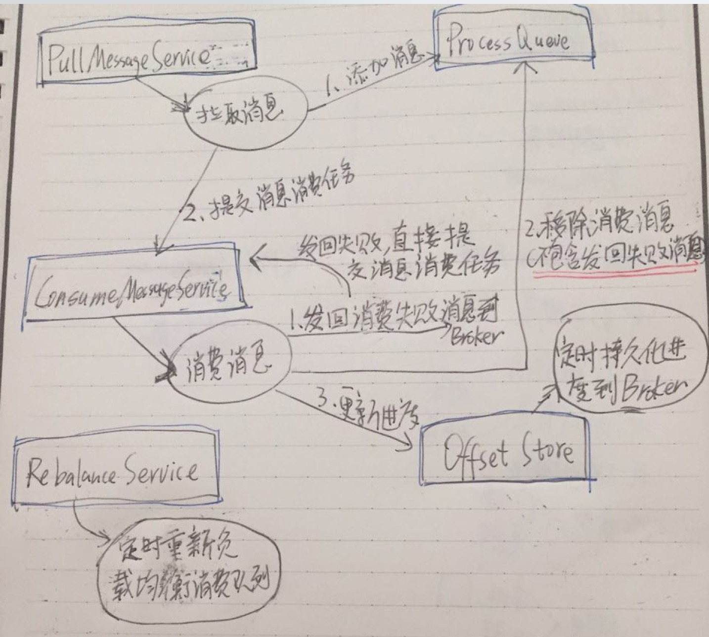

# 1、概述

本文接：[《Message拉取&消费（上）》](https://github.com/YunaiV/Blog/blob/master/RocketMQ/1005-RocketMQ源码解析：Message拉取&消费（上）.md)。

主要解析 `Consumer` 在 **消费** 逻辑涉及到的源码。

# 2、Consumer

MQ 提供了两类消费者：

* PullConsumer：TODO
* PushConsumer：
    * 在大多数场景下使用。
    * 名字虽然是 `Push` 开头，实际在实现时，使用 `Pull` 方式实现。通过 `Pull` **不断不断不断**轮询 `Broker` 获取消息。当不存在新消息时，`Broker` 会**挂起请求**，直到有新消息产生，取消挂起，返回新消息。这样，基本和 `Broker` 主动 `Push` 做到**接近**的实时性（当然，还是有相应的实时性损失）。原理类似 **[长轮询( `Long-Polling` )](https://www.ibm.com/developerworks/cn/web/wa-lo-comet/)**。

**本文主要以主要讲解`PushConsumer`，部分讲解`PullConsumer`。**
**本文主要以主要讲解`PushConsumer`，部分讲解`PullConsumer`。**
**本文主要以主要讲解`PushConsumer`，部分讲解`PullConsumer`。**

# 3、PullConsumer 一览

先看一张 `PullConsumer` 包含的组件以及组件之间的交互图：

* `RebalanceService`：负责负载均衡消费队列，即分配当前 `Consumer` 可消费的队列。当有新的 `Consumer` 的加入或移除，都会进行消费队列重新分配。
* `PullMessageService`：拉取消息线程服务，**不断不断不断**从 `Broker` 拉取消息，并提交消费任务到 `ConsumeMessageService`。
* `ConsumeMessageService`：消费消息线程服务，**不断不断不断**消费消息，并处理消费结果。
* `RemoteBrokerOffsetStore`：`Consumer` 消费进度管理，负责从 `Broker` 获取消费进度，更新消费进度到 `Broker`。
* `ProcessQueue` ：消息处理队列。

# 7、Consumer 调用[拉取消息]接口
# 8、Consumer 消费消息
# 9、Consumer 调用[发回消息]接口
# 10、Consumer 调用[更新消费进度]接口

