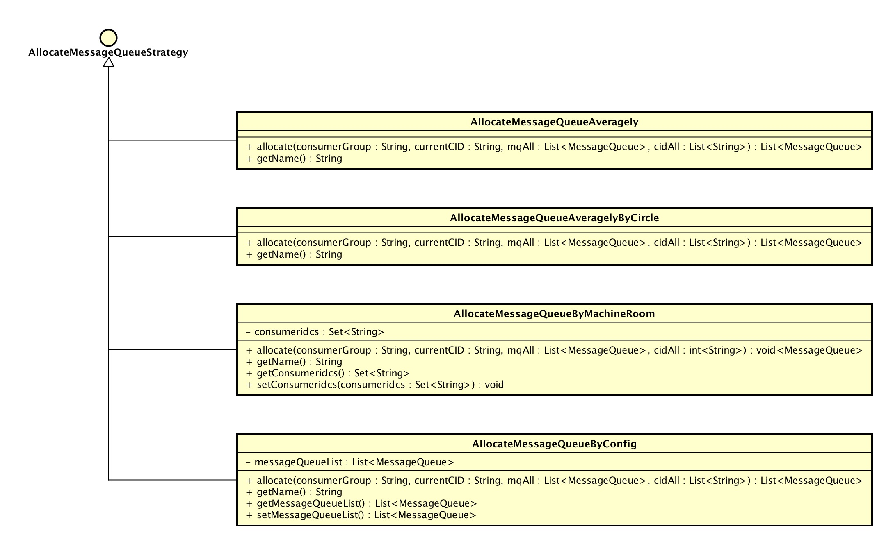
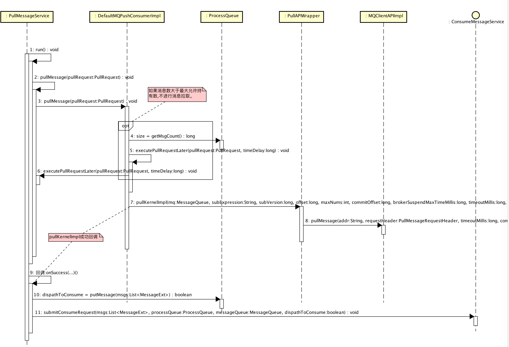

- [1、概述](#)
- [2、Consumer](#)
- [3、PushConsumer 一览](#)
- [4、PushConsumer 消费队列分配](#)
	- [RebalanceService](#)
	- [MQClientInstance#doRebalance(...)](#)
	- [DefaultMQPushConsumerImpl#doRebalance(...)](#)
	- [RebalanceImpl#doRebalance(...)](#)
		- [RebalanceImpl#rebalanceByTopic(...)](#)
		- [RebalanceImpl#removeUnnecessaryMessageQueue(...)](#)
			- [RebalancePushImpl#removeUnnecessaryMessageQueue(...)](#)
			- [[PullConsumer] RebalancePullImpl#removeUnnecessaryMessageQueue(...)](#)
		- [AllocateMessageQueueStrategy](#)
			- [AllocateMessageQueueAveragely](#)
			- [AllocateMessageQueueByMachineRoom](#)
			- [AllocateMessageQueueAveragelyByCircle](#)
			- [AllocateMessageQueueByConfig](#)
- [5、PushConsumer 消费进度读取](#)
	- [RebalancePushImpl#computePullFromWhere(...)](#)
	- [[PullConsumer] RebalancePullImpl#computePullFromWhere(...)](#)
- [7、Consumer 调用[拉取消息]接口](#)
- [8、Consumer 消费消息](#)
- [9、Consumer 调用[发回消息]接口](#)
- [10、Consumer 调用[更新消费进度]接口](#)

# 1、概述

本文接：[《Message拉取&消费（上）》](https://github.com/YunaiV/Blog/blob/master/RocketMQ/1005-RocketMQ源码解析：Message拉取&消费（上）.md)。

主要解析 `Consumer` 在 **消费** 逻辑涉及到的源码。

# 2、Consumer

MQ 提供了两类消费者：

* PullConsumer：TODO
* PushConsumer：
    * 在大多数场景下使用。
    * 名字虽然是 `Push` 开头，实际在实现时，使用 `Pull` 方式实现。通过 `Pull` **不断不断不断**轮询 `Broker` 获取消息。当不存在新消息时，`Broker` 会**挂起请求**，直到有新消息产生，取消挂起，返回新消息。这样，基本和 `Broker` 主动 `Push` 做到**接近**的实时性（当然，还是有相应的实时性损失）。原理类似 **[长轮询( `Long-Polling` )](https://www.ibm.com/developerworks/cn/web/wa-lo-comet/)**。


**本文主要讲解`PushConsumer`，部分讲解`PullConsumer`，跳过`顺序消费`。**
**本文主要讲解`PushConsumer`，部分讲解`PullConsumer`，跳过`顺序消费`。**
**本文主要讲解`PushConsumer`，部分讲解`PullConsumer`，跳过`顺序消费`。**

# 3、PushConsumer 一览

先看一张 `PushConsumer` 包含的组件以及组件之间的交互图：


* `RebalanceService`：负责分配消费队列，即分配当前 `Consumer` 可消费的队列。当有新的 `Consumer` 的加入或移除，都会进行消费队列重新负载均衡，分配消费队列。
* `PullMessageService`：拉取消息线程服务，**不断不断不断**从 `Broker` 拉取消息，并提交消费任务到 `ConsumeMessageService`。
* `ConsumeMessageService`：消费消息线程服务，**不断不断不断**消费消息，并处理消费结果。
* `RemoteBrokerOffsetStore`：`Consumer` 消费进度管理，负责从 `Broker` 获取消费进度，更新消费进度到 `Broker`。
* `ProcessQueue` ：消息处理队列。
* `MQClientInstance` ：封装对 `Namesrv`，`Broker` 的 API调用，提供给 `Producer`、`Consumer` 使用。

# 4、PushConsumer 消费队列分配


## RebalanceService

```Java
  1: public class RebalanceService extends ServiceThread {
  2: 
  3:     /**
  4:      * 等待间隔，单位：毫秒
  5:      */
  6:     private static long waitInterval =
  7:         Long.parseLong(System.getProperty(
  8:             "rocketmq.client.rebalance.waitInterval", "20000"));
  9: 
 10:     private final Logger log = ClientLogger.getLog();
 11:     /**
 12:      * MQClient对象
 13:      */
 14:     private final MQClientInstance mqClientFactory;
 15: 
 16:     public RebalanceService(MQClientInstance mqClientFactory) {
 17:         this.mqClientFactory = mqClientFactory;
 18:     }
 19: 
 20:     @Override
 21:     public void run() {
 22:         log.info(this.getServiceName() + " service started");
 23: 
 24:         while (!this.isStopped()) {
 25:             this.waitForRunning(waitInterval);
 26:             this.mqClientFactory.doRebalance();
 27:         }
 28: 
 29:         log.info(this.getServiceName() + " service end");
 30:     }
 31: 
 32:     @Override
 33:     public String getServiceName() {
 34:         return RebalanceService.class.getSimpleName();
 35:     }
 36: }
```

* 说明 ：分配消费队列线程服务。
* 第 26 行 ：调用 `MQClientInstance#doRebalance(...)` 分配消费队列。目前有三种情况情况下触发：
    * 如 `第 25 行` 等待超时，每 20s 调用一次。
    * `PushConsumer` 启动时，调用 `rebalanceService#wakeup(...)` 触发。
    * `Broker` 通知 `Consumer` 加入 或 移除时，`Consumer` 响应通知，调用 `rebalanceService#wakeup(...)` 触发。

 详细解析见：[MQClientInstance#doRebalance(...)](mqclientinstancedorebalance)。

## MQClientInstance#doRebalance(...)

```Java
  1: public void doRebalance() {
  2:     for (Map.Entry<String, MQConsumerInner> entry : this.consumerTable.entrySet()) {
  3:         MQConsumerInner impl = entry.getValue();
  4:         if (impl != null) {
  5:             try {
  6:                 impl.doRebalance();
  7:             } catch (Throwable e) {
  8:                 log.error("doRebalance exception", e);
  9:             }
 10:         }
 11:     }
 12: }
```

* 说明 ：遍历当前 `Client` 包含的 `consumerTable`( `Consumer`集合 )，执行消费队列分配。
* **疑问**：目前代码调试下来，`consumerTable` 只包含 `Consumer` 自己。😈有大大对这个疑问有解答的，烦请解答下。
* 第 6 行 ：调用 `MQConsumerInner#doRebalance(...)` 进行队列分配。`DefaultMQPushConsumerImpl`、`DefaultMQPullConsumerImpl` 分别对该接口方法进行了实现。`DefaultMQPushConsumerImpl#doRebalance(...)` 详细解析见：[DefaultMQPushConsumerImpl#doRebalance(...)](defaultmqpushconsumerimpldorebalance)。

## DefaultMQPushConsumerImpl#doRebalance(...)

```Java
  1: public void doRebalance() {
  2:     if (!this.pause) {
  3:         this.rebalanceImpl.doRebalance(this.isConsumeOrderly());
  4:     }
  5: }
```

* 说明：执行消费队列分配。
* 第 3 行 ：调用 `RebalanceImpl#doRebalance(...)` 进行队列分配。详细解析见：[RebalancePushImpl#doRebalance(...)](rebalancepushimpldorebalance)。

## RebalanceImpl#doRebalance(...)

```Java
  1: /**
  2:  * 执行分配消费队列
  3:  *
  4:  * @param isOrder 是否顺序消息
  5:  */
  6: public void doRebalance(final boolean isOrder) {
  7:     // 分配每个 topic 的消息队列
  8:     Map<String, SubscriptionData> subTable = this.getSubscriptionInner();
  9:     if (subTable != null) {
 10:         for (final Map.Entry<String, SubscriptionData> entry : subTable.entrySet()) {
 11:             final String topic = entry.getKey();
 12:             try {
 13:                 this.rebalanceByTopic(topic, isOrder);
 14:             } catch (Throwable e) {
 15:                 if (!topic.startsWith(MixAll.RETRY_GROUP_TOPIC_PREFIX)) {
 16:                     log.warn("rebalanceByTopic Exception", e);
 17:                 }
 18:             }
 19:         }
 20:     }
 21:     // 移除未订阅的topic对应的消息队列
 22:     this.truncateMessageQueueNotMyTopic();
 23: }
 24: 
 25: /**
 26:  * 移除未订阅的消息队列
 27:  */
 28: private void truncateMessageQueueNotMyTopic() {
 29:     Map<String, SubscriptionData> subTable = this.getSubscriptionInner();
 30:     for (MessageQueue mq : this.processQueueTable.keySet()) {
 31:         if (!subTable.containsKey(mq.getTopic())) {
 32: 
 33:             ProcessQueue pq = this.processQueueTable.remove(mq);
 34:             if (pq != null) {
 35:                 pq.setDropped(true);
 36:                 log.info("doRebalance, {}, truncateMessageQueueNotMyTopic remove unnecessary mq, {}", consumerGroup, mq);
 37:             }
 38:         }
 39:     }
 40: }
```

* `#doRebalance(...)` 说明 ：执行分配消费队列。
    * 第 7 至 20 行 ：循环订阅主题集合( `subscriptionInner` )，分配每一个 `Topic` 的消费队列。
    * 第 22 行 ：移除未订阅的 `Topic` 的消费队列。
* `#truncateMessageQueueNotMyTopic(...)` 说明 ：移除未订阅的消费队列。**当调用 `DefaultMQPushConsumer#unsubscribe(topic)` 时，只移除订阅主题集合( `subscriptionInner` )，对应消费队列移除在该方法。**

### RebalanceImpl#rebalanceByTopic(...)

```Java
  1: private void rebalanceByTopic(final String topic, final boolean isOrder) {
  2:     switch (messageModel) {
  3:         case BROADCASTING: {
  4:             Set<MessageQueue> mqSet = this.topicSubscribeInfoTable.get(topic);
  5:             if (mqSet != null) {
  6:                 boolean changed = this.updateProcessQueueTableInRebalance(topic, mqSet, isOrder);
  7:                 if (changed) {
  8:                     this.messageQueueChanged(topic, mqSet, mqSet);
  9:                     log.info("messageQueueChanged {} {} {} {}", //
 10:                         consumerGroup, //
 11:                         topic, //
 12:                         mqSet, //
 13:                         mqSet);
 14:                 }
 15:             } else {
 16:                 log.warn("doRebalance, {}, but the topic[{}] not exist.", consumerGroup, topic);
 17:             }
 18:             break;
 19:         }
 20:         case CLUSTERING: {
 21:             // 获取 topic 对应的 队列 和 consumer信息
 22:             Set<MessageQueue> mqSet = this.topicSubscribeInfoTable.get(topic);
 23:             List<String> cidAll = this.mQClientFactory.findConsumerIdList(topic, consumerGroup);
 24:             if (null == mqSet) {
 25:                 if (!topic.startsWith(MixAll.RETRY_GROUP_TOPIC_PREFIX)) {
 26:                     log.warn("doRebalance, {}, but the topic[{}] not exist.", consumerGroup, topic);
 27:                 }
 28:             }
 29: 
 30:             if (null == cidAll) {
 31:                 log.warn("doRebalance, {} {}, get consumer id list failed", consumerGroup, topic);
 32:             }
 33: 
 34:             if (mqSet != null && cidAll != null) {
 35:                 // 排序 消费队列 和 消费者数组。因为是在Client进行分配队列，排序后，各Client的顺序才能保持一致。
 36:                 List<MessageQueue> mqAll = new ArrayList<>();
 37:                 mqAll.addAll(mqSet);
 38: 
 39:                 Collections.sort(mqAll);
 40:                 Collections.sort(cidAll);
 41: 
 42:                 AllocateMessageQueueStrategy strategy = this.allocateMessageQueueStrategy;
 43: 
 44:                 // 根据 队列分配策略 分配消费队列
 45:                 List<MessageQueue> allocateResult;
 46:                 try {
 47:                     allocateResult = strategy.allocate(//
 48:                         this.consumerGroup, //
 49:                         this.mQClientFactory.getClientId(), //
 50:                         mqAll, //
 51:                         cidAll);
 52:                 } catch (Throwable e) {
 53:                     log.error("AllocateMessageQueueStrategy.allocate Exception. allocateMessageQueueStrategyName={}", strategy.getName(),
 54:                         e);
 55:                     return;
 56:                 }
 57: 
 58:                 Set<MessageQueue> allocateResultSet = new HashSet<>();
 59:                 if (allocateResult != null) {
 60:                     allocateResultSet.addAll(allocateResult);
 61:                 }
 62: 
 63:                 // 更新消费队列
 64:                 boolean changed = this.updateProcessQueueTableInRebalance(topic, allocateResultSet, isOrder);
 65:                 if (changed) {
 66:                     log.info(
 67:                         "rebalanced result changed. allocateMessageQueueStrategyName={}, group={}, topic={}, clientId={}, mqAllSize={}, cidAllSize={}, rebalanceResultSize={}, rebalanceResultSet={}",
 68:                         strategy.getName(), consumerGroup, topic, this.mQClientFactory.getClientId(), mqSet.size(), cidAll.size(),
 69:                         allocateResultSet.size(), allocateResultSet);
 70:                     this.messageQueueChanged(topic, mqSet, allocateResultSet);
 71:                 }
 72:             }
 73:             break;
 74:         }
 75:         default:
 76:             break;
 77:     }
 78: }
 79: 
 80: /**
 81:  * 当负载均衡时，更新 消息处理队列
 82:  * - 移除 在processQueueTable && 不存在于 mqSet 里的消息队列
 83:  * - 增加 不在processQueueTable && 存在于mqSet 里的消息队列
 84:  *
 85:  * @param topic Topic
 86:  * @param mqSet 负载均衡结果后的消息队列数组
 87:  * @param isOrder 是否顺序
 88:  * @return 是否变更
 89:  */
 90: private boolean updateProcessQueueTableInRebalance(final String topic, final Set<MessageQueue> mqSet, final boolean isOrder) {
 91:     boolean changed = false;
 92: 
 93:     // 移除 在processQueueTable && 不存在于 mqSet 里的消息队列
 94:     Iterator<Entry<MessageQueue, ProcessQueue>> it = this.processQueueTable.entrySet().iterator();
 95:     while (it.hasNext()) { // TODO 待读：
 96:         Entry<MessageQueue, ProcessQueue> next = it.next();
 97:         MessageQueue mq = next.getKey();
 98:         ProcessQueue pq = next.getValue();
 99: 
100:         if (mq.getTopic().equals(topic)) {
101:             if (!mqSet.contains(mq)) { // 不包含的队列
102:                 pq.setDropped(true);
103:                 if (this.removeUnnecessaryMessageQueue(mq, pq)) {
104:                     it.remove();
105:                     changed = true;
106:                     log.info("doRebalance, {}, remove unnecessary mq, {}", consumerGroup, mq);
107:                 }
108:             } else if (pq.isPullExpired()) { // 队列拉取超时，进行清理
109:                 switch (this.consumeType()) {
110:                     case CONSUME_ACTIVELY:
111:                         break;
112:                     case CONSUME_PASSIVELY:
113:                         pq.setDropped(true);
114:                         if (this.removeUnnecessaryMessageQueue(mq, pq)) {
115:                             it.remove();
116:                             changed = true;
117:                             log.error("[BUG]doRebalance, {}, remove unnecessary mq, {}, because pull is pause, so try to fixed it",
118:                                 consumerGroup, mq);
119:                         }
120:                         break;
121:                     default:
122:                         break;
123:                 }
124:             }
125:         }
126:     }
127: 
128:     // 增加 不在processQueueTable && 存在于mqSet 里的消息队列。
129:     List<PullRequest> pullRequestList = new ArrayList<>(); // 拉消息请求数组
130:     for (MessageQueue mq : mqSet) {
131:         if (!this.processQueueTable.containsKey(mq)) {
132:             if (isOrder && !this.lock(mq)) {
133:                 log.warn("doRebalance, {}, add a new mq failed, {}, because lock failed", consumerGroup, mq);
134:                 continue;
135:             }
136: 
137:             this.removeDirtyOffset(mq);
138:             ProcessQueue pq = new ProcessQueue();
139:             long nextOffset = this.computePullFromWhere(mq);
140:             if (nextOffset >= 0) {
141:                 ProcessQueue pre = this.processQueueTable.putIfAbsent(mq, pq);
142:                 if (pre != null) {
143:                     log.info("doRebalance, {}, mq already exists, {}", consumerGroup, mq);
144:                 } else {
145:                     log.info("doRebalance, {}, add a new mq, {}", consumerGroup, mq);
146:                     PullRequest pullRequest = new PullRequest();
147:                     pullRequest.setConsumerGroup(consumerGroup);
148:                     pullRequest.setNextOffset(nextOffset);
149:                     pullRequest.setMessageQueue(mq);
150:                     pullRequest.setProcessQueue(pq);
151:                     pullRequestList.add(pullRequest);
152:                     changed = true;
153:                 }
154:             } else {
155:                 log.warn("doRebalance, {}, add new mq failed, {}", consumerGroup, mq);
156:             }
157:         }
158:     }
159: 
160:     // 发起消息拉取请求
161:     this.dispatchPullRequest(pullRequestList);
162: 
163:     return changed;
164: }
```

* `#rebalanceByTopic(...)` 说明 ：分配 `Topic` 的消费队列。
    * 第 3 至 19 行 ：广播模式( `BROADCASTING` ) 下，分配 `Topic` 对应的**所有**消费队列。   
    * 第 20 至 74 行 ：集群模式( `CLUSTERING` ) 下，分配 `Topic` 对应的**部分**消费队列。
        * 第 21 至 40 行 ：获取 `Topic` 对应的队列和消费者们，并对其进行排序。因为各 `Consumer` 是在本地分配消费队列，排序后才能保证各 `Consumer` 顺序一致。
        *  第 42 至 61 行 ：根据 队列分配策略( `AllocateMessageQueueStrategy` ) 分配消费队列。详细解析见：[AllocateMessageQueueStrategy](#allocatemessagequeuestrategy)。
        *  第 63 至 72 行 ：更新 `Topic` 对应的消费队列。
* `#updateProcessQueueTableInRebalance(...)` 说明 ：当分配队列时，更新 `Topic` 对应的消费队列，并返回是否有变更。
    * 第 93 至 126 行 ：移除不存在于 分配的消费队列( `mqSet` ) 的 消息处理队列( `processQueueTable` )。
        * 第 103 行 ：移除不需要的消费队列。详细解析见：[RebalancePushImpl#removeUnnecessaryMessageQueue(...)](#rebalancepushimplremoveunnecessarymessagequeue)。
        * 第 108 行 ：队列拉取超时，即 `当前时间 - 最后一次拉取消息时间 > 120s` ( 120s 可配置)，判定发生 **BUG**，过久未进行消息拉取，移除队列。移除后，下面**#新增队列逻辑#**可以重新加入新的该队列。
    * 第 128 至 158 行 ：增加 分配的消费队列( `mqSet` ) 新增的消费队列。
        * 第 132 至 135 行 ：`顺序消费` 相关跳过，详细解析见：[《Message顺序发送与消费》](https://github.com/YunaiV/Blog/blob/master/RocketMQ/1007-RocketMQ源码解析：Message顺序发送与消费.md)。
        * 第 137 行 ：移除队列的消费进度。
        * 第 139 行 ：获取队列消费进度。详细解析见：[RebalancePushImpl#computePullFromWhere(...)](#rebalancepushimplcomputepullfromwhere)。
        * 第 140 至 156 行 ：**添加新消费处理队列，添加消费拉取消息请求**。
    * 第 161 行 ：**发起新增的消费队列消息拉取请求**。详细解析见：TOTOTOTO

### RebalanceImpl#removeUnnecessaryMessageQueue(...)

#### RebalancePushImpl#removeUnnecessaryMessageQueue(...)

```Java
  1: public boolean removeUnnecessaryMessageQueue(MessageQueue mq, ProcessQueue pq) {
  2:     // 同步队列的消费进度，并移除之。
  3:     this.defaultMQPushConsumerImpl.getOffsetStore().persist(mq);
  4:     this.defaultMQPushConsumerImpl.getOffsetStore().removeOffset(mq);
  5:     // TODO 顺序消费
  6:     if (this.defaultMQPushConsumerImpl.isConsumeOrderly()
  7:         && MessageModel.CLUSTERING.equals(this.defaultMQPushConsumerImpl.messageModel())) {
  8:         try {
  9:             if (pq.getLockConsume().tryLock(1000, TimeUnit.MILLISECONDS)) {
 10:                 try {
 11:                     return this.unlockDelay(mq, pq);
 12:                 } finally {
 13:                     pq.getLockConsume().unlock();
 14:                 }
 15:             } else {
 16:                 log.warn("[WRONG]mq is consuming, so can not unlock it, {}. maybe hanged for a while, {}", //
 17:                     mq, //
 18:                     pq.getTryUnlockTimes());
 19: 
 20:                 pq.incTryUnlockTimes();
 21:             }
 22:         } catch (Exception e) {
 23:             log.error("removeUnnecessaryMessageQueue Exception", e);
 24:         }
 25: 
 26:         return false;
 27:     }
 28:     return true;
 29: }
```

* 说明 ：移除不需要的消费队列相关的信息，并返回是否移除成功。
* 第 2 至 4 行 ：**同步**队列的消费进度，并移除之。
* 第 5 至 27 行 ：`顺序消费` 相关跳过，详细解析见：[《Message顺序发送与消费》](https://github.com/YunaiV/Blog/blob/master/RocketMQ/1007-RocketMQ源码解析：Message顺序发送与消费.md)。

#### `[PullConsumer]` RebalancePullImpl#removeUnnecessaryMessageQueue(...)

```Java
  1: public boolean removeUnnecessaryMessageQueue(MessageQueue mq, ProcessQueue pq) {
  2:     this.defaultMQPullConsumerImpl.getOffsetStore().persist(mq);
  3:     this.defaultMQPullConsumerImpl.getOffsetStore().removeOffset(mq);
  4:     return true;
  5: }
```

* 说明 ：移除不需要的消费队列相关的信息，并返回移除成功。**和`RebalancePushImpl#removeUnnecessaryMessageQueue(...)`基本一致。**

### RebalancePushImpl#dispatchPullRequest(...)

```Java
  1: public void dispatchPullRequest(List<PullRequest> pullRequestList) {
  2:     for (PullRequest pullRequest : pullRequestList) {
  3:         this.defaultMQPushConsumerImpl.executePullRequestImmediately(pullRequest);
  4:         log.info("doRebalance, {}, add a new pull request {}", consumerGroup, pullRequest);
  5:     }
  6: }
```

* 说明 ：发起消息拉取请求。**该调用是`PushConsumer`不断不断不断拉取消息的起点**。

#### DefaultMQPushConsumerImpl#executePullRequestImmediately(...)

```Java
  1: public void executePullRequestImmediately(final PullRequest pullRequest) {
  2:     this.mQClientFactory.getPullMessageService().executePullRequestImmediately(pullRequest);
  3: }
```

* 说明 ：提交拉取请求。提交后，`PullMessageService` **异步执行**，**非阻塞**。详细解析见：[PullMessageService](pullmessageservice)。

### AllocateMessageQueueStrategy



#### AllocateMessageQueueAveragely

```Java
  1: public class AllocateMessageQueueAveragely implements AllocateMessageQueueStrategy {
  2:     private final Logger log = ClientLogger.getLog();
  3: 
  4:     @Override
  5:     public List<MessageQueue> allocate(String consumerGroup, String currentCID, List<MessageQueue> mqAll,
  6:         List<String> cidAll) {
  7:         // 校验参数是否正确
  8:         if (currentCID == null || currentCID.length() < 1) {
  9:             throw new IllegalArgumentException("currentCID is empty");
 10:         }
 11:         if (mqAll == null || mqAll.isEmpty()) {
 12:             throw new IllegalArgumentException("mqAll is null or mqAll empty");
 13:         }
 14:         if (cidAll == null || cidAll.isEmpty()) {
 15:             throw new IllegalArgumentException("cidAll is null or cidAll empty");
 16:         }
 17: 
 18:         List<MessageQueue> result = new ArrayList<>();
 19:         if (!cidAll.contains(currentCID)) {
 20:             log.info("[BUG] ConsumerGroup: {} The consumerId: {} not in cidAll: {}",
 21:                 consumerGroup,
 22:                 currentCID,
 23:                 cidAll);
 24:             return result;
 25:         }
 26:         // 平均分配
 27:         int index = cidAll.indexOf(currentCID); // 第几个consumer。
 28:         int mod = mqAll.size() % cidAll.size(); // 余数，即多少消息队列无法平均分配。
 29:         int averageSize =
 30:             mqAll.size() <= cidAll.size() ? 1 : (mod > 0 && index < mod ? mqAll.size() / cidAll.size()
 31:                 + 1 : mqAll.size() / cidAll.size());
 32:         int startIndex = (mod > 0 && index < mod) ? index * averageSize : index * averageSize + mod; // 有余数的情况下，[0, mod) 平分余数，即每consumer多分配一个节点；第index开始，跳过前mod余数。
 33:         int range = Math.min(averageSize, mqAll.size() - startIndex); // 分配队列数量。之所以要Math.min()的原因是，mqAll.size() <= cidAll.size()，部分consumer分配不到消费队列。
 34:         for (int i = 0; i < range; i++) {
 35:             result.add(mqAll.get((startIndex + i) % mqAll.size()));
 36:         }
 37:         return result;
 38:     }
 39: 
 40:     @Override
 41:     public String getName() {
 42:         return "AVG";
 43:     }
 44: }
```

* 说明 ：**平均**分配队列策略。
* 第 7 至 25 行 ：参数校验。
* 第 26 至 36 行 ：平均分配消费队列。
    * 第 27 行 ：`index` ：当前 `Consumer` 在消费集群里是第几个。这里就是为什么需要对传入的 `cidAll` 参数必须进行排序的原因。如果不排序，`Consumer` 在本地计算出来的 `index` 无法一致，影响计算结果。
    * 第 28 行 ：`mod` ：余数，即多少消费队列无法平均分配。
    * 第 29 至 31 行 ：`averageSize` ：代码可以简化成 `(mod > 0 && index < mod ? mqAll.size() / cidAll.size() + 1 : mqAll.size() / cidAll.size())`。
        * `[ 0, mod )` ：`mqAll.size() / cidAll.size() + 1`。前面 `mod` 个 `Consumer` 平分余数，多获得 1 个消费队列。
        * `[ mod, cidAll.size() )` ：`mqAll.size() / cidAll.size()`。
    * 第 32 行 ：`startIndex` ：`Consumer` 分配消息队列开始位置。
    * 第 33 行 ：`range` ：分配队列数量。之所以要 `Math#min(...)` 的原因：当 `mqAll.size() <= cidAll.size()` 时，最后几个 `Consumer` 分配不到消费队列。
    * 第 34 至 36 行 ：生成分配消费队列结果。
* 举个例子：

固定消费队列长度为**4**。

|   | Consumer * 2 *可以整除* | Consumer * 3 *不可整除* | Consumer * 5 *无法都分配* |
| --- | --- | --- | --- |
| 消费队列[0] | Consumer[0] | Consumer[0] | Consumer[0] |
| 消费队列[1] | Consumer[0] | Consumer[0] | Consumer[1] |
| 消费队列[2] | Consumer[1] | Consumer[1] | Consumer[2] |
| 消费队列[3] | Consumer[1] | Consumer[2] | Consumer[3] |

#### AllocateMessageQueueByMachineRoom

```Java
  1: public class AllocateMessageQueueByMachineRoom implements AllocateMessageQueueStrategy {
  2:     /**
  3:      * 消费者消费brokerName集合
  4:      */
  5:     private Set<String> consumeridcs;
  6: 
  7:     @Override
  8:     public List<MessageQueue> allocate(String consumerGroup, String currentCID, List<MessageQueue> mqAll,
  9:         List<String> cidAll) {
 10:         // 参数校验
 11:         List<MessageQueue> result = new ArrayList<MessageQueue>();
 12:         int currentIndex = cidAll.indexOf(currentCID);
 13:         if (currentIndex < 0) {
 14:             return result;
 15:         }
 16:         // 计算符合当前配置的消费者数组('consumeridcs')对应的消费队列
 17:         List<MessageQueue> premqAll = new ArrayList<MessageQueue>();
 18:         for (MessageQueue mq : mqAll) {
 19:             String[] temp = mq.getBrokerName().split("@");
 20:             if (temp.length == 2 && consumeridcs.contains(temp[0])) {
 21:                 premqAll.add(mq);
 22:             }
 23:         }
 24:         // 平均分配
 25:         int mod = premqAll.size() / cidAll.size();
 26:         int rem = premqAll.size() % cidAll.size();
 27:         int startIndex = mod * currentIndex;
 28:         int endIndex = startIndex + mod;
 29:         for (int i = startIndex; i < endIndex; i++) {
 30:             result.add(mqAll.get(i));
 31:         }
 32:         if (rem > currentIndex) {
 33:             result.add(premqAll.get(currentIndex + mod * cidAll.size()));
 34:         }
 35:         return result;
 36:     }
 37: 
 38:     @Override
 39:     public String getName() {
 40:         return "MACHINE_ROOM";
 41:     }
 42: 
 43:     public Set<String> getConsumeridcs() {
 44:         return consumeridcs;
 45:     }
 46: 
 47:     public void setConsumeridcs(Set<String> consumeridcs) {
 48:         this.consumeridcs = consumeridcs;
 49:     }
 50: }
```

* 说明 ：**平均**分配**可消费的** `Broker` 对应的消费队列。
* 第 7 至 15 行 ：参数校验。
* 第 16 至 23 行 ：计算**可消费的** `Broker` 对应的消费队列。
* 第 25 至 34 行 ：平均分配消费队列。该**平均分配**方式和 `AllocateMessageQueueAveragely` 略有不同，其是将多余的结尾部分分配给前 `rem` 个 `Consumer`。
* 疑问：*比较疑惑使用该分配策略，`Consumer` 和 `Broker` 分配需要怎么配置*。😈等研究**主从**相关源码时，仔细考虑下。

#### AllocateMessageQueueAveragelyByCircle

 ```Java
   1: public class AllocateMessageQueueAveragelyByCircle implements AllocateMessageQueueStrategy {
  2:     private final Logger log = ClientLogger.getLog();
  3: 
  4:     @Override
  5:     public List<MessageQueue> allocate(String consumerGroup, String currentCID, List<MessageQueue> mqAll,
  6:         List<String> cidAll) {
  7:         // 校验参数是否正确
  8:         if (currentCID == null || currentCID.length() < 1) {
  9:             throw new IllegalArgumentException("currentCID is empty");
 10:         }
 11:         if (mqAll == null || mqAll.isEmpty()) {
 12:             throw new IllegalArgumentException("mqAll is null or mqAll empty");
 13:         }
 14:         if (cidAll == null || cidAll.isEmpty()) {
 15:             throw new IllegalArgumentException("cidAll is null or cidAll empty");
 16:         }
 17: 
 18:         List<MessageQueue> result = new ArrayList<MessageQueue>();
 19:         if (!cidAll.contains(currentCID)) {
 20:             log.info("[BUG] ConsumerGroup: {} The consumerId: {} not in cidAll: {}",
 21:                 consumerGroup,
 22:                 currentCID,
 23:                 cidAll);
 24:             return result;
 25:         }
 26: 
 27:         // 环状分配
 28:         int index = cidAll.indexOf(currentCID);
 29:         for (int i = index; i < mqAll.size(); i++) {
 30:             if (i % cidAll.size() == index) {
 31:                 result.add(mqAll.get(i));
 32:             }
 33:         }
 34:         return result;
 35:     }
 36: 
 37:     @Override
 38:     public String getName() {
 39:         return "AVG_BY_CIRCLE";
 40:     }
 41: }
 ```
 
 * 说明 ：环状分配消费队列。

#### AllocateMessageQueueByConfig

```Java
  1: public class AllocateMessageQueueByConfig implements AllocateMessageQueueStrategy {
  2:     private List<MessageQueue> messageQueueList;
  3: 
  4:     @Override
  5:     public List<MessageQueue> allocate(String consumerGroup, String currentCID, List<MessageQueue> mqAll,
  6:         List<String> cidAll) {
  7:         return this.messageQueueList;
  8:     }
  9: 
 10:     @Override
 11:     public String getName() {
 12:         return "CONFIG";
 13:     }
 14: 
 15:     public List<MessageQueue> getMessageQueueList() {
 16:         return messageQueueList;
 17:     }
 18: 
 19:     public void setMessageQueueList(List<MessageQueue> messageQueueList) {
 20:         this.messageQueueList = messageQueueList;
 21:     }
 22: }
```

* 说明 ：分配配置的消息队列。
* 疑问 ：*疑惑该分配策略的使用场景。*

# 5、PushConsumer 消费进度读取

## RebalancePushImpl#computePullFromWhere(...)

```Java
  1: public long computePullFromWhere(MessageQueue mq) {
  2:     long result = -1;
  3:     final ConsumeFromWhere consumeFromWhere = this.defaultMQPushConsumerImpl.getDefaultMQPushConsumer().getConsumeFromWhere();
  4:     final OffsetStore offsetStore = this.defaultMQPushConsumerImpl.getOffsetStore();
  5:     switch (consumeFromWhere) {
  6:         case CONSUME_FROM_LAST_OFFSET_AND_FROM_MIN_WHEN_BOOT_FIRST: // 废弃
  7:         case CONSUME_FROM_MIN_OFFSET: // 废弃
  8:         case CONSUME_FROM_MAX_OFFSET: // 废弃
  9:         case CONSUME_FROM_LAST_OFFSET: {
 10:             long lastOffset = offsetStore.readOffset(mq, ReadOffsetType.READ_FROM_STORE);
 11:             if (lastOffset >= 0) {
 12:                 result = lastOffset;
 13:             }
 14:             // First start,no offset
 15:             else if (-1 == lastOffset) {
 16:                 if (mq.getTopic().startsWith(MixAll.RETRY_GROUP_TOPIC_PREFIX)) {
 17:                     result = 0L;
 18:                 } else {
 19:                     try {
 20:                         result = this.mQClientFactory.getMQAdminImpl().maxOffset(mq);
 21:                     } catch (MQClientException e) {
 22:                         result = -1;
 23:                     }
 24:                 }
 25:             } else {
 26:                 result = -1;
 27:             }
 28:             break;
 29:         }
 30:         case CONSUME_FROM_FIRST_OFFSET: {
 31:             long lastOffset = offsetStore.readOffset(mq, ReadOffsetType.READ_FROM_STORE);
 32:             if (lastOffset >= 0) {
 33:                 result = lastOffset;
 34:             } else if (-1 == lastOffset) {
 35:                 result = 0L;
 36:             } else {
 37:                 result = -1;
 38:             }
 39:             break;
 40:         }
 41:         case CONSUME_FROM_TIMESTAMP: {
 42:             long lastOffset = offsetStore.readOffset(mq, ReadOffsetType.READ_FROM_STORE);
 43:             if (lastOffset >= 0) {
 44:                 result = lastOffset;
 45:             } else if (-1 == lastOffset) {
 46:                 if (mq.getTopic().startsWith(MixAll.RETRY_GROUP_TOPIC_PREFIX)) {
 47:                     try {
 48:                         result = this.mQClientFactory.getMQAdminImpl().maxOffset(mq);
 49:                     } catch (MQClientException e) {
 50:                         result = -1;
 51:                     }
 52:                 } else {
 53:                     try {
 54:                         long timestamp = UtilAll.parseDate(this.defaultMQPushConsumerImpl.getDefaultMQPushConsumer().getConsumeTimestamp(),
 55:                             UtilAll.YYYY_MMDD_HHMMSS).getTime();
 56:                         result = this.mQClientFactory.getMQAdminImpl().searchOffset(mq, timestamp);
 57:                     } catch (MQClientException e) {
 58:                         result = -1;
 59:                     }
 60:                 }
 61:             } else {
 62:                 result = -1;
 63:             }
 64:             break;
 65:         }
 66: 
 67:         default:
 68:             break;
 69:     }
 70: 
 71:     return result;
 72: }
```

* 说明 ：计算消费队列开始消费位置。
* `PushConsumer` 读取消费进度有三种选项：
    * `CONSUME_FROM_LAST_OFFSET` ：第 6 至 29 行 ：一个新的消费集群第一次启动从**队列的最后位置**开始消费。**后续再启动接着上次消费的进度开始消费**。
    * `CONSUME_FROM_FIRST_OFFSET` ：第 30 至 40 行 ：一个新的消费集群第一次启动从队列的**最前位置**开始消费。**后续再启动接着上次消费的进度开始消费**。
    * `CONSUME_FROM_TIMESTAMP` ：第 41 至 65 行 ：一个新的消费集群第一次启动从**指定时间点**开始消费。**后续再启动接着上次消费的进度开始消费**。


## `[PullConsumer]` RebalancePullImpl#computePullFromWhere(...)

TOTOTOTOTO

# 6、PushConsumer 拉取消息



## PullMessageService

```Java
  1: public class PullMessageService extends ServiceThread {
  2:     private final Logger log = ClientLogger.getLog();
  3:     /**
  4:      * 拉取消息请求队列
  5:      */
  6:     private final LinkedBlockingQueue<PullRequest> pullRequestQueue = new LinkedBlockingQueue<>();
  7:     /**
  8:      * MQClient对象
  9:      */
 10:     private final MQClientInstance mQClientFactory;
 11:     /**
 12:      * 定时器。用于延迟提交拉取请求
 13:      */
 14:     private final ScheduledExecutorService scheduledExecutorService = Executors
 15:         .newSingleThreadScheduledExecutor(new ThreadFactory() {
 16:             @Override
 17:             public Thread newThread(Runnable r) {
 18:                 return new Thread(r, "PullMessageServiceScheduledThread");
 19:             }
 20:         });
 21: 
 22:     public PullMessageService(MQClientInstance mQClientFactory) {
 23:         this.mQClientFactory = mQClientFactory;
 24:     }
 25: 
 26:     /**
 27:      * 执行延迟拉取消息请求
 28:      *
 29:      * @param pullRequest 拉取消息请求
 30:      * @param timeDelay 延迟时长
 31:      */
 32:     public void executePullRequestLater(final PullRequest pullRequest, final long timeDelay) {
 33:         this.scheduledExecutorService.schedule(new Runnable() {
 34: 
 35:             @Override
 36:             public void run() {
 37:                 PullMessageService.this.executePullRequestImmediately(pullRequest);
 38:             }
 39:         }, timeDelay, TimeUnit.MILLISECONDS);
 40:     }
 41: 
 42:     /**
 43:      * 执行立即拉取消息请求
 44:      *
 45:      * @param pullRequest 拉取消息请求
 46:      */
 47:     public void executePullRequestImmediately(final PullRequest pullRequest) {
 48:         try {
 49:             this.pullRequestQueue.put(pullRequest);
 50:         } catch (InterruptedException e) {
 51:             log.error("executePullRequestImmediately pullRequestQueue.put", e);
 52:         }
 53:     }
 54: 
 55:     /**
 56:      * 执行延迟任务
 57:      *
 58:      * @param r 任务
 59:      * @param timeDelay 延迟时长
 60:      */
 61:     public void executeTaskLater(final Runnable r, final long timeDelay) {
 62:         this.scheduledExecutorService.schedule(r, timeDelay, TimeUnit.MILLISECONDS);
 63:     }
 64: 
 65:     public ScheduledExecutorService getScheduledExecutorService() {
 66:         return scheduledExecutorService;
 67:     }
 68: 
 69:     /**
 70:      * 拉取消息
 71:      *
 72:      * @param pullRequest 拉取消息请求
 73:      */
 74:     private void pullMessage(final PullRequest pullRequest) {
 75:         final MQConsumerInner consumer = this.mQClientFactory.selectConsumer(pullRequest.getConsumerGroup());
 76:         if (consumer != null) {
 77:             DefaultMQPushConsumerImpl impl = (DefaultMQPushConsumerImpl) consumer;
 78:             impl.pullMessage(pullRequest);
 79:         } else {
 80:             log.warn("No matched consumer for the PullRequest {}, drop it", pullRequest);
 81:         }
 82:     }
 83: 
 84:     @Override
 85:     public void run() {
 86:         log.info(this.getServiceName() + " service started");
 87: 
 88:         while (!this.isStopped()) {
 89:             try {
 90:                 PullRequest pullRequest = this.pullRequestQueue.take();
 91:                 if (pullRequest != null) {
 92:                     this.pullMessage(pullRequest);
 93:                 }
 94:             } catch (InterruptedException e) {
 95:             } catch (Exception e) {
 96:                 log.error("Pull Message Service Run Method exception", e);
 97:             }
 98:         }
 99: 
100:         log.info(this.getServiceName() + " service end");
101:     }
102: 
103:     @Override
104:     public String getServiceName() {
105:         return PullMessageService.class.getSimpleName();
106:     }
107: 
108: }
```

* 说明 ：拉取消息线程服务，不断不断不断从 `Broker` 拉取消息，并提交消费任务到 `ConsumeMessageService`。
* `#executePullRequestLater(...)` ：第 26 至 40 行 ： 提交**延迟**拉取消息请求。
* `#executePullRequestImmediately(...)` ：第 42 至 53 行 ：提交**立即**拉取消息请求。
* `#executeTaskLater(...)` ：第 55 至 63 行 ：提交**延迟任务**。
* `#pullMessage(...)` ：第 69 至 82 行 ：执行拉取消息逻辑。详细解析见：[DefaultMQPushConsumerImpl#pullMessage(...)](#defaultmqpushconsumerimplpullmessage)。
* `#run(...)` ：第 84 至 101 行 ：循环拉取消息请求队列( `pullRequestQueue` )，进行消息拉取。

## DefaultMQPushConsumerImpl#pullMessage(...)

```Java
  1: public void pullMessage(final PullRequest pullRequest) {
  2:     final ProcessQueue processQueue = pullRequest.getProcessQueue();
  3:     if (processQueue.isDropped()) {
  4:         log.info("the pull request[{}] is dropped.", pullRequest.toString());
  5:         return;
  6:     }
  7: 
  8:     // 设置队列最后拉取消息时间
  9:     pullRequest.getProcessQueue().setLastPullTimestamp(System.currentTimeMillis());
 10: 
 11:     // 判断consumer状态是否运行中。如果不是，则延迟拉取消息。
 12:     try {
 13:         this.makeSureStateOK();
 14:     } catch (MQClientException e) {
 15:         log.warn("pullMessage exception, consumer state not ok", e);
 16:         this.executePullRequestLater(pullRequest, PULL_TIME_DELAY_MILLS_WHEN_EXCEPTION);
 17:         return;
 18:     }
 19: 
 20:     // 判断是否暂停中。
 21:     if (this.isPause()) {
 22:         log.warn("consumer was paused, execute pull request later. instanceName={}, group={}", this.defaultMQPushConsumer.getInstanceName(), this.defaultMQPushConsumer.getConsumerGroup());
 23:         this.executePullRequestLater(pullRequest, PULL_TIME_DELAY_MILLS_WHEN_SUSPEND);
 24:         return;
 25:     }
 26: 
 27:     // 判断是否超过最大持有消息数量。默认最大值为1000。
 28:     long size = processQueue.getMsgCount().get();
 29:     if (size > this.defaultMQPushConsumer.getPullThresholdForQueue()) {
 30:         this.executePullRequestLater(pullRequest, PULL_TIME_DELAY_MILLS_WHEN_FLOW_CONTROL); // 提交延迟消息拉取请求。50ms。
 31:         if ((flowControlTimes1++ % 1000) == 0) {
 32:             log.warn(
 33:                 "the consumer message buffer is full, so do flow control, minOffset={}, maxOffset={}, size={}, pullRequest={}, flowControlTimes={}",
 34:                 processQueue.getMsgTreeMap().firstKey(), processQueue.getMsgTreeMap().lastKey(), size, pullRequest, flowControlTimes1);
 35:         }
 36:         return;
 37:     }
 38: 
 39:     if (!this.consumeOrderly) { // 判断消息跨度是否过大。
 40:         if (processQueue.getMaxSpan() > this.defaultMQPushConsumer.getConsumeConcurrentlyMaxSpan()) {
 41:             this.executePullRequestLater(pullRequest, PULL_TIME_DELAY_MILLS_WHEN_FLOW_CONTROL); // 提交延迟消息拉取请求。50ms。
 42:             if ((flowControlTimes2++ % 1000) == 0) {
 43:                 log.warn(
 44:                     "the queue's messages, span too long, so do flow control, minOffset={}, maxOffset={}, maxSpan={}, pullRequest={}, flowControlTimes={}",
 45:                     processQueue.getMsgTreeMap().firstKey(), processQueue.getMsgTreeMap().lastKey(), processQueue.getMaxSpan(),
 46:                     pullRequest, flowControlTimes2);
 47:             }
 48:             return;
 49:         }
 50:     } else { // TODO 顺序消费
 51:         if (processQueue.isLocked()) {
 52:             if (!pullRequest.isLockedFirst()) {
 53:                 final long offset = this.rebalanceImpl.computePullFromWhere(pullRequest.getMessageQueue());
 54:                 boolean brokerBusy = offset < pullRequest.getNextOffset();
 55:                 log.info("the first time to pull message, so fix offset from broker. pullRequest: {} NewOffset: {} brokerBusy: {}",
 56:                     pullRequest, offset, brokerBusy);
 57:                 if (brokerBusy) {
 58:                     log.info("[NOTIFYME]the first time to pull message, but pull request offset larger than broker consume offset. pullRequest: {} NewOffset: {}",
 59:                         pullRequest, offset);
 60:                 }
 61: 
 62:                 pullRequest.setLockedFirst(true);
 63:                 pullRequest.setNextOffset(offset);
 64:             }
 65:         } else {
 66:             this.executePullRequestLater(pullRequest, PULL_TIME_DELAY_MILLS_WHEN_EXCEPTION);
 67:             log.info("pull message later because not locked in broker, {}", pullRequest);
 68:             return;
 69:         }
 70:     }
 71: 
 72:     // 获取Topic 对应的订阅信息。若不存在，则延迟拉取消息
 73:     final SubscriptionData subscriptionData = this.rebalanceImpl.getSubscriptionInner().get(pullRequest.getMessageQueue().getTopic());
 74:     if (null == subscriptionData) {
 75:         this.executePullRequestLater(pullRequest, PULL_TIME_DELAY_MILLS_WHEN_EXCEPTION);
 76:         log.warn("find the consumer's subscription failed, {}", pullRequest);
 77:         return;
 78:     }
 79: 
 80:     final long beginTimestamp = System.currentTimeMillis();
 81: 
 82:     PullCallback pullCallback = new PullCallback() {
 83:         @Override
 84:         public void onSuccess(PullResult pullResult) {
 85:             if (pullResult != null) {
 86:                 pullResult = DefaultMQPushConsumerImpl.this.pullAPIWrapper.processPullResult(pullRequest.getMessageQueue(), pullResult,
 87:                     subscriptionData);
 88: 
 89:                 switch (pullResult.getPullStatus()) {
 90:                     case FOUND:
 91:                         // 设置下次拉取消息队列位置
 92:                         long prevRequestOffset = pullRequest.getNextOffset();
 93:                         pullRequest.setNextOffset(pullResult.getNextBeginOffset());
 94: 
 95:                         // 统计
 96:                         long pullRT = System.currentTimeMillis() - beginTimestamp;
 97:                         DefaultMQPushConsumerImpl.this.getConsumerStatsManager().incPullRT(pullRequest.getConsumerGroup(),
 98:                             pullRequest.getMessageQueue().getTopic(), pullRT);
 99: 
100:                         long firstMsgOffset = Long.MAX_VALUE;
101:                         if (pullResult.getMsgFoundList() == null || pullResult.getMsgFoundList().isEmpty()) {
102:                             DefaultMQPushConsumerImpl.this.executePullRequestImmediately(pullRequest);
103:                         } else {
104:                             firstMsgOffset = pullResult.getMsgFoundList().get(0).getQueueOffset();
105: 
106:                             // 统计
107:                             DefaultMQPushConsumerImpl.this.getConsumerStatsManager().incPullTPS(pullRequest.getConsumerGroup(),
108:                                 pullRequest.getMessageQueue().getTopic(), pullResult.getMsgFoundList().size());
109: 
110:                             // 提交拉取到的消息到消息处理队列
111:                             boolean dispathToConsume = processQueue.putMessage(pullResult.getMsgFoundList());
112: 
113:                             // 提交消费请求
114:                             DefaultMQPushConsumerImpl.this.consumeMessageService.submitConsumeRequest(//
115:                                 pullResult.getMsgFoundList(), //
116:                                 processQueue, //
117:                                 pullRequest.getMessageQueue(), //
118:                                 dispathToConsume);
119: 
120:                             // 提交下次拉取消息请求
121:                             if (DefaultMQPushConsumerImpl.this.defaultMQPushConsumer.getPullInterval() > 0) {
122:                                 DefaultMQPushConsumerImpl.this.executePullRequestLater(pullRequest,
123:                                     DefaultMQPushConsumerImpl.this.defaultMQPushConsumer.getPullInterval());
124:                             } else {
125:                                 DefaultMQPushConsumerImpl.this.executePullRequestImmediately(pullRequest);
126:                             }
127:                         }
128: 
129:                         // 下次拉取消费队列位置小于上次拉取消息队列位置 或者 第一条消息的消费队列位置小于上次拉取消息队列位置，则判定为BUG，输出log
130:                         if (pullResult.getNextBeginOffset() < prevRequestOffset//
131:                             || firstMsgOffset < prevRequestOffset) {
132:                             log.warn(
133:                                 "[BUG] pull message result maybe data wrong, nextBeginOffset: {} firstMsgOffset: {} prevRequestOffset: {}", //
134:                                 pullResult.getNextBeginOffset(), //
135:                                 firstMsgOffset, //
136:                                 prevRequestOffset);
137:                         }
138: 
139:                         break;
140:                     case NO_NEW_MSG:
141:                         // 设置下次拉取消息队列位置
142:                         pullRequest.setNextOffset(pullResult.getNextBeginOffset());
143: 
144:                         // 持久化消费进度
145:                         DefaultMQPushConsumerImpl.this.correctTagsOffset(pullRequest);
146: 
147:                         // 立即提交拉取消息请求
148:                         DefaultMQPushConsumerImpl.this.executePullRequestImmediately(pullRequest);
149:                         break;
150:                     case NO_MATCHED_MSG:
151:                         // 设置下次拉取消息队列位置
152:                         pullRequest.setNextOffset(pullResult.getNextBeginOffset());
153: 
154:                         // 持久化消费进度
155:                         DefaultMQPushConsumerImpl.this.correctTagsOffset(pullRequest);
156: 
157:                         // 提交立即拉取消息请求
158:                         DefaultMQPushConsumerImpl.this.executePullRequestImmediately(pullRequest);
159:                         break;
160:                     case OFFSET_ILLEGAL:
161:                         log.warn("the pull request offset illegal, {} {}", //
162:                             pullRequest.toString(), pullResult.toString());
163:                         // 设置下次拉取消息队列位置
164:                         pullRequest.setNextOffset(pullResult.getNextBeginOffset());
165: 
166:                         // 设置消息处理队列为dropped
167:                         pullRequest.getProcessQueue().setDropped(true);
168: 
169:                         // 提交延迟任务，进行消费处理队列移除。不立即移除的原因：可能有地方正在使用，避免受到影响。
170:                         DefaultMQPushConsumerImpl.this.executeTaskLater(new Runnable() {
171: 
172:                             @Override
173:                             public void run() {
174:                                 try {
175:                                     // 更新消费进度，同步消费进度到Broker
176:                                     DefaultMQPushConsumerImpl.this.offsetStore.updateOffset(pullRequest.getMessageQueue(),
177:                                         pullRequest.getNextOffset(), false);
178:                                     DefaultMQPushConsumerImpl.this.offsetStore.persist(pullRequest.getMessageQueue());
179: 
180:                                     // 移除消费处理队列
181:                                     DefaultMQPushConsumerImpl.this.rebalanceImpl.removeProcessQueue(pullRequest.getMessageQueue());
182: 
183:                                     log.warn("fix the pull request offset, {}", pullRequest);
184:                                 } catch (Throwable e) {
185:                                     log.error("executeTaskLater Exception", e);
186:                                 }
187:                             }
188:                         }, 10000);
189:                         break;
190:                     default:
191:                         break;
192:                 }
193:             }
194:         }
195: 
196:         @Override
197:         public void onException(Throwable e) {
198:             if (!pullRequest.getMessageQueue().getTopic().startsWith(MixAll.RETRY_GROUP_TOPIC_PREFIX)) {
199:                 log.warn("execute the pull request exception", e);
200:             }
201: 
202:             // 提交延迟拉取消息请求
203:             DefaultMQPushConsumerImpl.this.executePullRequestLater(pullRequest, PULL_TIME_DELAY_MILLS_WHEN_EXCEPTION);
204:         }
205:     };
206: 
207:     // 集群消息模型下，计算提交的消费进度。
208:     boolean commitOffsetEnable = false;
209:     long commitOffsetValue = 0L;
210:     if (MessageModel.CLUSTERING == this.defaultMQPushConsumer.getMessageModel()) {
211:         commitOffsetValue = this.offsetStore.readOffset(pullRequest.getMessageQueue(), ReadOffsetType.READ_FROM_MEMORY);
212:         if (commitOffsetValue > 0) {
213:             commitOffsetEnable = true;
214:         }
215:     }
216: 
217:     // 计算请求的 订阅表达式 和 是否进行filtersrv过滤消息
218:     String subExpression = null;
219:     boolean classFilter = false;
220:     SubscriptionData sd = this.rebalanceImpl.getSubscriptionInner().get(pullRequest.getMessageQueue().getTopic());
221:     if (sd != null) {
222:         if (this.defaultMQPushConsumer.isPostSubscriptionWhenPull() && !sd.isClassFilterMode()) {
223:             subExpression = sd.getSubString();
224:         }
225: 
226:         classFilter = sd.isClassFilterMode();
227:     }
228: 
229:     // 计算拉取消息系统标识
230:     int sysFlag = PullSysFlag.buildSysFlag(//
231:         commitOffsetEnable, // commitOffset
232:         true, // suspend
233:         subExpression != null, // subscription
234:         classFilter // class filter
235:     );
236: 
237:     // 执行拉取。如果拉取请求发生异常时，提交延迟拉取消息请求。
238:     try {
239:         this.pullAPIWrapper.pullKernelImpl(//
240:             pullRequest.getMessageQueue(), // 1
241:             subExpression, // 2
242:             subscriptionData.getSubVersion(), // 3
243:             pullRequest.getNextOffset(), // 4
244:             this.defaultMQPushConsumer.getPullBatchSize(), // 5
245:             sysFlag, // 6
246:             commitOffsetValue, // 7
247:             BROKER_SUSPEND_MAX_TIME_MILLIS, // 8
248:             CONSUMER_TIMEOUT_MILLIS_WHEN_SUSPEND, // 9
249:             CommunicationMode.ASYNC, // 10
250:             pullCallback// 11
251:         );
252:     } catch (Exception e) {
253:         log.error("pullKernelImpl exception", e);
254:         this.executePullRequestLater(pullRequest, PULL_TIME_DELAY_MILLS_WHEN_EXCEPTION);
255:     }
256: }
257: 
258: private void correctTagsOffset(final PullRequest pullRequest) {
259:     if (0L == pullRequest.getProcessQueue().getMsgCount().get()) {
260:         this.offsetStore.updateOffset(pullRequest.getMessageQueue(), pullRequest.getNextOffset(), true);
261:     }
262: }
```

* `#pullMessage(...)` 说明 ：拉取消息。
    * 第 3 至 6 行 ：消息处理队列已经终止，不进行消息拉取。
    * 第 9 行 ：设置消息处理队列最后拉取消息时间。
    * 第 11 至 18 行 ：`Consumer` 未处于运行中状态，不进行消息拉取，*提交**延迟**拉取消息请求*。
    * 第 20 至 25 行 ： `Consumer` 处于暂停中，不进行消息拉取，*提交**延迟**拉取消息请求*。
    * 第 27 至 37 行 ：消息处理队列持有消息超过最大允许值（默认：1000），不进行消息拉取，*提交**延迟**拉取消息请求*。
    * 第 39 至 49 行 ：`Consumer` 为**并发消费** 并且 消费队列持有消息跨度过大（消息跨度 = 持有消息最后一条和第一条的消息位置差，默认：2000），不进行消息拉取，*提交**延迟**拉取消息请求*。
    * 第 50 至 70 行 ：`顺序消费` 相关跳过，详细解析见：[《Message顺序发送与消费》](https://github.com/YunaiV/Blog/blob/master/RocketMQ/1007-RocketMQ源码解析：Message顺序发送与消费.md)。
    * 第 72 至 78 行 ：`Topic` 对应的订阅信息不存在，不进行消息拉取，*提交**延迟**拉取消息请求*。
    * 第 222 至 224 行 ：判断请求是否使用 `Consumer` 自己的订阅信息，而不使用 `Broker` 里的 `SubscriptionData`。详细解析见：[PullMessageProcessor#processRequest(...) 第 64 至 110 行代码](https://github.com/YunaiV/Blog/blob/master/RocketMQ/1005-RocketMQ%E6%BA%90%E7%A0%81%E8%A7%A3%E6%9E%90%EF%BC%9AMessage%E6%8B%89%E5%8F%96%26%E6%B6%88%E8%B4%B9%EF%BC%88%E4%B8%8A%EF%BC%89.md#pullmessageprocessorprocessrequest)。
    * 第 226 行 ：是否开启过滤类过滤模式。《》
    * 第 229 至 235 行 ：
    * 第 237 至 255 行 ：

# 8、Consumer 消费消息
# 9、Consumer 调用[发回消息]接口
# 10、Consumer 调用[更新消费进度]接口


