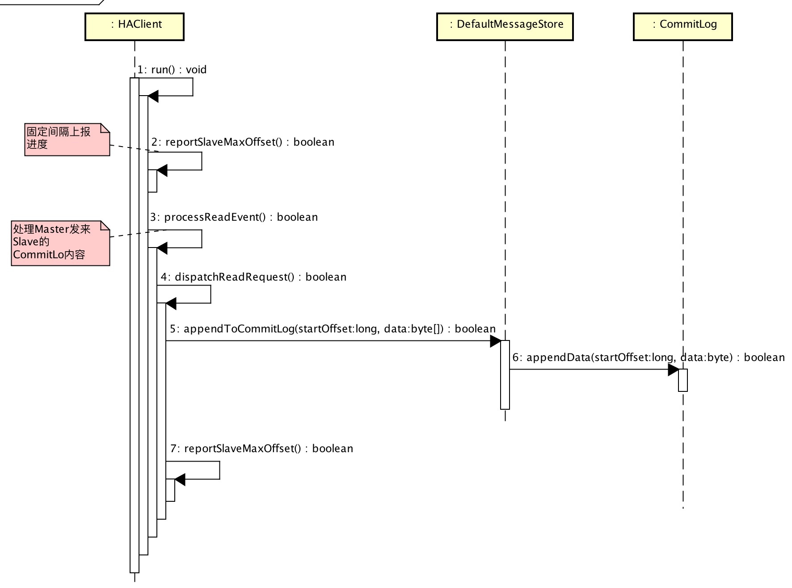

# 1. 概述

本文主要解析 `Namesrv`、`Broker` 如何实现高可用，`Producer`、`Consumer` 怎么与它们通信保证高可用。

# 2. Namesrv 高可用

**启动多个 `Namesrv` 实现高可用。**  
相较于 `Zookeeper`、`Consul`、`Etcd` 等，`Namesrv` 是一个**超轻量级**的注册中心，提供**命名服务**。

## 2.1 Broker 注册到 Namesrv

* 📌 **多个 `Namesrv` 之间，没有任何关系（不存在类似 `Zookeeper` 的 `Leader`/`Follower` 等角色），不进行通信与数据同步。通过 `Broker` 循环注册多个 `Namesrv`。**

```Java
  1: // ⬇️⬇️⬇️【NettyRemotingClient.java】
  2: public RegisterBrokerResult registerBrokerAll(
  3:     final String clusterName,
  4:     final String brokerAddr,
  5:     final String brokerName,
  6:     final long brokerId,
  7:     final String haServerAddr,
  8:     final TopicConfigSerializeWrapper topicConfigWrapper,
  9:     final List<String> filterServerList,
 10:     final boolean oneway,
 11:     final int timeoutMills) {
 12:     RegisterBrokerResult registerBrokerResult = null;
 13: 
 14:     List<String> nameServerAddressList = this.remotingClient.getNameServerAddressList();
 15:     if (nameServerAddressList != null) {
 16:         for (String namesrvAddr : nameServerAddressList) { // 循环多个 Namesrv
 17:             try {
 18:                 RegisterBrokerResult result = this.registerBroker(namesrvAddr, clusterName, brokerAddr, brokerName, brokerId,
 19:                     haServerAddr, topicConfigWrapper, filterServerList, oneway, timeoutMills);
 20:                 if (result != null) {
 21:                     registerBrokerResult = result;
 22:                 }
 23: 
 24:                 log.info("register broker to name server {} OK", namesrvAddr);
 25:             } catch (Exception e) {
 26:                 log.warn("registerBroker Exception, {}", namesrvAddr, e);
 27:             }
 28:         }
 29:     }
 30: 
 31:     return registerBrokerResult;
 32: }
```

## 2.2 Producer、Consumer 访问 Namesrv

* 📌 **`Producer`、`Consumer` 从 `Namesrv`列表选择一个可连接的进行通信。**

```Java
  1: // ⬇️⬇️⬇️【NettyRemotingClient.java】
  2: private Channel getAndCreateNameserverChannel() throws InterruptedException {
  3:     // 返回已选择、可连接Namesrv
  4:     String addr = this.namesrvAddrChoosed.get();
  5:     if (addr != null) {
  6:         ChannelWrapper cw = this.channelTables.get(addr);
  7:         if (cw != null && cw.isOK()) {
  8:             return cw.getChannel();
  9:         }
 10:     }
 11:     //
 12:     final List<String> addrList = this.namesrvAddrList.get();
 13:     if (this.lockNamesrvChannel.tryLock(LOCK_TIMEOUT_MILLIS, TimeUnit.MILLISECONDS)) {
 14:         try {
 15:             // 返回已选择、可连接的Namesrv
 16:             addr = this.namesrvAddrChoosed.get();
 17:             if (addr != null) {
 18:                 ChannelWrapper cw = this.channelTables.get(addr);
 19:                 if (cw != null && cw.isOK()) {
 20:                     return cw.getChannel();
 21:                 }
 22:             }
 23:             // 从【Namesrv列表】中选择一个连接的返回
 24:             if (addrList != null && !addrList.isEmpty()) {
 25:                 for (int i = 0; i < addrList.size(); i++) {
 26:                     int index = this.namesrvIndex.incrementAndGet();
 27:                     index = Math.abs(index);
 28:                     index = index % addrList.size();
 29:                     String newAddr = addrList.get(index);
 30: 
 31:                     this.namesrvAddrChoosed.set(newAddr);
 32:                     Channel channelNew = this.createChannel(newAddr);
 33:                     if (channelNew != null)
 34:                         return channelNew;
 35:                 }
 36:             }
 37:         } catch (Exception e) {
 38:             log.error("getAndCreateNameserverChannel: create name server channel exception", e);
 39:         } finally {
 40:             this.lockNamesrvChannel.unlock();
 41:         }
 42:     } else {
 43:         log.warn("getAndCreateNameserverChannel: try to lock name server, but timeout, {}ms", LOCK_TIMEOUT_MILLIS);
 44:     }
 45: 
 46:     return null;
 47: }
```

# 3. Broker 高可用

**启动多个 `Broker集群` 实现高可用。**  
**`Broker集群` = `Master节点`x1 + `Slave节点`xN。**  
类似 `MySQL`，`Master节点` 提供**读写**服务，`Slave节点` 只提供**读**服务。  

## 3.1 Broker 主从

* **每个集群，`Slave`节点 从 `Master`节点 不断拉取 `CommitLog`。**
* **集群 与 集群 之间没有任何关系，不进行通信与数据同步。**

集群内，`Master`节点 有**两种**类型：`Master_Sync`、`Master_Async`：前者在 `Producer` 发送消息时，等待 `Slave`节点 存储完毕后再返回发送结果，而后者不需要等待。

-------

### 3.1.1 组件

再看具体实现代码之前，我们来看看 `Master`/`Slave`节点 包含的组件：  


* `Master`节点
    * `AcceptSocketService` ：接收 `Slave`节点 连接。
    * `HAConnection`
        * `ReadSocketService` ：**读**来自 `Slave`节点 的数据。 
        * `WriteSocketService` ：**写**到往 `Slave`节点 的数据。
* `Slave`节点
    * `HAClient` ：对 `Master`节点 连接、读写数据。

### 3.1.2 通信协议

`Master`节点 与 `Slave`节点 **通信协议**很简单，只有如下两条。

| 对象 | 用途 | 第几位 | 字段 | 数据类型 | 字节数 | 说明
| :-- | :-- | :-- | :-- | :-- | :-- | :-- |
| Slave=>Master | 上报CommitLog最大物理位置 |  |  |  |  |  |
|  | | 0 | maxPhyOffset  |  Long | 8 | CommitLog最大物理位置 |
| Master=>Slave | 传递CommitLog内容 |  |  |  |  |  |
| | | 0 | fromPhyOffset | Long | 8 | CommitLog开始物理位置 | 
| | | 1 | size | Int | 4 | 同步CommitLog内容长度 | 
| | | 2 | body | Bytes | size | 同步CommitLog内容 | 

### 3.1.3 Slave



-------

* **`Slave` 主循环，实现了**不断不断不断**从 `Master` 读取 `CommitLog` 内容。**

```Java
  1: // ⬇️⬇️⬇️【HAClient.java】
  2: public void run() {
  3:     log.info(this.getServiceName() + " service started");
  4: 
  5:     while (!this.isStopped()) {
  6:         try {
  7:             if (this.connectMaster()) {
  8:                 // 若到满足上报间隔，上报到Master进度
  9:                 if (this.isTimeToReportOffset()) {
 10:                     boolean result = this.reportSlaveMaxOffset(this.currentReportedOffset);
 11:                     if (!result) {
 12:                         this.closeMaster();
 13:                     }
 14:                 }
 15: 
 16:                 this.selector.select(1000);
 17: 
 18:                 // 处理读取事件
 19:                 boolean ok = this.processReadEvent();
 20:                 if (!ok) {
 21:                     this.closeMaster();
 22:                 }
 23: 
 24:                 // 若进度有变化，上报到Master进度
 25:                 if (!reportSlaveMaxOffsetPlus()) {
 26:                     continue;
 27:                 }
 28: 
 29:                 // Master过久未返回数据，关闭连接
 30:                 long interval = HAService.this.getDefaultMessageStore().getSystemClock().now() - this.lastWriteTimestamp;
 31:                 if (interval > HAService.this.getDefaultMessageStore().getMessageStoreConfig()
 32:                     .getHaHousekeepingInterval()) {
 33:                     log.warn("HAClient, housekeeping, found this connection[" + this.masterAddress
 34:                         + "] expired, " + interval);
 35:                     this.closeMaster();
 36:                     log.warn("HAClient, master not response some time, so close connection");
 37:                 }
 38:             } else {
 39:                 this.waitForRunning(1000 * 5);
 40:             }
 41:         } catch (Exception e) {
 42:             log.warn(this.getServiceName() + " service has exception. ", e);
 43:             this.waitForRunning(1000 * 5);
 44:         }
 45:     }
 46: 
 47:     log.info(this.getServiceName() + " service end");
 48: }
```

* 第 8 至 14 行 ：**固定间隔（默认5s）**向 `Master` 上报 `Slave` 本地 `CommitLog` 最大物理位置。该操作有两个作用：（1）`Slave` 向 `Master` 拉取 `CommitLog` 内容请求；（2）心跳。
* 第 16 至 22 行 ：处理 `Master` 发来 `Slave` 的 `CommitLog` 内容。

-------

* **我们来看看 `#dispatchReadRequest(...)` 与 `#reportSlaveMaxOffset(...)` 是怎么实现的。**

```Java
  1: // 【HAClient.java】
  2: /**
  3:  * 读取Master写入的CommitLog数据，并返回是异常
  4:  * 如果读取到数据，写入CommitLog
  5:  * 异常原因：
  6:  *   1. Master的push来的数据offset 不等于 Slave的CommitLog数据最大offset
  7:  *   2. 上报到Master进度失败
  8:  *
  9:  * @return 是否异常
 10:  */
 11: private boolean dispatchReadRequest() {
 12:     final int msgHeaderSize = 8 + 4; // phyoffset + size
 13:     int readSocketPos = this.byteBufferRead.position();
 14: 
 15:     while (true) {
 16:         // 读取到请求
 17:         int diff = this.byteBufferRead.position() - this.dispatchPostion;
 18:         if (diff >= msgHeaderSize) {
 19:             // 读取masterPhyOffset、bodySize。使用dispatchPostion的原因是：处理数据“粘包”导致数据读取不完整。
 20:             long masterPhyOffset = this.byteBufferRead.getLong(this.dispatchPostion);
 21:             int bodySize = this.byteBufferRead.getInt(this.dispatchPostion + 8);
 22:             // 校验 Master的push来的数据offset 是否和 Slave的CommitLog数据最大offset 是否相同。
 23:             long slavePhyOffset = HAService.this.defaultMessageStore.getMaxPhyOffset();
 24:             if (slavePhyOffset != 0) {
 25:                 if (slavePhyOffset != masterPhyOffset) {
 26:                     log.error("master pushed offset not equal the max phy offset in slave, SLAVE: "
 27:                         + slavePhyOffset + " MASTER: " + masterPhyOffset);
 28:                     return false;
 29:                 }
 30:             }
 31:             // 读取到消息
 32:             if (diff >= (msgHeaderSize + bodySize)) {
 33:                 // 写入CommitLog
 34:                 byte[] bodyData = new byte[bodySize];
 35:                 this.byteBufferRead.position(this.dispatchPostion + msgHeaderSize);
 36:                 this.byteBufferRead.get(bodyData);
 37:                 HAService.this.defaultMessageStore.appendToCommitLog(masterPhyOffset, bodyData);
 38:                 // 设置处理到的位置
 39:                 this.byteBufferRead.position(readSocketPos);
 40:                 this.dispatchPostion += msgHeaderSize + bodySize;
 41:                 // 上报到Master进度
 42:                 if (!reportSlaveMaxOffsetPlus()) {
 43:                     return false;
 44:                 }
 45:                 // 继续循环
 46:                 continue;
 47:             }
 48:         }
 49: 
 50:         // 空间写满，重新分配空间
 51:         if (!this.byteBufferRead.hasRemaining()) {
 52:             this.reallocateByteBuffer();
 53:         }
 54: 
 55:         break;
 56:     }
 57: 
 58:     return true;
 59: }
 60: 
 61: /**
 62:  * 上报进度
 63:  *
 64:  * @param maxOffset 进度
 65:  * @return 是否上报成功
 66:  */
 67: private boolean reportSlaveMaxOffset(final long maxOffset) {
 68:     this.reportOffset.position(0);
 69:     this.reportOffset.limit(8);
 70:     this.reportOffset.putLong(maxOffset);
 71:     this.reportOffset.position(0);
 72:     this.reportOffset.limit(8);
 73: 
 74:     for (int i = 0; i < 3 && this.reportOffset.hasRemaining(); i++) {
 75:         try {
 76:             this.socketChannel.write(this.reportOffset);
 77:         } catch (IOException e) {
 78:             log.error(this.getServiceName()
 79:                 + "reportSlaveMaxOffset this.socketChannel.write exception", e);
 80:             return false;
 81:         }
 82:     }
 83: 
 84:     return !this.reportOffset.hasRemaining();
 85: }
```

### 3.1.4 Master

* **`ReadSocketService` 逻辑同 `HAClient#processReadEvent(...)` 基本相同，我们直接看代码。**

```Java
  1: // ⬇️⬇️⬇️【ReadSocketService.java】
  2: private boolean processReadEvent() {
  3:     int readSizeZeroTimes = 0;
  4: 
  5:     // 清空byteBufferRead
  6:     if (!this.byteBufferRead.hasRemaining()) {
  7:         this.byteBufferRead.flip();
  8:         this.processPostion = 0;
  9:     }
 10: 
 11:     while (this.byteBufferRead.hasRemaining()) {
 12:         try {
 13:             int readSize = this.socketChannel.read(this.byteBufferRead);
 14:             if (readSize > 0) {
 15:                 readSizeZeroTimes = 0;
 16: 
 17:                 // 设置最后读取时间
 18:                 this.lastReadTimestamp = HAConnection.this.haService.getDefaultMessageStore().getSystemClock().now();
 19: 
 20:                 if ((this.byteBufferRead.position() - this.processPostion) >= 8) {
 21:                     // 读取Slave 请求来的CommitLog的最大位置
 22:                     int pos = this.byteBufferRead.position() - (this.byteBufferRead.position() % 8);
 23:                     long readOffset = this.byteBufferRead.getLong(pos - 8);
 24:                     this.processPostion = pos;
 25: 
 26:                     // 设置Slave CommitLog的最大位置
 27:                     HAConnection.this.slaveAckOffset = readOffset;
 28: 
 29:                     // 设置Slave 第一次请求的位置
 30:                     if (HAConnection.this.slaveRequestOffset < 0) {
 31:                         HAConnection.this.slaveRequestOffset = readOffset;
 32:                         log.info("slave[" + HAConnection.this.clientAddr + "] request offset " + readOffset);
 33:                     }
 34: 
 35:                     // 通知目前Slave进度。主要用于Master节点为同步类型的。
 36:                     HAConnection.this.haService.notifyTransferSome(HAConnection.this.slaveAckOffset);
 37:                 }
 38:             } else if (readSize == 0) {
 39:                 if (++readSizeZeroTimes >= 3) {
 40:                     break;
 41:                 }
 42:             } else {
 43:                 log.error("read socket[" + HAConnection.this.clientAddr + "] < 0");
 44:                 return false;
 45:             }
 46:         } catch (IOException e) {
 47:             log.error("processReadEvent exception", e);
 48:             return false;
 49:         }
 50:     }
 51: 
 52:     return true;
 53: }
```

* 

## 3.2 Producer 发送消息

## 3.3 Consumer 消费消息

// TODO 从节点消费

