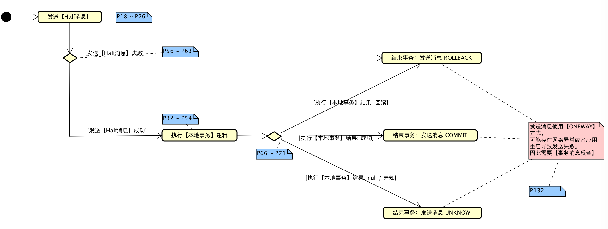
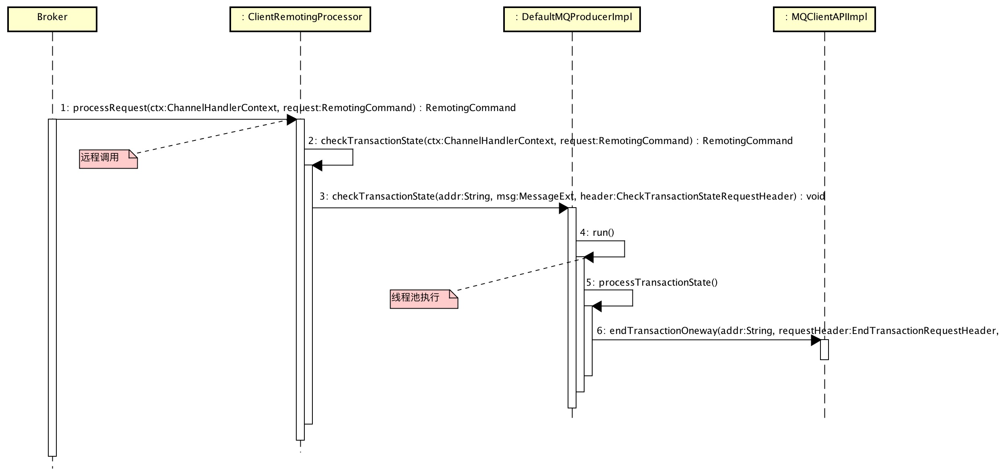

# 1. 概述

**必须必须必须** 前置阅读内容：

* [《事务消息（阿里云）》](https://help.aliyun.com/document_detail/43348.html?spm=5176.doc43490.6.566.Zd5Bl7)

# 2. 事务消息发送

## 2.1 Producer 发送事务消息

* 活动图如下（结合 `核心代码` 理解）：



* 核心代码如下：

```Java
  1: // ⬇️⬇️⬇️【DefaultMQProducerImpl.java】
  2: /**
  3:  * 发送事务消息
  4:  *
  5:  * @param msg 消息
  6:  * @param tranExecuter 【本地事务】执行器
  7:  * @param arg 【本地事务】执行器参数
  8:  * @return 事务发送结果
  9:  * @throws MQClientException 当 Client 发生异常时
 10:  */
 11: public TransactionSendResult sendMessageInTransaction(final Message msg, final LocalTransactionExecuter tranExecuter, final Object arg)
 12:     throws MQClientException {
 13:     if (null == tranExecuter) {
 14:         throw new MQClientException("tranExecutor is null", null);
 15:     }
 16:     Validators.checkMessage(msg, this.defaultMQProducer);
 17: 
 18:     // 发送【Half消息】
 19:     SendResult sendResult;
 20:     MessageAccessor.putProperty(msg, MessageConst.PROPERTY_TRANSACTION_PREPARED, "true");
 21:     MessageAccessor.putProperty(msg, MessageConst.PROPERTY_PRODUCER_GROUP, this.defaultMQProducer.getProducerGroup());
 22:     try {
 23:         sendResult = this.send(msg);
 24:     } catch (Exception e) {
 25:         throw new MQClientException("send message Exception", e);
 26:     }
 27: 
 28:     // 处理发送【Half消息】结果
 29:     LocalTransactionState localTransactionState = LocalTransactionState.UNKNOW;
 30:     Throwable localException = null;
 31:     switch (sendResult.getSendStatus()) {
 32:         // 发送【Half消息】成功，执行【本地事务】逻辑
 33:         case SEND_OK: {
 34:             try {
 35:                 if (sendResult.getTransactionId() != null) { // 事务编号。目前开源版本暂时没用到，猜想ONS在使用。
 36:                     msg.putUserProperty("__transactionId__", sendResult.getTransactionId());
 37:                 }
 38: 
 39:                 // 执行【本地事务】逻辑
 40:                 localTransactionState = tranExecuter.executeLocalTransactionBranch(msg, arg);
 41:                 if (null == localTransactionState) {
 42:                     localTransactionState = LocalTransactionState.UNKNOW;
 43:                 }
 44: 
 45:                 if (localTransactionState != LocalTransactionState.COMMIT_MESSAGE) {
 46:                     log.info("executeLocalTransactionBranch return {}", localTransactionState);
 47:                     log.info(msg.toString());
 48:                 }
 49:             } catch (Throwable e) {
 50:                 log.info("executeLocalTransactionBranch exception", e);
 51:                 log.info(msg.toString());
 52:                 localException = e;
 53:             }
 54:         }
 55:         break;
 56:         // 发送【Half消息】失败，标记【本地事务】状态为回滚
 57:         case FLUSH_DISK_TIMEOUT:
 58:         case FLUSH_SLAVE_TIMEOUT:
 59:         case SLAVE_NOT_AVAILABLE:
 60:             localTransactionState = LocalTransactionState.ROLLBACK_MESSAGE;
 61:             break;
 62:         default:
 63:             break;
 64:     }
 65: 
 66:     // 结束事务：提交消息 COMMIT / ROLLBACK
 67:     try {
 68:         this.endTransaction(sendResult, localTransactionState, localException);
 69:     } catch (Exception e) {
 70:         log.warn("local transaction execute " + localTransactionState + ", but end broker transaction failed", e);
 71:     }
 72: 
 73:     // 返回【事务发送结果】
 74:     TransactionSendResult transactionSendResult = new TransactionSendResult();
 75:     transactionSendResult.setSendStatus(sendResult.getSendStatus());
 76:     transactionSendResult.setMessageQueue(sendResult.getMessageQueue());
 77:     transactionSendResult.setMsgId(sendResult.getMsgId());
 78:     transactionSendResult.setQueueOffset(sendResult.getQueueOffset());
 79:     transactionSendResult.setTransactionId(sendResult.getTransactionId());
 80:     transactionSendResult.setLocalTransactionState(localTransactionState);
 81:     return transactionSendResult;
 82: }
 83: 
 84: /**
 85:  * 结束事务：提交消息 COMMIT / ROLLBACK
 86:  *
 87:  * @param sendResult 发送【Half消息】结果
 88:  * @param localTransactionState 【本地事务】状态
 89:  * @param localException 执行【本地事务】逻辑产生的异常
 90:  * @throws RemotingException 当远程调用发生异常时
 91:  * @throws MQBrokerException 当 Broker 发生异常时
 92:  * @throws InterruptedException 当线程中断时
 93:  * @throws UnknownHostException 当解码消息编号失败是
 94:  */
 95: public void endTransaction(//
 96:     final SendResult sendResult, //
 97:     final LocalTransactionState localTransactionState, //
 98:     final Throwable localException) throws RemotingException, MQBrokerException, InterruptedException, UnknownHostException {
 99:     // 解码消息编号
100:     final MessageId id;
101:     if (sendResult.getOffsetMsgId() != null) {
102:         id = MessageDecoder.decodeMessageId(sendResult.getOffsetMsgId());
103:     } else {
104:         id = MessageDecoder.decodeMessageId(sendResult.getMsgId());
105:     }
106: 
107:     // 创建请求
108:     String transactionId = sendResult.getTransactionId();
109:     final String brokerAddr = this.mQClientFactory.findBrokerAddressInPublish(sendResult.getMessageQueue().getBrokerName());
110:     EndTransactionRequestHeader requestHeader = new EndTransactionRequestHeader();
111:     requestHeader.setTransactionId(transactionId);
112:     requestHeader.setCommitLogOffset(id.getOffset());
113:     switch (localTransactionState) {
114:         case COMMIT_MESSAGE:
115:             requestHeader.setCommitOrRollback(MessageSysFlag.TRANSACTION_COMMIT_TYPE);
116:             break;
117:         case ROLLBACK_MESSAGE:
118:             requestHeader.setCommitOrRollback(MessageSysFlag.TRANSACTION_ROLLBACK_TYPE);
119:             break;
120:         case UNKNOW:
121:             requestHeader.setCommitOrRollback(MessageSysFlag.TRANSACTION_NOT_TYPE);
122:             break;
123:         default:
124:             break;
125:     }
126:     requestHeader.setProducerGroup(this.defaultMQProducer.getProducerGroup());
127:     requestHeader.setTranStateTableOffset(sendResult.getQueueOffset());
128:     requestHeader.setMsgId(sendResult.getMsgId());
129:     String remark = localException != null ? ("executeLocalTransactionBranch exception: " + localException.toString()) : null;
130: 
131:     // 提交消息 COMMIT / ROLLBACK。！！！通信方式为：Oneway！！！
132:     this.mQClientFactory.getMQClientAPIImpl().endTransactionOneway(brokerAddr, requestHeader, remark, this.defaultMQProducer.getSendMsgTimeout());
133: }
```

## 2.2 Broker 处理结束事务请求

* 查询请求的消息，进行**提交 / 回滚**。核心代码如下：

```Java
  1: // ⬇️⬇️⬇️【EndTransactionProcessor.java】
  2: public RemotingCommand processRequest(ChannelHandlerContext ctx, RemotingCommand request) throws RemotingCommandException {
  3:     final RemotingCommand response = RemotingCommand.createResponseCommand(null);
  4:     final EndTransactionRequestHeader requestHeader = (EndTransactionRequestHeader) request.decodeCommandCustomHeader(EndTransactionRequestHeader.class);
  5: 
  6:     // 省略代码 =》打印日志（只处理 COMMIT / ROLLBACK）
  7: 
  8:     // 查询提交的消息
  9:     final MessageExt msgExt = this.brokerController.getMessageStore().lookMessageByOffset(requestHeader.getCommitLogOffset());
 10:     if (msgExt != null) {
 11:         // 省略代码 =》校验消息
 12: 
 13:         // 生成消息
 14:         MessageExtBrokerInner msgInner = this.endMessageTransaction(msgExt);
 15:         msgInner.setSysFlag(MessageSysFlag.resetTransactionValue(msgInner.getSysFlag(), requestHeader.getCommitOrRollback()));
 16:         msgInner.setQueueOffset(requestHeader.getTranStateTableOffset());
 17:         msgInner.setPreparedTransactionOffset(requestHeader.getCommitLogOffset());
 18:         msgInner.setStoreTimestamp(msgExt.getStoreTimestamp());
 19:         if (MessageSysFlag.TRANSACTION_ROLLBACK_TYPE == requestHeader.getCommitOrRollback()) {
 20:             msgInner.setBody(null);
 21:         }
 22: 
 23:         // 存储生成消息
 24:         final MessageStore messageStore = this.brokerController.getMessageStore();
 25:         final PutMessageResult putMessageResult = messageStore.putMessage(msgInner);
 26: 
 27:         // 处理存储结果
 28:         if (putMessageResult != null) {
 29:             switch (putMessageResult.getPutMessageStatus()) {
 30:                 // Success
 31:                 case PUT_OK:
 32:                 case FLUSH_DISK_TIMEOUT:
 33:                 case FLUSH_SLAVE_TIMEOUT:
 34:                 case SLAVE_NOT_AVAILABLE:
 35:                     response.setCode(ResponseCode.SUCCESS);
 36:                     response.setRemark(null);
 37:                     break;
 38:                 // Failed
 39:                 case CREATE_MAPEDFILE_FAILED:
 40:                     response.setCode(ResponseCode.SYSTEM_ERROR);
 41:                     response.setRemark("create maped file failed.");
 42:                     break;
 43:                 case MESSAGE_ILLEGAL:
 44:                 case PROPERTIES_SIZE_EXCEEDED:
 45:                     response.setCode(ResponseCode.MESSAGE_ILLEGAL);
 46:                     response.setRemark("the message is illegal, maybe msg body or properties length not matched. msg body length limit 128k, msg properties length limit 32k.");
 47:                     break;
 48:                 case SERVICE_NOT_AVAILABLE:
 49:                     response.setCode(ResponseCode.SERVICE_NOT_AVAILABLE);
 50:                     response.setRemark("service not available now.");
 51:                     break;
 52:                 case OS_PAGECACHE_BUSY:
 53:                     response.setCode(ResponseCode.SYSTEM_ERROR);
 54:                     response.setRemark("OS page cache busy, please try another machine");
 55:                     break;
 56:                 case UNKNOWN_ERROR:
 57:                     response.setCode(ResponseCode.SYSTEM_ERROR);
 58:                     response.setRemark("UNKNOWN_ERROR");
 59:                     break;
 60:                 default:
 61:                     response.setCode(ResponseCode.SYSTEM_ERROR);
 62:                     response.setRemark("UNKNOWN_ERROR DEFAULT");
 63:                     break;
 64:             }
 65: 
 66:             return response;
 67:         } else {
 68:             response.setCode(ResponseCode.SYSTEM_ERROR);
 69:             response.setRemark("store putMessage return null");
 70:         }
 71:     } else {
 72:         response.setCode(ResponseCode.SYSTEM_ERROR);
 73:         response.setRemark("find prepared transaction message failed");
 74:         return response;
 75:     }
 76: 
 77:     return response;
 78: }
```

## 2.3 Broker 生成 ConsumeQueue

* 事务消息，提交（`COMMIT`）后才生成 `ConsumeQueue`。

```Java
  1: // ⬇️⬇️⬇️【DefaultMessageStore.java】
  2: public void doDispatch(DispatchRequest req) {
  3:     // 非事务消息 或 事务提交消息 建立 消息位置信息 到 ConsumeQueue
  4:     final int tranType = MessageSysFlag.getTransactionValue(req.getSysFlag());
  5:     switch (tranType) {
  6:         case MessageSysFlag.TRANSACTION_NOT_TYPE: // 非事务消息
  7:         case MessageSysFlag.TRANSACTION_COMMIT_TYPE: // 事务消息COMMIT
  8:             DefaultMessageStore.this.putMessagePositionInfo(req.getTopic(), req.getQueueId(), req.getCommitLogOffset(), req.getMsgSize(),
  9:                 req.getTagsCode(), req.getStoreTimestamp(), req.getConsumeQueueOffset());
 10:             break;
 11:         case MessageSysFlag.TRANSACTION_PREPARED_TYPE: // 事务消息PREPARED
 12:         case MessageSysFlag.TRANSACTION_ROLLBACK_TYPE: // 事务消息ROLLBACK
 13:             break;
 14:     }
 15:     // 省略代码 =》 建立 索引信息 到 IndexFile
 16: }
```

# 3. 事务消息回查

* 【事务消息回查】功能曾经开源过，目前（V4.0.0）暂未开源。如下是该功能的开源情况：

| 版本 | 【事务消息回查】 |
| --- | --- |
| 官方V3.0.4 ~ V3.1.4 | 基于 文件系统 实现 |
| 官方V3.1.5 ~ V4.0.0 | 基于 数据库 实现，未开源 |
| 非官方V3.5.8 | 基于 数据库 实现 |

我们来看看三种情况下是怎么实现的。

## 3.1 Broker 发起【事务消息回查】

### 3.1.1 官方V3.1.4：基于文件系统


RocketMQ 这种实现事务方式，没有通过 KV 存储做，而是通过 Offset 方式，存在一个显著缺陷，即通过 Offset 更改数据，会令系统的脏页过多，需要特别关注。

### 3.1.2 官方V4.0.0：基于数据库

### 3.1.3 非官方V3.5.8：基于数据库

## 3.2 Producer 接收【事务消息回查】

* 顺序图如下：



* 核心代码如下：

```Java
  1: // ⬇️⬇️⬇️【DefaultMQProducerImpl.java】
  2: /**
  3:  * 检查【事务状态】状态
  4:  *
  5:  * @param addr broker地址
  6:  * @param msg 消息
  7:  * @param header 请求
  8:  */
  9: @Override
 10: public void checkTransactionState(final String addr, final MessageExt msg, final CheckTransactionStateRequestHeader header) {
 11:     Runnable request = new Runnable() {
 12:         private final String brokerAddr = addr;
 13:         private final MessageExt message = msg;
 14:         private final CheckTransactionStateRequestHeader checkRequestHeader = header;
 15:         private final String group = DefaultMQProducerImpl.this.defaultMQProducer.getProducerGroup();
 16: 
 17:         @Override
 18:         public void run() {
 19:             TransactionCheckListener transactionCheckListener = DefaultMQProducerImpl.this.checkListener();
 20:             if (transactionCheckListener != null) {
 21:                 // 获取事务执行状态
 22:                 LocalTransactionState localTransactionState = LocalTransactionState.UNKNOW;
 23:                 Throwable exception = null;
 24:                 try {
 25:                     localTransactionState = transactionCheckListener.checkLocalTransactionState(message);
 26:                 } catch (Throwable e) {
 27:                     log.error("Broker call checkTransactionState, but checkLocalTransactionState exception", e);
 28:                     exception = e;
 29:                 }
 30: 
 31:                 // 处理事务结果，提交消息 COMMIT / ROLLBACK
 32:                 this.processTransactionState(//
 33:                     localTransactionState, //
 34:                     group, //
 35:                     exception);
 36:             } else {
 37:                 log.warn("checkTransactionState, pick transactionCheckListener by group[{}] failed", group);
 38:             }
 39:         }
 40: 
 41:         /**
 42:          * 处理事务结果，提交消息 COMMIT / ROLLBACK
 43:          *
 44:          * @param localTransactionState 【本地事务】状态
 45:          * @param producerGroup producerGroup
 46:          * @param exception 检查【本地事务】状态发生的异常
 47:          */
 48:         private void processTransactionState(//
 49:             final LocalTransactionState localTransactionState, //
 50:             final String producerGroup, //
 51:             final Throwable exception) {
 52:             final EndTransactionRequestHeader thisHeader = new EndTransactionRequestHeader();
 53:             thisHeader.setCommitLogOffset(checkRequestHeader.getCommitLogOffset());
 54:             thisHeader.setProducerGroup(producerGroup);
 55:             thisHeader.setTranStateTableOffset(checkRequestHeader.getTranStateTableOffset());
 56:             thisHeader.setFromTransactionCheck(true);
 57: 
 58:             // 设置消息编号
 59:             String uniqueKey = message.getProperties().get(MessageConst.PROPERTY_UNIQ_CLIENT_MESSAGE_ID_KEYIDX);
 60:             if (uniqueKey == null) {
 61:                 uniqueKey = message.getMsgId();
 62:             }
 63:             thisHeader.setMsgId(uniqueKey);
 64: 
 65:             thisHeader.setTransactionId(checkRequestHeader.getTransactionId());
 66:             switch (localTransactionState) {
 67:                 case COMMIT_MESSAGE:
 68:                     thisHeader.setCommitOrRollback(MessageSysFlag.TRANSACTION_COMMIT_TYPE);
 69:                     break;
 70:                 case ROLLBACK_MESSAGE:
 71:                     thisHeader.setCommitOrRollback(MessageSysFlag.TRANSACTION_ROLLBACK_TYPE);
 72:                     log.warn("when broker check, client rollback this transaction, {}", thisHeader);
 73:                     break;
 74:                 case UNKNOW:
 75:                     thisHeader.setCommitOrRollback(MessageSysFlag.TRANSACTION_NOT_TYPE);
 76:                     log.warn("when broker check, client does not know this transaction state, {}", thisHeader);
 77:                     break;
 78:                 default:
 79:                     break;
 80:             }
 81: 
 82:             String remark = null;
 83:             if (exception != null) {
 84:                 remark = "checkLocalTransactionState Exception: " + RemotingHelper.exceptionSimpleDesc(exception);
 85:             }
 86: 
 87:             try {
 88:                 // 提交消息 COMMIT / ROLLBACK
 89:                 DefaultMQProducerImpl.this.mQClientFactory.getMQClientAPIImpl().endTransactionOneway(brokerAddr, thisHeader, remark,
 90:                     3000);
 91:             } catch (Exception e) {
 92:                 log.error("endTransactionOneway exception", e);
 93:             }
 94:         }
 95:     };
 96: 
 97:     // 提交执行
 98:     this.checkExecutor.submit(request);
 99: }
100: 
101: // ⬇️⬇️⬇️【DefaultMQProducerImpl.java】
102: /**
103:  * 【事务消息回查】检查监听器
104:  */
105: public interface TransactionCheckListener {
106: 
107:     /**
108:      * 获取（检查）【本地事务】状态
109:      *
110:      * @param msg 消息
111:      * @return 事务状态
112:      */
113:     LocalTransactionState checkLocalTransactionState(final MessageExt msg);
114: 
115: }
```

